# COSE-312
https://prl.korea.ac.kr/courses/cose312/2025/

# Index
- [1. Lecture 1](#lecture-1)
- [2. Lecture 2](#lecture-2)
- [3. Lecture 3](#lecture-3)
- [4. Lecture 4](#lecture-4)
- [5. Lecture 5](#lecture-5)
- [6. Lecture 6](#lecture-6)
- [7. Lecture 7](#lecture-7)
- [8. Lecture 8](#lecture-8)

# Lecture 1
Compiler: Software that **tranlates** source language into target language <br>

Target language is usually machine language(x86), but not always <br>

Java => First compiles into intermediate form named **bytecodes** 


Compiler should preserve the meaning(semantics) of the source program


## Structure of Compilers


## Front End
Input : source program(character string) => Translate into **Intermediate Representation(IR)** <br>

IR: 2-dimensional structure. Abstract-Syntax-Tree <br>

### Lexical Analyzer
Character Stream -> Token Stream <br>

Token: Defined as pair of **Type** and **Value**


### Syntax Analyzer
Token Stream -> Syntax Tree <br>

With Syntax Tree, semantics of the program appears


### Semantic Analyzer
Check semantic correctness of input program(very hard) <br>

Syntactic correctness can be checked perfectly with parser <br>

Semantic correctness is much more complicated and tricky <br>

Type checking is important. Make sure every operator has **matching operand**


### IR Translator
Syntax Tree -> IR (IR is also tree structure) <br>

Intermediate Representation:
- lower-level than source language
- higher-level than target language

Three-Address Code -> At most two operand on right side <br>

Why using IR? -> Reuse, Optimization...

### Optimizer
Consists of multiple optimizers


Let's look at a simple example


Following features have been applied

- Constant propagation: Substitute subject of allocation into value itself
- Deadcode elimination: Delete unnecessary code 
- Copy elimination

## Back End
IR -> Target machine code <br>

Difference between high-level and low-level: <br>

Register Allocation Problem: cannot use many variables in machine code <br>

But this problem is NP, solvale at least

## Summary


# Lecture 2
Character sequence into token sequence based on **white space** <br>

parenthesis, char(keyword), star, if -> Thing like this are counted separately <br>

```
float match0 (char *s) /* find a zero */
{if (!strncmp(s, "0.0", 3))
    return 0.0;
}
```

Given this code... <br>


EOF: End Of File <br>

To do lexing...
- Specification: How to specify lexical patterns (Regular Expression)
- Recognition: How to **recognize** lexical patterns (DFA)
- Automation: How to automatically generate string recognizer from spec
(Thompson's construction and subset construction)

## Specification
### Alphabet
Alpabet Σ is a **finite, non-empty** set of symbols <br>

### Strings
String: finite sequence of symbols chosen from alphabet <br>

For example: 1, 01, 10110 are strings over Σ = {0, 1} <br>


### Languages
Language L is a subset of Σ∗: L ⊆ Σ∗


### Regular Expressions
Meta language that specifies another language <br>

Since regular expression is language, it has syntax and semantics <br>

Syntax: Usually define with **context free grammar** <br>
 <br>
- Regular expressions (R) are defined recursively, with simpler regular expressions as components.
- The set of strings described by a regular expression forms a regular language, which is a specific type of formal language that can be recognized by a finite automaton. <br>

Semantics: L(R) => Meaning of Regular Expression R. L(R) is subset of Σ* <br>


### Regular Definitions
It's inconvenient to express all the specifications with Regular Expressions <br>

Regular Definition: Give names to regular expressions and use the names in subsequent expressions <br>


### Extensions of Regular Expressions


## String Recognition by Finite Automata
Implement recognized pattern with finite automata

### NFA
NFA eventually means set of strings that NFA accepts(recognizable strings) <br>

Lexical Analyzer: Change string into equivalent NFA -> DFA <br>


-2Q -> Power set of Q. Set of every subset of Q
-if Q={q0, q1, q2}, 2^Q =  { {}, {q0}, {q1}, {q2}, {q0,q1}, {q0,q2}, {q1,q2}, {q0,q1,q2}}

### DFA
DFA is special case of NFA
- No moves on ϵ
- For each state and input symbol, next state is unique 


## Automation
RE --- Thompson's contruction ---> NFA --- subset construction ---> DFA <br>

### Principles of Compilation
Every automatic compilation 
- is done **compositionally** and
- maintains some **invariants** during compilation 

If program looks like this: R1|R2 <br>
- Compilation of R1|R2 is defined in terms of compilation of R1 and R2
- Compiled NFAs for R1 and R2 satisfy the invariants:
    - NFA has only one accepting state
    - no arc into initial state, and out of accepting state 

Source Language:


### Compilation(Base Cases)


### ϵ-Closures
ϵ-Closure(I) => Set of states reachable from I without consuming any symbols <br>

### Running Example
1. Initial DFA state is d0 = ϵ0Closure({0})

2. For initial state S, consider every x ∈ Σ and compute corresponding next state

3. For the state {1,2,3,4,6,9}, compute next states


Continue until nothing changes <br>

Those states that include NFA's accepting state becomes DFA's accepting state.

### Subset Construction Algorithm


### Algorithm for computing ϵ-Closures
Formal definition: T = ϵ-Closure(I) is the smallest set such that <br>
 <br>
Alternatively, T is the smallest solution of the equation F(X) ⊆ (X) where <br>
 <br>

Such solution is called the **least fixed point of F** <br>

Following is fixed point iteration algorithm <br>


# Lecture 3
Build parse tree (syntax tree) 

## Context-Free Grammar
Regular is weak to express 2-dimensional structure. Have ot use Context-Free Grammar<br>

Palindrome(w∈{0,1}∗|w=wR) is representative example of CFG. Not regular but context-free <br>

Every context-free grammar is defined by recursive definition 
- Bases: ϵ, 0, 1 -> palindromes
- Induction: If w is palindrome, so are 0w0, 1w1


## Derivation 


To check if a string is contained in some grammar, can do it by derivation <br>

From the start variable, if the string can be derived, that string is contained in grammar <br>

Parsing => Doing derivation in reverse 


- Leftmost Derivation(=>l): **Leftmost non-terminal** in each sentential is always chosen
- Rightmost Derivation(=>r): **Rightmost non-terminal** in each sentential is always chosen 

If S ⇒∗l α,α is left sentential form. =>*r -> right sentential form

## Parse Tree
Graphical tree-like representation of derivation <br>

Parse tree ignores variations in the order in which symbols are replaced <br>

```
E ⇒ −E ⇒ −(E) ⇒ −(E + E) ⇒ −(id + E) ⇒ −(id + id)
E ⇒ −E ⇒ −(E) ⇒ −(E + E) ⇒ −(E + id) ⇒ −(id + id)
```


If derivation use same set of rules -> parse tree is identical 

## Ambiguity
Grammar is **ambiguous** if
- Produces more than one parse tree for some sentence
- Has multiple leftmost derivations
- Has multiple rightmost derivations

## Eliminating Ambiguity
E → E + E | E ∗ E | (E) | id -> Make layers of grammar 

1. Precedence: bind * tighter than +
1 + 2 * 3 => Always parse by 1 + (2 * 3)
2. Associativity: * and + associate to the left
1 + 2 + 3 => Always parse by (1 + 2) + 3

## Eliminating Left-Recursion
E -> E + T | T : left-recursive form <br>

Rewrite grammar using right recursion

```
E -> T E'
E' -> + T E'
E' -> ϵ
```

In general,
```
A → Aα | β 
```

can change like below
```
A → βA′
A′ → αA′| ϵ
```

### Left Factoring
```
S → if E then S else S
S → if E then S
```
This grammar has rules with the same prefix. => **Left Fator**

```
S → if E then S X
X → ϵ
X → else S
```

In general, if A → αβ1 | αβ2 are two A-productions, can refactor like this
```
A → αA′
A′ → β1 | β2
```

## Non-Context-Free Language Constructs
Case 1: <br>


First w => Declaration of identifier w <br>
Second w => Use of identifier <br>

This problem is about checking identifier before using it <br>

However, CFG cannot handle this <br>

Case 2: <br>


Modeling of checking function's parameter number <br>

Checking these properties is usually done during **semantic-analysis** 

# Lecture 4
Top-Down Parsing : Constructing parse tree starting from the root -> leaf <br>

Key Problem: When doing leftmost derivation, which rule should be selected? 

Expression Grammar:
```
E → T E′
E′ → + T E′| ϵ
T → F T′
T′ → ∗ F T′| ϵ
F → (E) | id
```

## Parsing Table
Parsing table for expression grammar looks like this

- $ -> endmarker <br>

Sequence of predictive parsing for **id + id * id** <br>


Following is predictive parsing algorithm
- Input: string w and paring table M for grammar G
- Output: leftmost derivation of w or error


## Construct Parsing Table
- Compute FIRST and FOLLOW sets of the grammar
- Contruct the parsing table using these sets

### FIRST and FOLLOW


Let's calculate for example grammar
```
E → T E′          -> 1
E′ → + T E′| ϵ    -> 2
T → F T′          -> 3 
T′ → ∗ F T′| ϵ    -> 4
F → (E) | id      -> 5
```

- FIRST(F):
{'(', 'id'} by rule 5
- FIRST(T):
Look at rule 3 => Get FIRST(F) => {'(', 'id'}
- FIRST(E):
By rule 1, goto rule 3, and then look up FIRST(F) => {'(', 'id'}
- FIRST(E'):
By rule 2, {'+', 'ϵ'}
- FIRST(T'):
By rule 4, {'*', 'ϵ'}
- FOLLOW(E): Add endmaker to FOLLOW set of start symbol
By rule 5, {'$', ')'}
- FOLLOW(E')
In rule 1, nothing behind E', so add FOLLOW(E) to FOLLOW(E'). {'$', ')'}
- FOLLOW(T)
In rule 1, there are two cases. Since ϵ contained in FIRST(E'), can add FOLLOW(E) to FOLLOW(T). And, by rule 2, add (FIRST(E') - ϵ) also. {'$', ')', '+'}
- FOLLOW(T')
By rule 3, add FOLLOW(T) into FOLLOW(T'). {'$', ')', '+'}
- FOLLOW(F)
In rule 3, if T' goes to ϵ, add FOLLOW(T) into FOLLOW(F). If not, add FIRST(T') also. {'$', ')', '+', '*'}

### Algorithm for computing FIRST

### Algorithm for computing FOLLOW
 <br>

Exercise: <br>
```
X → Y | a
Y → c | ϵ
Z → d | X Y Z
```

FIRST(X): {'a', 'c', 'ϵ'} <br>
FIRST(Y): {'c', 'ϵ'} <br>
FIRST(Z): {'d', 'a', 'c'} <br>
FOLLOW(X): {'$', 'c', 'a', 'd'} <br>
FOLLOW(Y): {'$', 'd', 'a', 'c'} From X->Y, add FOLLOW(X) to FOLLOW(Y)<br>
FOLLOW(Z): {'$'} <br>

### Construction of Parsing Table
 <br>
Build table M[A, a]: A is nonterminal, and a is a terminal or $ <br>

Idea:
- Choose A → α, if the next symbol a is in FIRST(α)
- If α =>* ϵ, choose A → α if a ∈ FOLLOW(A)


# Lecture 5
Bottom Up is more powerful. Just making unambiguous is fine
```
1. E -> E+T
2. E -> T
3. T -> T * F
4. T -> F
5. F -> (E)
6. F -> id
```

Bottom-Up Parsing: Construct a parse tree beginning at the leaves and working up toward the root <br>

 <br>
Construct rightmost-derivation in reverse

## Handle
Have to make choice when to **reduce** and when to **match** <br>

Ex: When T * id, 2 or 6 <br>

Handle: Substring that matches the body of a production and whose production leads to a right-sentential form <br>

**Find a handle and reduce!**

## LR Parsing
- L : Left-to-right scanning of the input
- R : Rightmost-derivation in reverse
- k : k-tokens lookahead 

Handles are recognized by a DFA 

### LR Parsing Overview
LR parser has **stack** and **input**. Based on the lookahead and stack, perform two actions: <br>

- Shift: Performed when the top of the stack is not a handle
Move the first input token to the stack
- Reduce: Performed when the top of the stack is a handle
Choose a rule X -> A B C; pop C,B,A; push X <br>

Example
```
1. E -> E+T
2. E -> T
3. T -> T * F
4. T -> F
5. F -> (E)
6. F -> id
```


### Recognizing Handles
With DFA, can make transition table for expression grammar <br>

For non-terminal symbols, **goto** are defined(State transition) <br>

acc (accept) only exists where endmarker is.


- Parse state:
Stack: T*, Input: id$
Run the DFA on stack, treating shift/goto actions as edges of the DFA: 0 -> 2 -> 7
Look up the entry (7, id) -> shift 5(not a handle)
Push id onto the stack
-Parse state:
Stack: T*id, Input: $
Run the DFA on stack: 0 -> 2 -> 7 -> 5
Look up the entry (5, $) -> reduce 6(handle)
Reduce by rule 6: F -> id

### LR Parsing Process
Stack maintains DFA states:


Algorithm is like below


## LR(0) and SLR Parser Generation
We can make a parsing table only if we make a corresponding automata <br>

Node is set of some rules, and edges consists of symbols and $(accept) <br>


### LR(0) Items
State => Set of **items** <br>

Item => Production with a dot somewhere on the body

```
<Items for A -> XYZ >
A -> .XYZ
A -> X.YZ
A -> XY.Z
A -> XYZ.
```
Dot => Denoting progress of parsing. How far it read, and how many left.... <br>

A -> ϵ has only one item: A -> ·

### The Initial Parse State
Before making automata, we usually append Rule 0: E' -> E, for convenience <br>

Initially, parser will have empty stack, and input will be complete E-sentence indicated by item **E' -> .E** <br>

Collect all of the items reachable from initial item without consuming any input tokens
```
E' -> .E
E  -> .E + T
E  -> .T
T  -> .T * F
T  -> .F
F  -> .(E)
F  -> .id
```
This is I0. Parser cannot distinguish among I0's items without consuming any symbol 

### Closure of Item Sets
If I is a set of items for a grammar G, then CLOSURE(I) is the set of items constructed from I by the two rules:
- Initially, add every item in I to CLOSURE(I)
- If A -> α.Bβ is in CLOSURE(I) and B -> γ is a production, then add the item B → .γ to CLOSURE(I), if it is not already there. Apply this rule until no more new itmes can be added(Fixed Point)


### Construction of LR(0) Automaton
After making I0, construct the next states for each grammar symbol(goto function) <br>

To goto I1 consuming E, **E'->.E** -> **E'->E.**. Can make I1 with closure <br>


### Goto
I: set of items, X: symbol <br>

GOTO(I,X) => Closure of the set of all items A -> αX.β such that A -> α.Xβ is in I <br>


## Construction of LR(0) Automaton
T: set of states, E: set of edges


### Construction of LR(0) Parsing Table

For any token X, if there is item like **A -> X.**, automatically add reduce


## Conflicts
Duplicated entries => Conflict <br>

- Shift/reduce => Parser cannot decide whether to shift or reduce
- Reduce/reduce => Parser cannot decide which reduction to perform

If no conlict in LR(0) parsing table => LR(0) Grammar

## Construction of SLR Parsing Table
Let's think about **E->T.** case. According to LR(0) algorithm, it automatically add reduce to all I2 symbols. <br>

We can perform additional check with FOLLOW set <br>

Example: **T * id**. If we choose reduce, it becomes **E * id**. This occurs parsing error. 


Following is SLR table


### Limitaions of SLR
Consider this unambiguous grammar
```
S -> L = R | R
L -> *R | id
R -> L
```

I2
```
S -> L. = R
R -> L.
```

I6
```
S -> L = .R
R -> .L
L -> .*R
L -> .id
```

Since **R -> L.** we can add r3 for the token inside FOLLOW(R) = {=,$}. <br>

But, we already made **=** entry from I2 to I6, so when given 
```
Stack: L
Input: = id
```
situation, we get shift/reduce conflict


## More Powerful LR Parsers
- LR(1): Parsing table is based on LR(1) items.
(R->L,$): reduce with R->L when the next token is $ => Generate large set of states
- LALR(1): based on LR(0) items, introducing lookaheads into LR(0) items. 

## Lecture 6
```
0: E' -> E
1: E -> E + E
2: E -> E * E
3: E -> (E)
4: E -> id
```

This grammar is unambiguous, but looks much more friendly <br>

Following is LR(0) items <br>

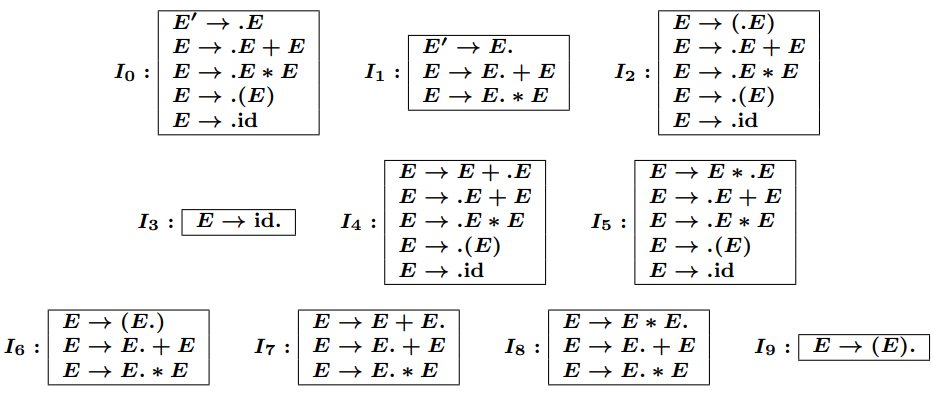 <br>

SLR Parsing Table looks like this <br>

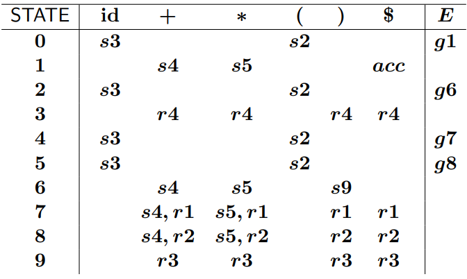 <br>

I7, I8 => 2 conflicts occur(when next input is + and *, shift/reduce)

### Resolving Conflicts with Precedence
Conflicts -> Resolved by assuming that precedence and left-associative <br>

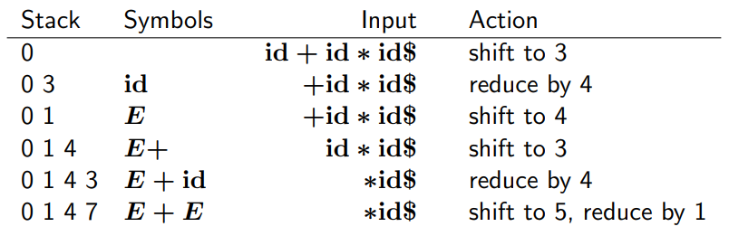 <br>

SHIFT is correct: **reduce** means changing **E+E** into E, we should handle * first <br>

Shift -> "I will read the latter first and then reduce the latter first" <br>

Take shift action when the parser is at state 7 and the next input symbol is * <br>

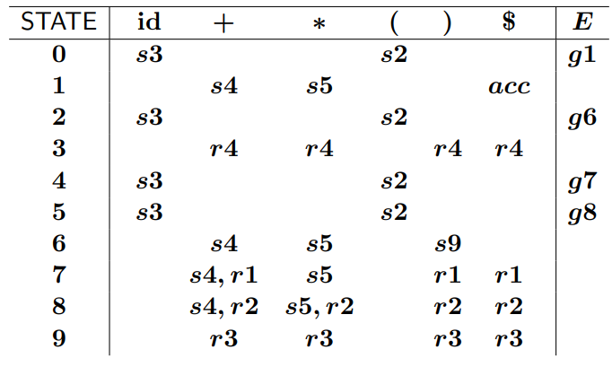 <br>


### Resolving Conflicts with Associativity
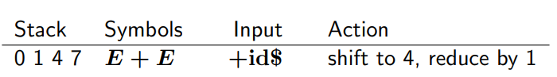

REDUCE is correct: To make left-associative, we have to do reduce first <br>

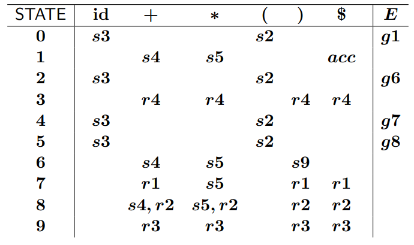

### Exercise
Suppose the parse is at state 8 <br>

#### 1. Which is correct when the next input is +?
I8 has these items
```
E -> E * E.
E -> E. + E
E -> E. * E
```

**id * id + id** can bring us to state 8. Let's check 
```
Stack     Symbols     Input
0                     id*id+id
0 3       id          *id+id
0 1       E           *id+id
0 1 5     E*          id+id
0 1 5 3   E*id        +id
0 1 5 8   E*E         +id
```
Now we are at state 8 and next input is **+** <br>

In this situation, we have to select **reduce** <br>

Selecting reduce means, handling * first than + <br>

If we choose shift, 
```
id * id + id
```
will be interpreted like

```
0 1 5 8 4 7   E * E + E   $ => E + E handled first! 

id * (id + id)
```

To implement precedence, we have to choose **reduce**

#### 2. Which is correct when the next input is *?
```
Stack     Symbols     Input
0                     id*id*id
0 3       id          *id*id
0 1       E           *id*id
0 1 5     E*          id*id
0 1 5 3   E*id        *id
0 1 5 8   E*E         *id
```
Again, we have to choose **reduce**, because of left-associativity <br>

### The "Dangling-Else" Ambiguity
Let's say grammar for conditional statements is like below
```
stmt -> if expr then stmt
     |  if expr then stmt else stmt
     | other
```

This grammar is ambiguous since
```
if E1 then if E2 then S1 else S2
```
has two parse trees <br>

Following is simplified and augmented version. i: if expr then, S: stmt, e: else 
```
S' -> S 
S  -> i S e S | i S | a
```

These are LR(0) states <br>
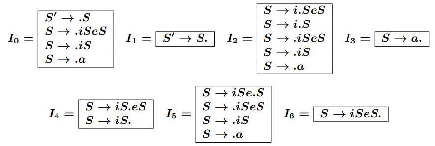

We can guess that there will be shift/reduce conflict in I4 <br>

FOLLOW set of S is {e, $}, so if we make SLR parsing table, shift/reduce happen in (4, e) entry <br>

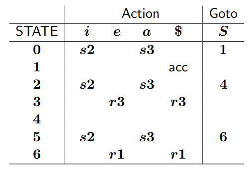 <br>

r2, s5 goes into (4,e) and r2 goes into (4, $)

```
Stack      Symbols      Input
0                       i S e s
0 2        i            S e S
0 4        i S          e S
```

In this situation, we have to select **shift** <br>

If we reduce, else is connected to outer-if statement, but shift can connect **else** to closest if <br>

```
if(condition1) {
    if(condition2) {
        statement;
    } else {
        statement2;
    }
}

If we select reduce, becomes if(condition1) { if(condition2) statement;} else statement2;
```

Intuitively, else is connected to closest-if statement

#### Example
```
Stack       Symbols      Input      action
0                        iiaea$     shift
0 2         i            iaea$      shift
0 2 2       ii           aea$       shift
0 2 2 3     iia          ea$        shift
0 2 2 4     iiS          ea$        reduce 3
0 2 2 4 5   iiSe         a$         shift
0 2 2 4 5 3 iiSea        $          shift
0 2 2 4 5 6 iiSeS        $          reduce 1
0 2 4       iS           $          reduce 2
0 1         S            $          acc
```

#### Exercise
Grammar was ambiguous becuase of dangling-else problem. <br>

```
if expr1 then if expr2 then stmt1 else stmt2
```
This can be parsed in two different ways <br>

We can remove ambiguity by applying rule of "else is connected to closest if" <br>

Ambiguity of above grammar can be removed by introducing auxiliary nonterminals <br>
- M: matched statement (if - else)
- U: unmatched statement (only if)

```
S → M
S → U
M → if expr then M else M  //If unmatched exists, entire statement becomes unmatched
M → other
U → if expr then S
U → if expr then U else S
```

# Lecture 7
Yacc: **Yet Another Compiler-Compiler** <br>

ocamlyacc -> parser generator for OCaml <br>
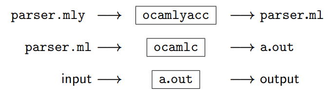 <br>

## Example: Calculator
- ast.ml: abstract Syntax
- eval.ml: evaluator implementation
- parser.mly: input to ocamlyacc
- lexer.mll: input to ocamllex
- main.ml: driver routine

### ast.ml
```
type expr =
   Num of int
 | Add of expr * expr
 | Sub of expr * expr
 | Mul of expr * expr
 | Div of expr * expr
 | Pow of expr * expr
```

Expression of below AST <br>
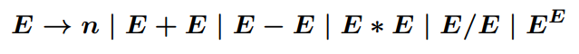

### Grammar Specification
```
%{
    User declarations
}%
    Parser declarations
%%
    Grammar rules
```

- User declarations: OCaml declarations usable from the parser
- Parser declarations: symbols, precednece, associativity (token)
- Grammar rules: productions of the grammar

**parser.mly** looks like this
```
%{
%}

%token NEWLINE LPAREN RPAREN PLUS MINUS MULTIPLY DIV POW
%token <int> NUM

%start program
%type <Ast.expr> program

%%

program : exp NEWLINE { $1 }
exp : NUM { Ast.Num ($1) }
| exp PLUS exp { Ast.Add ($1, $3) }
| exp MINUS exp { Ast.Sub ($1, $3) }
| exp MULTIPLY exp { Ast.Mul ($1, $3) }
| exp DIV exp { Ast.Div ($1, $3) }
| exp POW exp { Ast.Pow ($1, $3) }
| LPAREN exp RPAREN { $2 }

```

NUM -> int type value that has sementic value <br>

start program -> Start variable of CFG <br>

<Ast.expr> -> Denotes that this type of value is generated when program is read <br>

$1 -> Keyword of yacc <br>

```
NUM { Ast.Add ($1)}
```
NUM goes to $1 <br>

```
exp PLUS exp { Ast.Add ($1, $3)} 
```
first exp goes to $1 and second exp goes to $3, second token PLUS is not used

**lexer.mll** looks like this
```
{
  open Parser
  exception LexicalError
}

let number = [’0’-’9’]+
let blank = [’ ’ ’\t’]

rule token = parse
  | blank { token lexbuf }
  | ’\n’ { NEWLINE }
  | number { NUM (int_of_string (Lexing.lexeme lexbuf)) }
  | ’+’ { PLUS }
  | ’-’ { MINUS }
  | ’*’ { MULTIPLY }
  | ’/’ { DIV }
  | ’^’ { POW }
  | ’(’ { LPAREN }
  | ’)’ { RPAREN }
  | _ { raise LexicalError }
```

This is mapping defined token. <br>

Open Parser is for using defined tokens <br>

When faced **\n**, return NEWLINE <br>

**eval.ml** looks like this
```
open Ast

let rec eval : expr -> int
=fun e ->
  match e with
  | Num n -> n
  | Add (e1, e2) -> (eval e1) + (eval e2)
  | Sub (e1, e2) -> (eval e1) - (eval e2)
  | Mul (e1, e2) -> (eval e1) * (eval e2)
  | Div (e1, e2) -> (eval e1) / (eval e2)
  | Pow (e1, e2) -> pow (eval e1) (eval e2)
and pow a b =
  if b = 0 then 1 else a * pow a (b-1)
```

**main.ml**
```
let main () =
  let lexbuf = Lexing.from_channel stdin in
  let ast = Parser.program Lexer.token lexbuf in
  let num = Eval.eval ast in
    print_endline (string_of_int num)

let _ = main ()
```

**Makefile**
```
all:
  ocamlc -c ast.ml
  ocamlyacc parser.mly
  ocamlc -c parser.mli
  ocamllex lexer.mll
  ocamlc -c lexer.ml
  ocamlc -c parser.ml
  ocamlc -c eval.ml
  ocamlc -c main.ml
  ocamlc ast.cmo lexer.cmo parser.cmo eval.cmo main.cmo

clean:
  rm -f *.cmo *.cmi a.out lexer.ml parser.ml parser.mli
```

### Conflicts
```
$ make
ocamlc -c ast.ml
ocamlyacc parser.mly
25 shift/reduce conflicts.  => ocamlycc tells if there is conflicts
ocamlc -c parser.mli
ocamllex lexer.mll
12 states, 267 transitions, table size 1140 bytes
...
```

Can resolve conflicts like this
```
%left PLUS MINUS
%left MULTIPLY DIV
%right POW
```

Precedence goes up as it go down (PLUS < DIV < POW) <br>

left, right means associativity <br>

### Example: The While Language
Following is sample usage

```
// sum.c
n := 10; i := 1;
fact := 1;
while (i <= n) {
    fact := fact * i;
    i := i + 1;
}
print (fact);

// fact.c
n := 10; i := 1;
evens := 0; // sum of even numbers
odds := 0; // sum of odd numbers
while (i <= n)
{
    if (!(i % 2 == 1) && i % 2 == 0) {
        evens := evens + i;
}   else {
        odds := odds + i;
    }
    i := i + 1;
}
print (evens);
print (odds);
```

AST looks like this
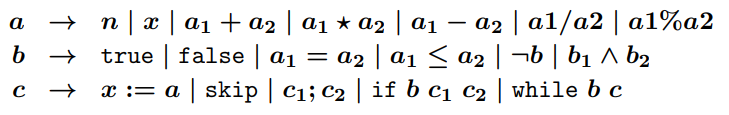
```
type var = string

type aexp =
| Int of int | Var of var
| Add of aexp * aexp | Sub of aexp * aexp
| Mul of aexp * aexp | Div of aexp * aexp | Mod of aexp * aexp

type bexp =
| Bool of bool
| Eq of aexp * aexp
| Le of aexp * aexp
| Neg of bexp
| Conj of bexp * bexp

type cmd =
| Assign of var * aexp
| Skip
| Seq of cmd * cmd
| If of bexp * cmd * cmd
| While of bexp * cmd
| Print of aexp

type program = cmd
```

### Grammar specification
**parser.mly**
```
%{
%}

%token <string> IDENT
%token <int> NUMBER
%token <bool> BOOLEAN
%token LPAREN RPAREN LBRACE RBRACE SEMICOLON EOF
%token BAND NOT LE EQ PLUS MINUS STAR SLASH MOD ASSIGN SKIP PRINT IF ELSE WHILE

%left BAND
%left EQ
%left LE
%left PLUS MINUS
%left STAR SLASH MOD
%right NOT

%type <Ast.cmd> cmd
%type <Ast.aexp> aexp
%type <Ast.bexp> bexp
%type <Ast.program> program

%start program

%%
```

Let's implement rest of the parser.mly
```
$start program

%% 

program: cmd EOF {$1}

cmd :
	| IDENT ASSIGN aexp SEMICOLON { Ast.Assign ($1, $3)}
	| SKIP SEMICOLON { Ast.Skip }
	| cmd cmd { Ast.Seq ($1, $2) }
	| IF LPAREN bexp RPAREN LBRACE cmd RBRACE ELSE LBRACE cmd RBRACE { Ast.If ($3, $6, $10) }
	| WHILE LPAREN bexp RPAREN LBRACE cmd RBRACE { Ast.WHILE ($3, $6) }
	| PRINT LPAREN aexp RPAREN SEMICOLON {Ast.Print $2}

aexp:
  | NUMBER { Ast.Int $1 }
  | IDENT { Ast.Var $1 }
  | aexp PLUS aexp { Ast.Add ($1, $3) }
  | aexp MINUS aexp { Ast.Sub ($1, $3) }
  | aexp STAR aexp { Ast.Mul ($1, $3) }
  | aexp SLASH aexp { Ast.Div ($1, $3) }
  | aexp MOD aexp { Ast.Mod ($1, $3) }
  | LPAREN aexp RPAREN { $2 }  => Don't consider parenthesis, just evaluate 
	
bexp:
	| BOOLEAN {Ast.Bool $1}
	| aexp EQ aexp {Ast.Eq ($1, $3) }
	| aexp LE aexp {Ast.Le ($1, $3) }
	| NOT bexp {Ast.Neg $2}
	| bexp BAND bexp {Ast.Conj ($1, $3) }
	| LPAREN bexp RPAREN { $2 }
```

For simplicity, this grammar only considers if-statement like
```
if (bexp1) {
    cmd
}
else{
    cmd
}
```

**lexer.mll**
```
{
  open Parser
  exception LexingError of string
  let kwd_list : (string * Parser.token) list =
    [
      ("true", BOOLEAN true);
      ("false", BOOLEAN false);
      ("if", IF);
      ("else", ELSE);
      ("while", WHILE);
      ("skip", SKIP);
      ("print", PRINT)
    ]
  let id_or_kwd (s : string) : Parser.token =
    match List.assoc_opt s kwd_list with
    | Some t -> t
    | None -> IDENT s
}

let letter = [’a’-’z’ ’A’-’Z’]
let digit = [’0’-’9’]
let number = digit+
let space = ’ ’ | ’\t’ | ’\r’
let blank = space+
let new_line = ’\n’ | "\r\n"
let ident = letter (letter | digit | ’_’)*

let comment_line_header = "//"

rule next_token = parse
  | comment_line_header { comment_line lexbuf }
  | blank { next_token lexbuf }
  | new_line { Lexing.new_line lexbuf; next_token lexbuf }
  | ident as s { id_or_kwd s }
  | number as n { NUMBER (int_of_string n) }
  | ’(’ { LPAREN }
  | ’)’ { RPAREN }
  | ’{’ { LBRACE }
  | ’}’ { RBRACE }
  | ’;’ { SEMICOLON }
  | "==" { EQ }
  | "<=" { LE }
  | ’!’ { NOT }
  | ’+’ { PLUS }
  | ’-’ { MINUS }
  | ’*’ { STAR }
  | ’/’ { SLASH }
  | ’%’ { MOD }
  | "&&" { BAND }
  | ":=" { ASSIGN }
  | eof { EOF }
  | _ as c
    { LexingError (": illegal character \’" ^ (c |> String.make 1) ^ "\’")
        |> Stdlib.raise }

and comment_line = parse
  | new_line { Lexing.new_line lexbuf; next_token lexbuf }
  | eof { EOF }
  | _ { comment_line lexbuf }
```

**eval.ml**
```
open Ast

module State = struct
  type t = (var * int) list
  let empty = []
  let rec lookup s x =
  match s with
  | [] -> raise (Failure (x ^ " is not bound in state"))
  | (y,v)::s’ -> if x = y then v else lookup s’ x
  let update s x v = (x,v)::s
end

let rec eval_a : aexp -> State.t -> int
=fun a s ->
match a with
  | Int n -> n
  | Var x -> State.lookup s x
  | Add (a1, a2) -> (eval_a a1 s) + (eval_a a2 s)
  | Sub (a1, a2) -> (eval_a a1 s) - (eval_a a2 s)
  | Mul (a1, a2) -> (eval_a a1 s) * (eval_a a2 s)
  | Div (a1, a2) -> (eval_a a1 s) / (eval_a a2 s)
  | Mod (a1, a2) -> (eval_a a1 s) mod (eval_a a2 s)

let rec eval_b : bexp -> State.t -> bool
=fun b s ->
match b with
  | Bool true -> true
  | Bool false -> false
  | Eq (a1, a2) -> (eval_a a1 s) = (eval_a a2 s)
  | Le (a1, a2) -> (eval_a a1 s) <= (eval_a a2 s)
  | Neg b’ -> not (eval_b b’ s)
  | Conj (b1, b2) -> (eval_b b1 s) && (eval_b b2 s)

let rec eval_c : cmd -> State.t -> State.t
=fun c s ->
  match c with
  | Assign (x, a) -> State.update s x (eval_a a s)
  | Skip -> s
  | Seq (c1, c2) -> eval_c c2 (eval_c c1 s)
  | If (b, c1, c2) -> eval_c (if eval_b b s then c1 else c2) s
  | While (b, c) ->
    if eval_b b s then eval_c (While (b,c)) (eval_c c s)
    else s
  | Print a -> print_endline (string_of_int (eval_a a s)); s

let eval : program -> State.t
=fun p -> eval_c p State.empty
```

# Lecture 8
We used CFG to specify grammar when performing Syntax analysis <br>

To perform semantic analysis, first have to define the meaning <br>

There are two approaches to specify program semantics <br>

1. Operational Semantics: The meaning is specified by the computation steps executed on a machine 
2. Denotational semantics: The meaning is modelled by mathematical objects that represent the effect of executing the program

## The While Language
**AST** <br>
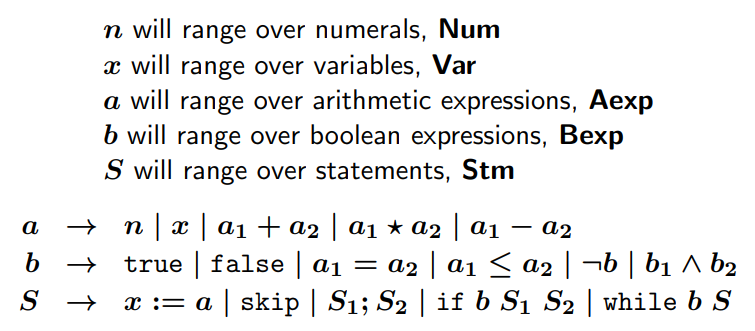 <br>

We can make program like this
```
y:=1; while ¬(x=1) do (y:=y⋆x; x:=x-1)
```
Although it is written like this, actually we can consider this as parsed tree form <br>

## Semantics of Expressions
To define program, have to define **State** <br>

State: Mapping Var to int value 
```
s ∈ State = Var → Z
```

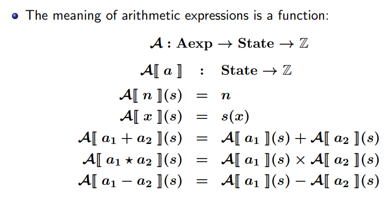 <br>

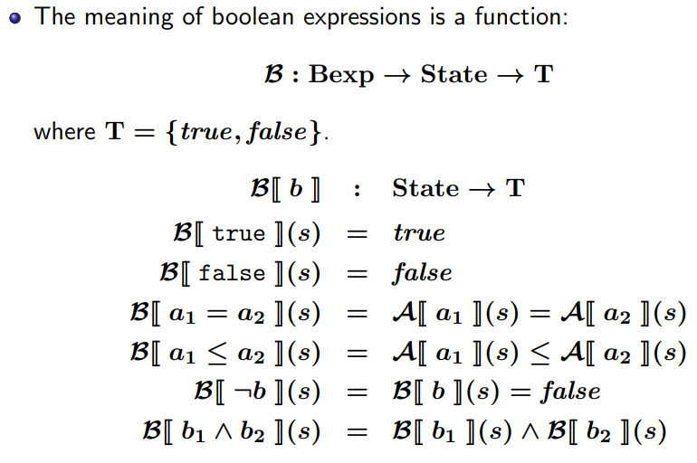 <br>

### Free Variables
Meaning set of variables that appears in expression. Can be defined inductively <br>

No FV for constant and Boolean value
```
FV(n) = ∅
FV(true) = ∅, FV(false) = ∅
```

FV for a varaible is variable itself
```
FV(X) = {X}
```

FV for aexp
```
FV (a1 + a2) = FV (a1) ∪ FV (a2)
FV (a1 ⋆ a2) = FV (a1) ∪ FV (a2)
FV (a1 − a2) = FV (a1) ∪ FV (a2)
```

FV for bexp
```
FV (a1 = a2) = FV (a1) ∪ FV (a2)
FV (a1 ≤ a2) = FV (a1) ∪ FV (a2)
FV (¬b) = FV (b)
FV (b1 ∧ b2) = FV (b1) ∪ FV (b2)
```

Only the free variables influence the value of an expression <br>

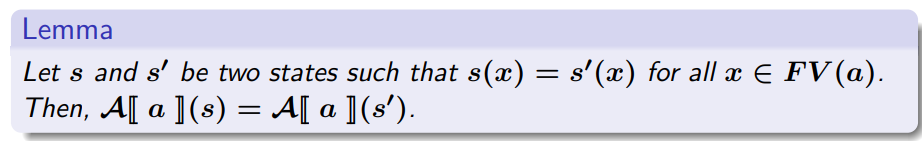 <br>

If two states have same value for all free variable, then evaluation result is also same <br>

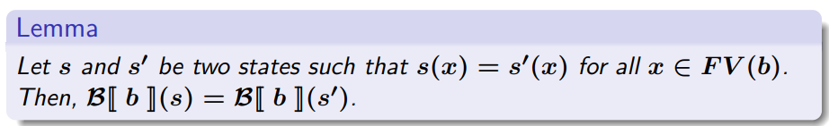 <br>

Similar lemma but about boolean expression

#### Substitution
a[y ↦ a0]: Aexp that is obtained by replacing each occurrence of y in a by a0 <br>

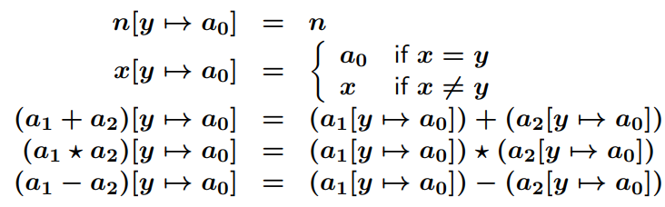 <br>

s[y ↦ v]: state s except that the value bound to y is v (Assignment)

## Operational Semantics
- Big-step: Describes how the overall results of executions are obtained(focus on big picture..)
- Small-step: Describes how the **individual** steps of the computations take place(focus on single step)

Semantics is specified by a transition system (S, →) where S is the set of states (configurations) with two types <br>

- <S, s>: non terminal state(statement S is to be executed from the state s)
- s: terminal state

Transition relation **(→) ⊆ S × S** : describe how the execution take place 

## Bit-Step Operational Semantics
Transition relation specifies the relationship between initial state and final state
```
⟨S, s⟩ → s'
```

Transition relation is defined with inference rule of the form: <br>

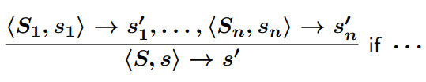 <br>

S1 ~ Sn => Statements that constitute S <br>

Rule has a number of premises and one conclusion <br>

May also have a number of conditions that have to be fulfulled whenever the rule is applied <br>

Rules without premises: **axioms**

### Big-Step Operational Semantics for While
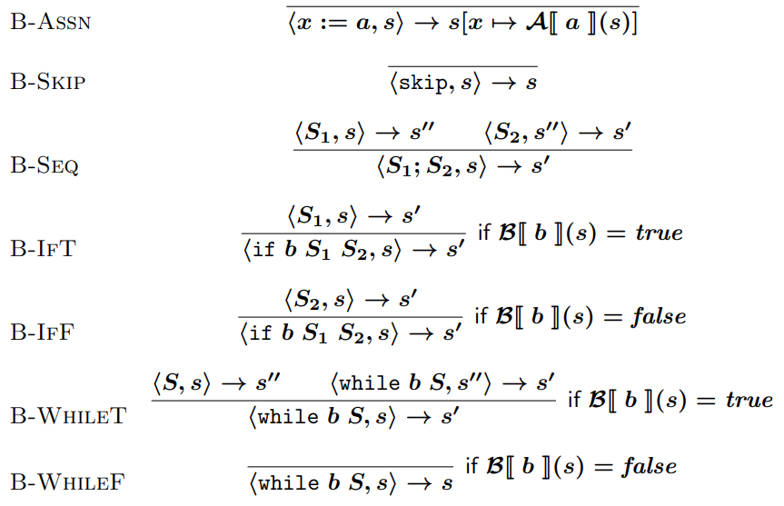 <br>

Example1 <br>
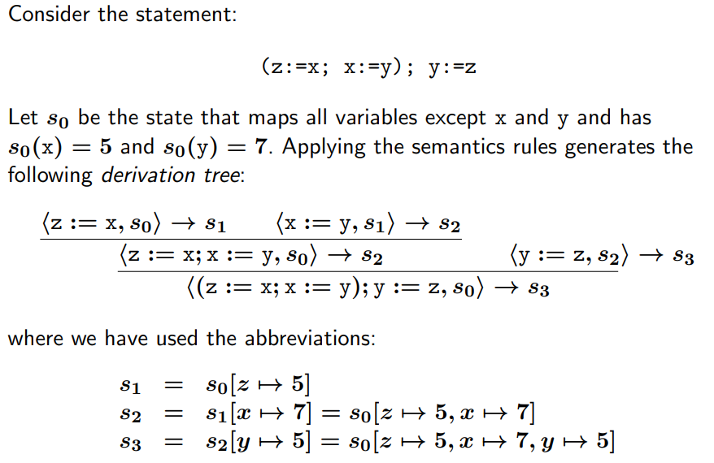 <br>

#### Execution Types
Execution <S, s>...
- Terminates -> if and only if there is state s' such that <S, s> -> s'(Derivation tree is finished)
- Loops -> if and only if there is no state s' (Derivation tree not finishing) <br>

### Semantic Equivalence
S1 = S2: Syntatically equivalent <br>
S1 ≡ S2: Semantically equivalent, if the following is true
```
⟨S1, s⟩ → s'  if and only if ⟨S2, s⟩ → s
```

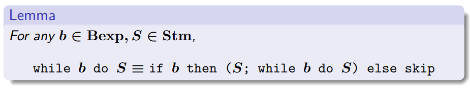 <br>

## Semantic Function for Statements
Semantics of statements can be defined by the partial function <br>

Partial function(↪): Cannot be defined for all possible input <br>

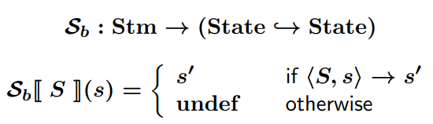 <br>

## Small-Step Operational Semantics
Individual computation steps are described by the transition relation:
```
<S,s> => γ
```

Where γ is non-terminal state <S',s'> or terminal state s' <br>

If γ is non-terminal, then execution of S from s is not completed <br>

If γ is terminal, then exeuction has terminated and final state is s' <br>

<S, s> is stuck if there is no γ such that <S, s> => γ

### Small-Step Operational Semantics for While
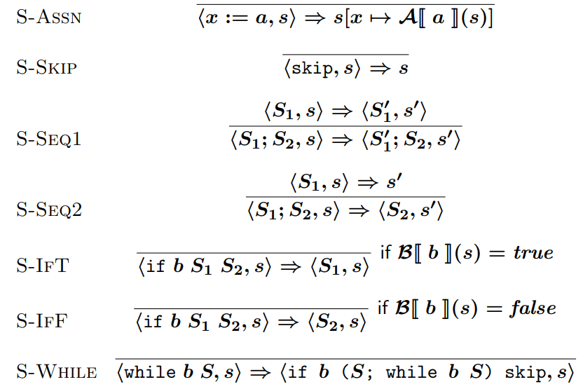 <br>

## Derivation Sequence
Derivation sequence of statement S starting from state s is either: finite sequence, infinite sequence

### Finite sequence
```
γ0, γ1, γ2, ... , γk
```

sometimes written
```
γ0 => γ1 => γ2 => ... => γk
```

consisting of configurations satisfying
```
γ0 = ⟨S, s⟩, γi ⇒ γi+1 for 0 ≤ i < k where k ≥ 0 and γk is either terminal or stuck configuration 
```

### Infinite sequence
```
γ0, γ1, γ2, ...
```

sometimes written as
```
γ0 => γ1 => γ2 => ...
```
consisting of configurations satisfying 
```
γ0 = <S, s> and γi => γi+1 for 0 ≤ i
```

Example <br>
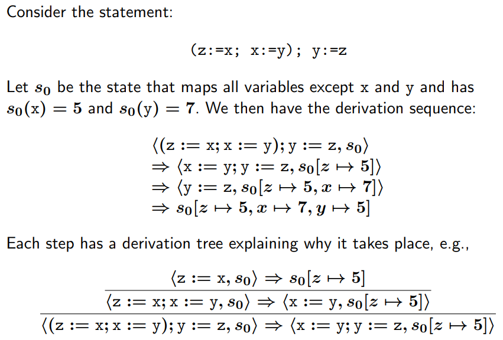 <br>

### Other Notations
γ0 ⇒k γk : Can reach γk after k steps of execution <br>

γ ⇒∗ γ' : Indicate that there are finite number of steps <br>

Execution of a statement S on a state s terminates if and only if there is a finite derivation sequence starting from <S, s> <br>

Infinite derivation sequnce => **loop**

## Semantic Function(Small-step)
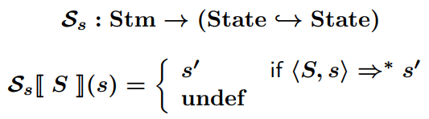 <br>

Sb -> big-step, Ss -> small-step 

## Equivalence of Big-Step and Small-Step Semantics
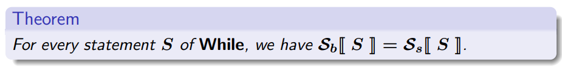 <br>

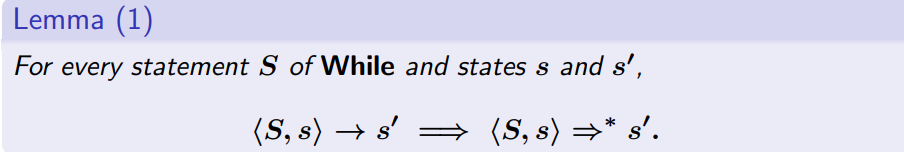 <br>
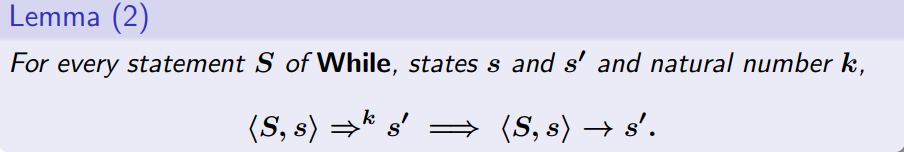 <br>
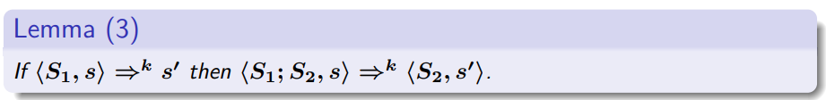 <br>
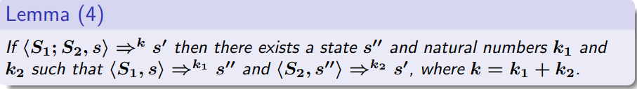 <br>

# Lecture 9
While: Syntax <br>
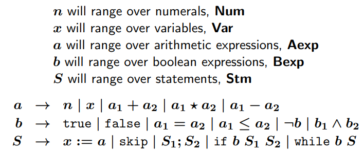 <br>

While: Semantics
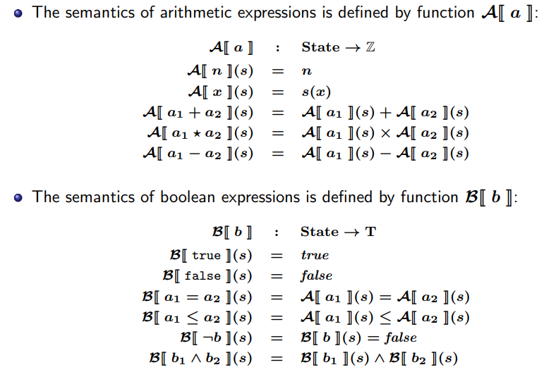 <br>
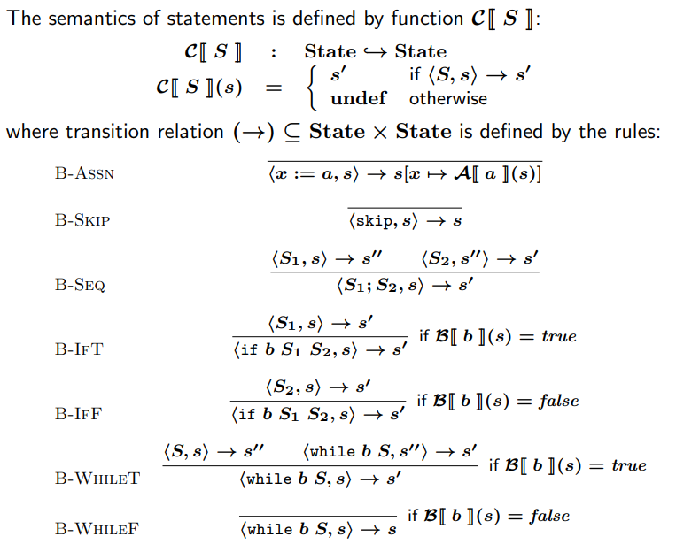 <br>

## Abstract Machine M
```
inst → push(n)
    | add
    | mult
    | sub
    | true
    | false
    | eq
    | le
    | and
    | neg
    | fetch(x)
    | store(x)
    | noop
    | branch(c, c)
    | loop(c, c)

Code ∋ c → ϵ
        | inst :: c
```

## Small-Step Operational Semantics
Configuration of M consists of three components
```
⟨c, e, s⟩ ∈ Code × Stack × State
```

c: sequence of instructions to be executed <br>

e: evaluation stack, Evaluation stack is a list of value:
```
Stack = (Z ∪ T)∗
```
used to evaluate arithmetic and boolean expressions

s: memory state, maps variables to values
```
State = Var → Z
```

A configuration is a terminal, if code component is empty 

## Transition Relation
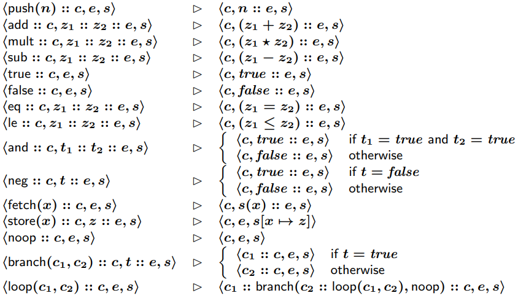

## Semantic Function
semantcis of code c ∈ Code is deinfed by partial function <br>

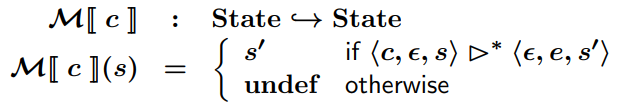 <br>

and Compilation Rules <br>
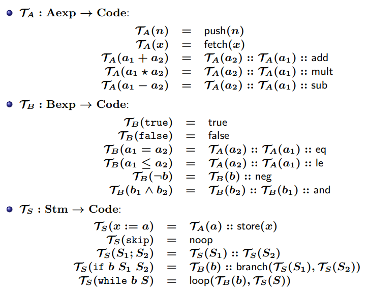 

## Compiler correctness
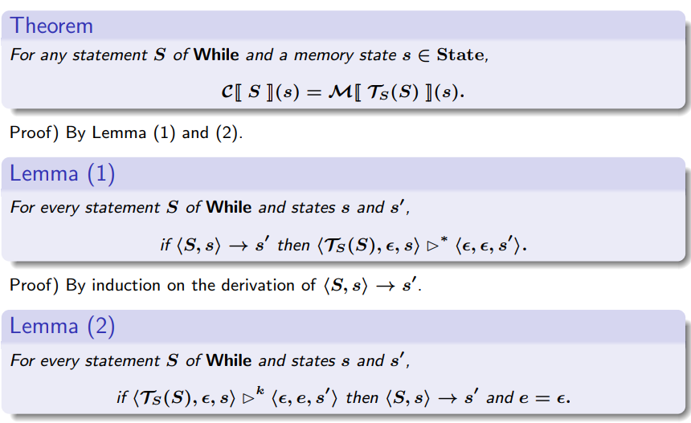 <br>
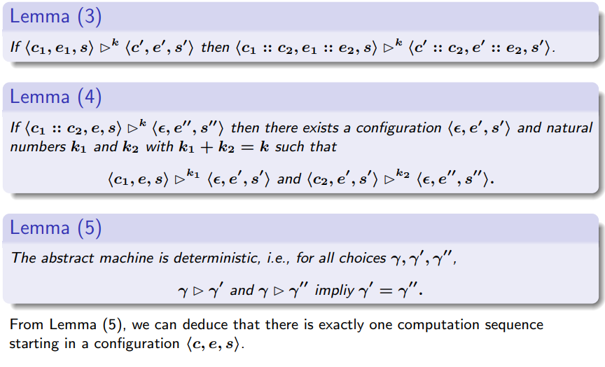 <br>
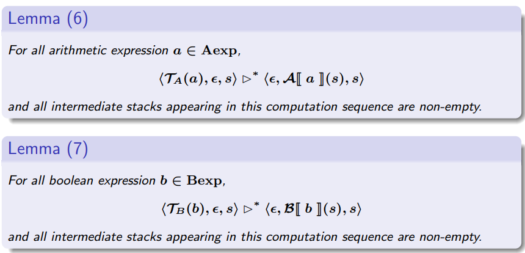

# Lecture 10
Translation from AST to IR <br>

IR is more suitable for analysis and optimzation, and translation to executable

## Source Language S
```
{
    int x;
    x = 0;
    print (x+1);
}

{
    int x;
    x = -1;
    if (x) { print (-1); }
    else { print (2); }
}

{
    int x;
    read (x); -> User input 
    if (x == 1 || x == 2) print (x); else print (x+1);
}

{ int sum; int i;
    i = 0; sum = 0;
    while (i < 10) {
        sum = sum + i;
        i++;
    }
    print (sum);
}
{ int[10] arr; int i;
    i = 0;
    while (i < 10) {
        arr[i] = i;
        i++;
    }
    print (i);
}
```

## Intermidiate Language T
```
{
    int x;
    x = 0;
    print (x+1);
}

0 : x = 0
0 : t1 = 0
0 : x = t1
0 : t3 = x
0 : t4 = 1
0 : t2 = t3 + t4
0 : write t2
0 : HALT
```

0: => label. 0 means dummy label, not target of goto 

```
{
    int x;
    x = -1;
    if (x) {
        print (-1);
    } else {
        print (2);
    }
}

0 : x = 0
0 : t2 = 1
0 : t1 = -t2
0 : x = t1
0 : t3 = x
0 : if t3 goto 2
0 : goto 3
2 : SKIP
0 : t5 = 1
0 : t4 = -t5
0 : write t4
0 : goto 4
3 : SKIP
0 : t6 = 2
0 : write t6
0 : goto 4
4 : SKIP
0 : HALT
```

## Abstract Syntax of S
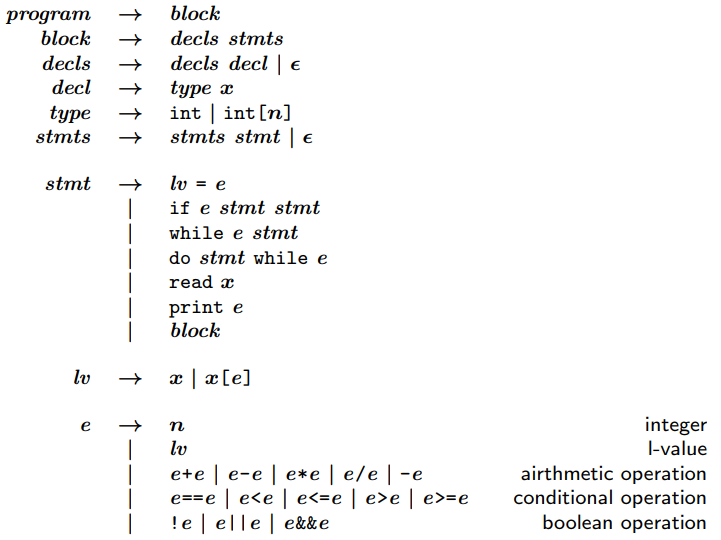 

## Semantics of S
Statement changes the memory state of the program(int i; int[10] arr; i = 1;) <br>

Memory -> mapping from locations to values 
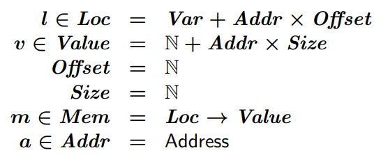 <br>

Following is Semantics Rules <br>

### Runtime Errors in S
For example, 
```
M(x) = (a, n2),0<=n1<n2
```
This means array and range both should be valid 

## Syntax of T

## Semantics
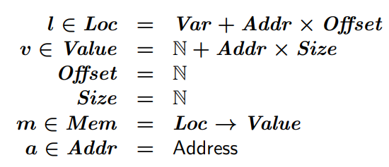 <br>

