# COSE-312
https://prl.korea.ac.kr/courses/cose312/2025/

# Index
- [1. Lecture 1](#lecture-1)
- [2. Lecture 2](#lecture-2)
- [3. Lecture 3](#lecture-3)
- [4. Lecture 4](#lecture-4)

# Lecture 1
Compiler: Software that **tranlates** source language into target language <br>

Target language is usually machine language(x86), but not always <br>

Java => First compiles into intermediate form named **bytecodes** 

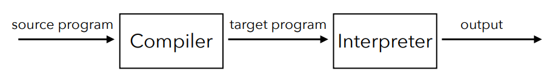

Compiler should preserve the meaning(semantics) of the source program

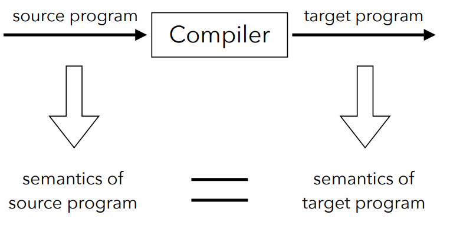

## Structure of Compilers

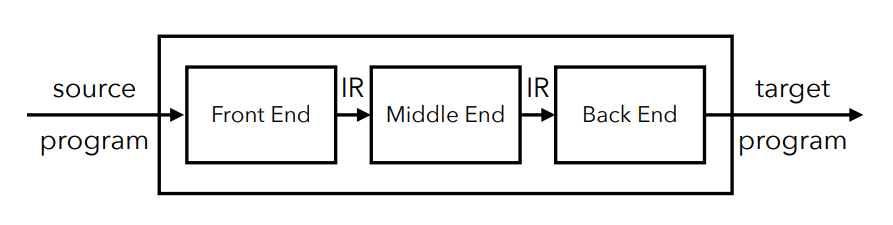

## Front End
Input : source program(character string) => Translate into **Intermediate Representation(IR)** <br>

IR: 2-dimensional structure. Abstract-Syntax-Tree <br>

### Lexical Analyzer
Character Stream -> Token Stream <br>

Token: Defined as pair of **Type** and **Value**

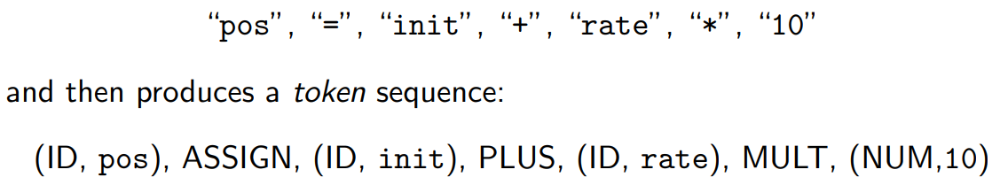

### Syntax Analyzer
Token Stream -> Syntax Tree <br>

With Syntax Tree, semantics of the program appears

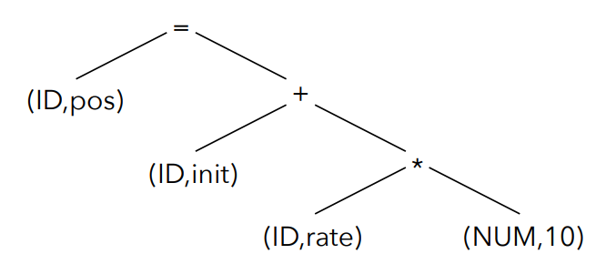

### Semantic Analyzer
Check semantic correctness of input program(very hard) <br>

Syntactic correctness can be checked perfectly with parser <br>

Semantic correctness is much more complicated and tricky <br>

Type checking is important. Make sure every operator has **matching operand**

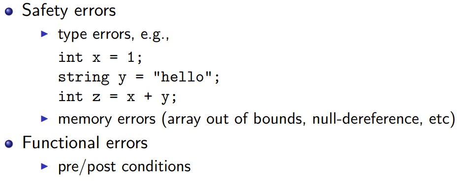

### IR Translator
Syntax Tree -> IR (IR is also tree structure) <br>

Intermediate Representation:
- lower-level than source language
- higher-level than target language

Three-Address Code -> At most two operand on right side <br>

Why using IR? -> Reuse, Optimization...

### Optimizer
Consists of multiple optimizers

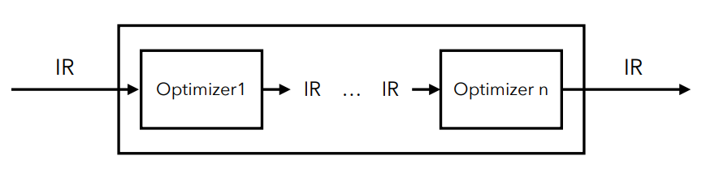

Let's look at a simple example

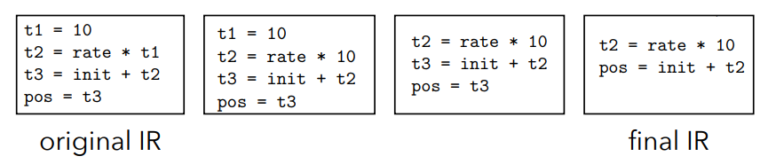

Following features have been applied

- Constant propagation: Substitute subject of allocation into value itself
- Deadcode elimination: Delete unnecessary code 
- Copy elimination

## Back End
IR -> Target machine code <br>

Difference between high-level and low-level: <br>

Register Allocation Problem: cannot use many variables in machine code <br>

But this problem is NP, solvale at least

## Summary
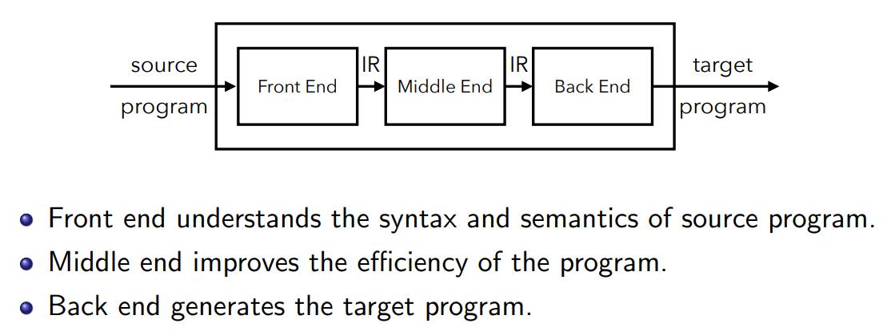

# Lecture 2
Character sequence into token sequence based on **white space** <br>

parenthesis, char(keyword), star, if -> Thing like this are counted separately <br>

```
float match0 (char *s) /* find a zero */
{if (!strncmp(s, "0.0", 3))
    return 0.0;
}
```

Given this code...

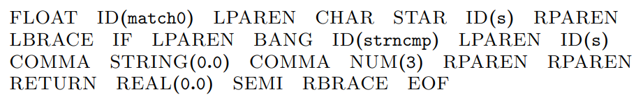

EOF: End Of File <br>

To do lexing...
- Specification: How to specify lexical patterns (Regular Expression)
- Recognition: How to **recognize** lexical patterns (DFA)
- Automation: How to automatically generate string recognizer from spec
(Thompson's construction and subset construction)

## Specification
### Alphabet
Alpabet Σ is a **finite, non-empty** set of symbols <br>

### Strings
String: finite sequence of symbols chosen from alphabet <br>

For example: 1, 01, 10110 are strings over Σ = {0, 1}

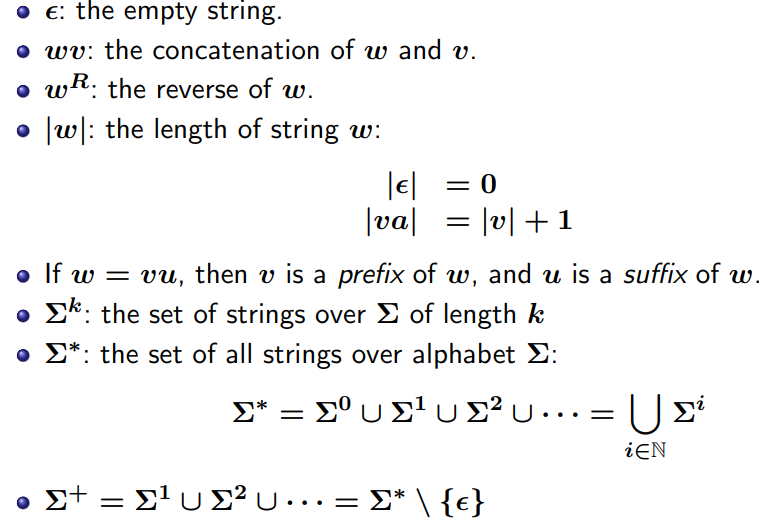

### Languages
Language L is a subset of Σ∗: L ⊆ Σ∗

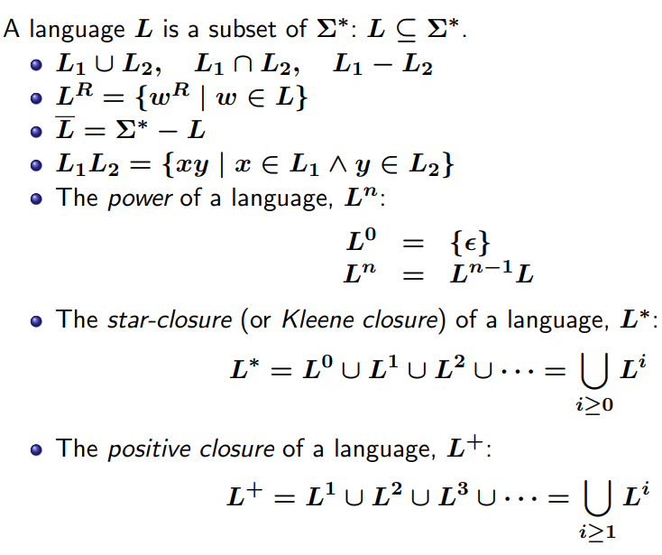

### Regular Expressions
Meta language that specifies another language <br>

Since regular expression is language, it has syntax and semantics <br>

Syntax: Usually define with **context free grammar**
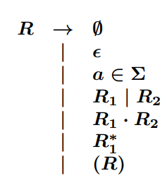
- Regular expressions (R) are defined recursively, with simpler regular expressions as components.
- The set of strings described by a regular expression forms a regular language, which is a specific type of formal language that can be recognized by a finite automaton. <br>

Semantics: L(R) => Meaning of Regular Expression R. L(R) is subset of Σ*
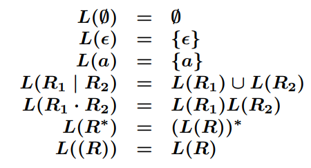

### Regular Definitions
It's inconvenient to express all the specifications with Regular Expressions <br>

Regular Definition: Give names to regular expressions and use the names in subsequent expressions <br>

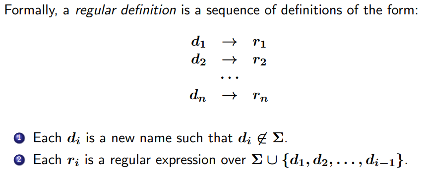

### Extensions of Regular Expressions
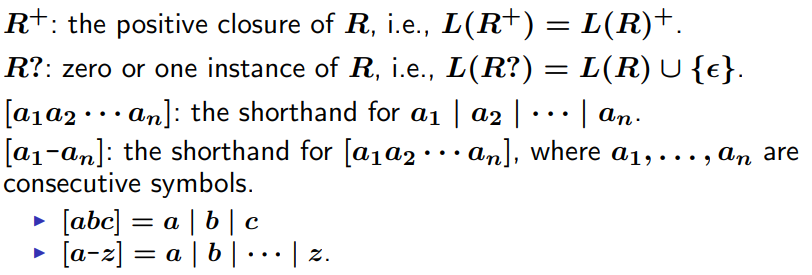

## String Recognition by Finite Automata
Implement recognized pattern with finite automata

### NFA
NFA eventually means set of strings that NFA accepts(recognizable strings) <br>

Lexical Analyzer: Change string into equivalent NFA -> DFA <br>

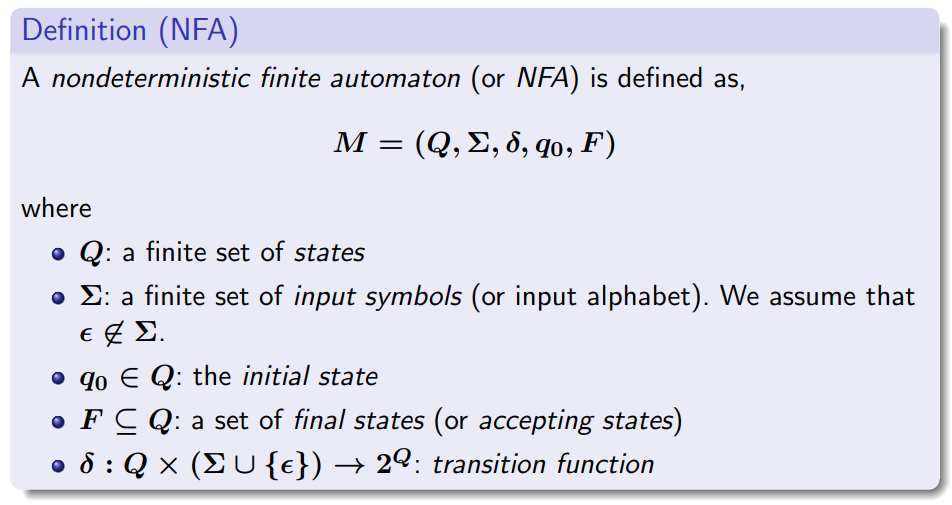
-2Q -> Power set of Q. Set of every subset of Q
-if Q={q0, q1, q2}, 2^Q =  { {}, {q0}, {q1}, {q2}, {q0,q1}, {q0,q2}, {q1,q2}, {q0,q1,q2}}

### DFA
DFA is special case of NFA
- No moves on ϵ
- For each state and input symbol, next state is unique 

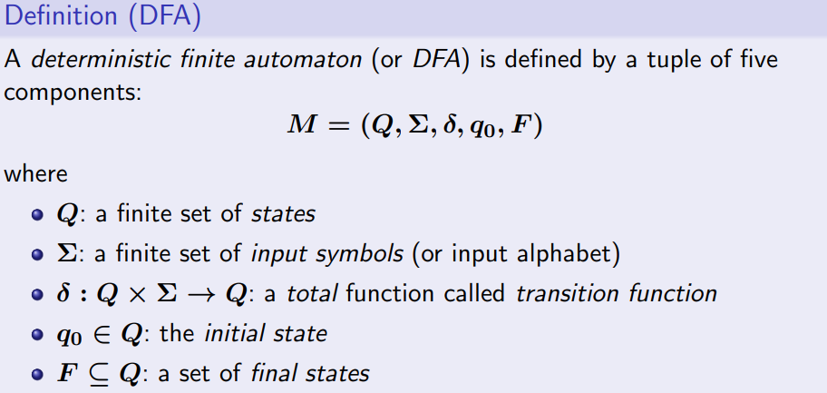

## Automation
RE --- Thompson's contruction ---> NFA --- subset construction ---> DFA <br>

### Principles of Compilation
Every automatic compilation 
- is done **compositionally** and
- maintains some **invariants** during compilation 

If program looks like this: R1|R2 <br>
- Compilation of R1|R2 is defined in terms of compilation of R1 and R2
- Compiled NFAs for R1 and R2 satisfy the invariants:
    - NFA has only one accepting state
    - no arc into initial state, and out of accepting state 

Source Language:
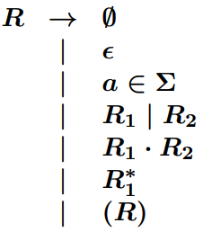

### Compilation(Base Cases)
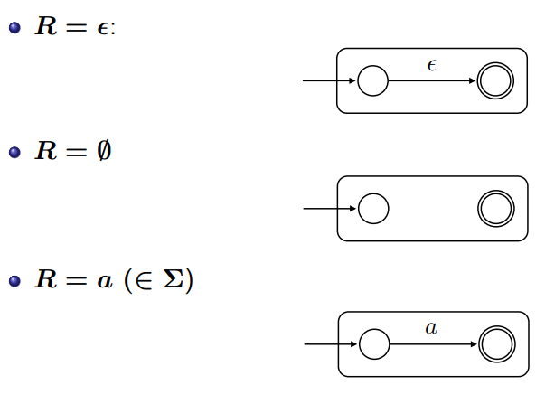
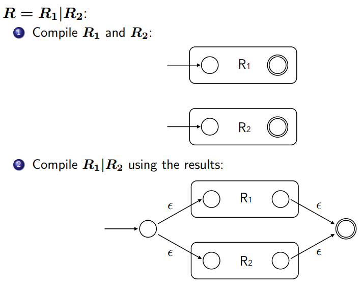
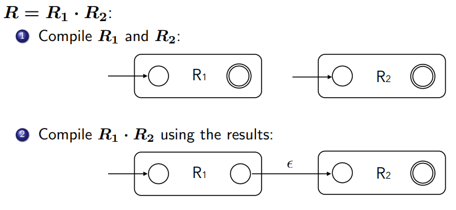
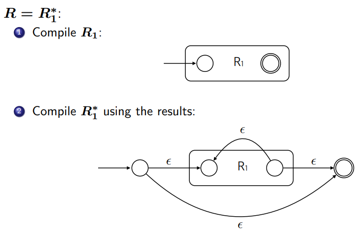

### ϵ-Closures
ϵ-Closure(I) => Set of states reachable from I without consuming any symbols <br>

### Running Example
1. Initial DFA state is d0 = ϵ0Closure({0})
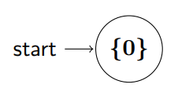
2. For initial state S, consider every x ∈ Σ and compute corresponding next state
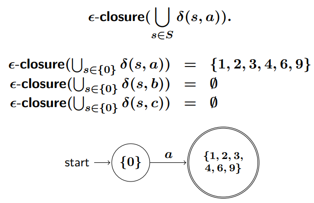
3. For the state {1,2,3,4,6,9}, compute next states
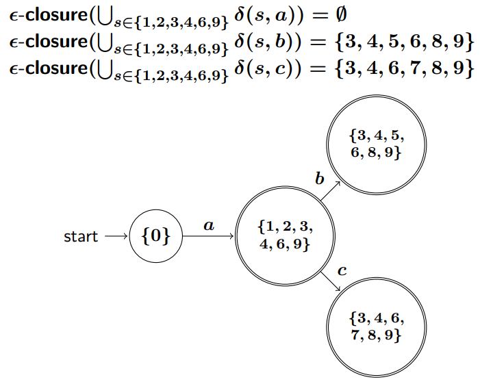

Continue until nothing changes <br>

Those states that include NFA's accepting state becomes DFA's accepting state.

### Subset Construction Algorithm
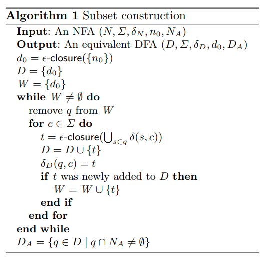

### Algorithm for computing ϵ-Closures
Formal definition: T = ϵ-Closure(I) is the smallest set such that
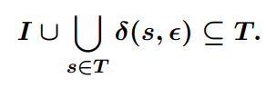
Alternatively, T is the smallest solution of the equation F(X) ⊆ (X) where
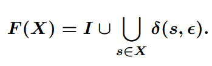

Such solution is called the **least fixed point of F** <br>

Following is fixed point iteration algorithm 

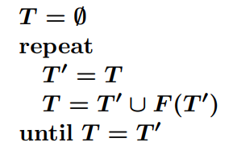

# Lecture 3
Build parse tree (syntax tree) 

## Context-Free Grammar
Regular is weak to express 2-dimensional structure. Have ot use Context-Free Grammar<br>

Palindrome(w∈{0,1}∗|w=wR) is representative example of CFG. Not regular but context-free <br>

Every context-free grammar is defined by recursive definition 
- Bases: ϵ, 0, 1 -> palindromes
- Induction: If w is palindrome, so are 0w0, 1w1
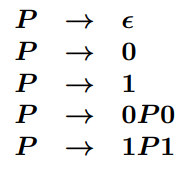

## Derivation 
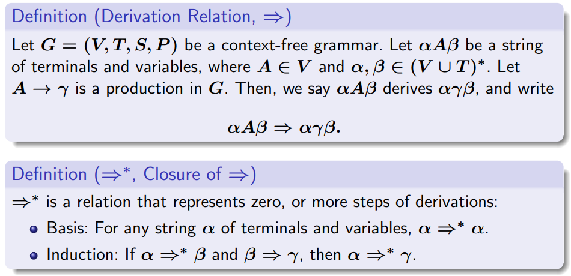

To check if a string is contained in some grammar, can do it by derivation <br>

From the start variable, if the string can be derived, that string is contained in grammar <br>

Parsing => Doing derivation in reverse 

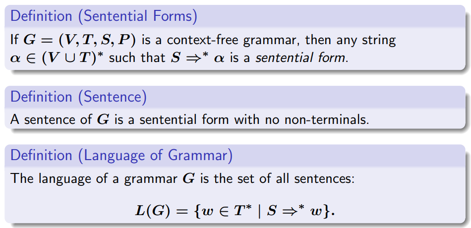

- Leftmost Derivation(=>l): **Leftmost non-terminal** in each sentential is always chosen
- Rightmost Derivation(=>r): **Rightmost non-terminal** in each sentential is always chosen 

If S ⇒∗l α,α is left sentential form. =>*r -> right sentential form

## Parse Tree
Graphical tree-like representation of derivation <br>

Parse tree ignores variations in the order in which symbols are replaced <br>

```
E ⇒ −E ⇒ −(E) ⇒ −(E + E) ⇒ −(id + E) ⇒ −(id + id)
E ⇒ −E ⇒ −(E) ⇒ −(E + E) ⇒ −(E + id) ⇒ −(id + id)
```

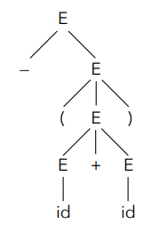

If derivation use same set of rules -> parse tree is identical 

## Ambiguity
Grammar is **ambiguous** if
- Produces more than one parse tree for some sentence
- Has multiple leftmost derivations
- Has multiple rightmost derivations

## Eliminating Ambiguity
E → E + E | E ∗ E | (E) | id -> Make layers of grammar 

1. Precedence: bind * tighter than +
1 + 2 * 3 => Always parse by 1 + (2 * 3)
2. Associativity: * and + associate to the left
1 + 2 + 3 => Always parse by (1 + 2) + 3

## Eliminating Left-Recursion
E -> E + T | T : left-recursive form <br>

Rewrite grammar using right recursion

```
E -> T E'
E' -> + T E'
E' -> ϵ
```

In general,
```
A → Aα | β 
```

can change like below
```
A → βA′
A′ → αA′| ϵ
```

### Left Factoring
```
S → if E then S else S
S → if E then S
```
This grammar has rules with the same prefix. => **Left Fator**

```
S → if E then S X
X → ϵ
X → else S
```

In general, if A → αβ1 | αβ2 are two A-productions, can refactor like this
```
A → αA′
A′ → β1 | β2
```

## Non-Context-Free Language Constructs
Case 1: <br>
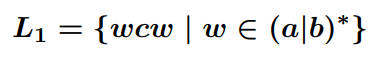

First w => Declaration of identifier w <br>
Second w => Use of identifier <br>

This problem is about checking identifier before using it <br>

However, CFG cannot handle this <br>

Case 2: <br>
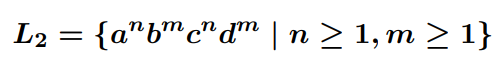

Modeling of checking function's parameter number <br>

Checking these properties is usually done during **semantic-analysis** 

# Lecture 4
Top-Down Parsing : Constructing parse tree starting from the root -> leaf <br>

Key Problem: When doing leftmost derivation, which rule should be selected? 

Expression Grammar:
```
E → T E′
E′ → + T E′| ϵ
T → F T′
T′ → ∗ F T′| ϵ
F → (E) | id
```

## Parsing Table
Parsing table for expression grammar looks like this
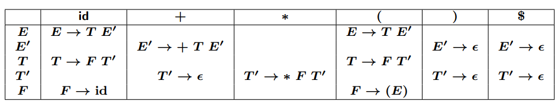
- $ -> endmarker <br>

Sequence of predictive parsing for **id + id * id** <br>
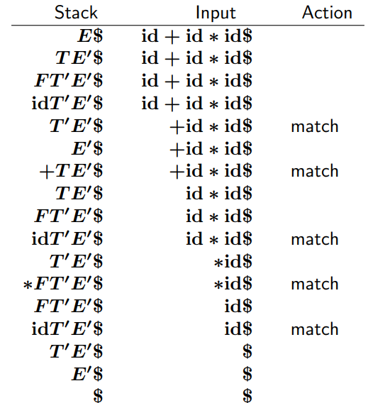

Following is predictive parsing algorithm
- Input: string w and paring table M for grammar G
- Output: leftmost derivation of w or error
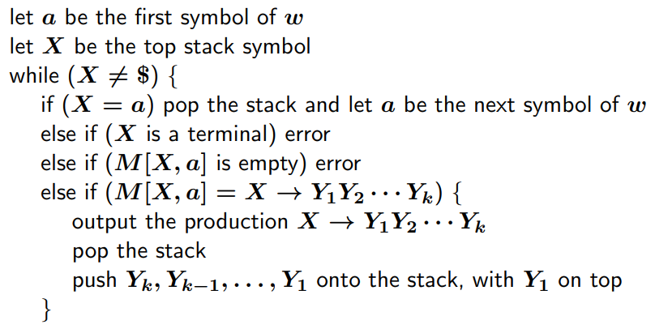

## Construct Parsing Table
- Compute FIRST and FOLLOW sets of the grammar
- Contruct the parsing table using these sets

### FIRST and FOLLOW
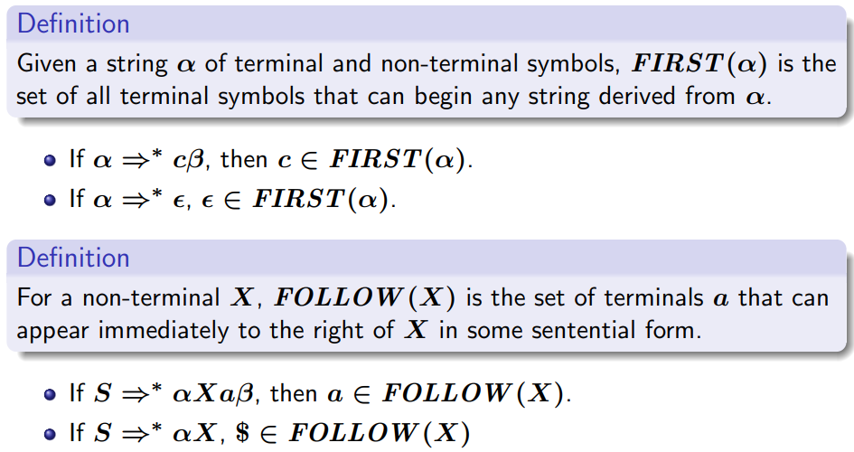

Let's calculate for example grammar
```
E → T E′          -> 1
E′ → + T E′| ϵ    -> 2
T → F T′          -> 3 
T′ → ∗ F T′| ϵ    -> 4
F → (E) | id      -> 5
```

- FIRST(F):
{'(', 'id'} by rule 5
- FIRST(T):
Look at rule 3 => Get FIRST(F) => {'(', 'id'}
- FIRST(E):
By rule 1, goto rule 3, and then look up FIRST(F) => {'(', 'id'}
- FIRST(E'):
By rule 2, {'+', 'ϵ'}
- FIRST(T'):
By rule 4, {'*', 'ϵ'}
<br>
- FOLLOW(E): Add endmaker to FOLLOW set of start symbol
By rule 5, {'$', ')'}
- FOLLOW(E')
In rule 1, nothing behind E', so add FOLLOW(E) to FOLLOW(E'). {'$', ')'}
- FOLLOW(T)
In rule 1, there are two cases. Since ϵ contained in FIRST(E'), can add FOLLOW(E) to FOLLOW(T). And, by rule 2, add (FIRST(E') - ϵ) also. {'$', ')', '+'}
- FOLLOW(T')
By rule 3, add FOLLOW(T) into FOLLOW(T'). {'$', ')', '+'}
- FOLLOW(F)
In rule 3, if T' goes to ϵ, add FOLLOW(T) into FOLLOW(F). If not, add FIRST(T') also. {'$', ')', '+', '*'}

### Algorithm for computing FIRST
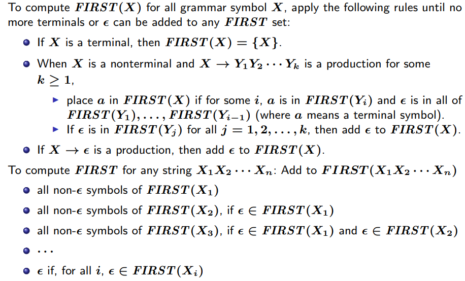
### Algorithm for computing FOLLOW
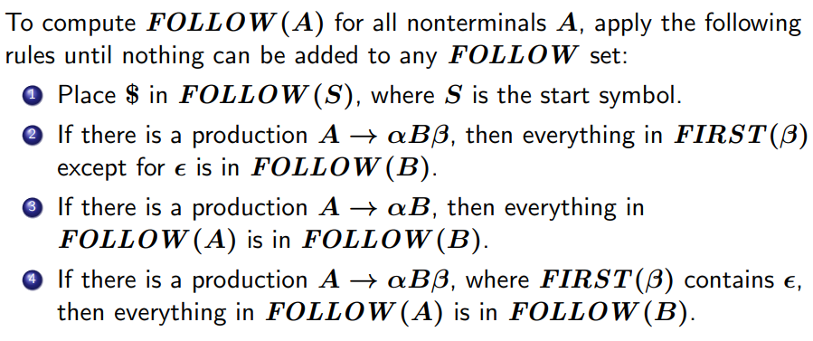

Exercise: <br>
```
X → Y | a
Y → c | ϵ
Z → d | X Y Z
```

FIRST(X): {'a', 'c', 'ϵ'} <br>
FIRST(Y): {'c', 'ϵ'} <br>
FIRST(Z): {'d', 'a', 'c'} <br>
FOLLOW(X): {'$', 'c', 'a', 'd'} <br>
FOLLOW(Y): {'$', 'd', 'a', 'c'} From X->Y, add FOLLOW(X) to FOLLOW(Y)<br>
FOLLOW(Z): {'$'} <br>

### Construction of Parsing Table
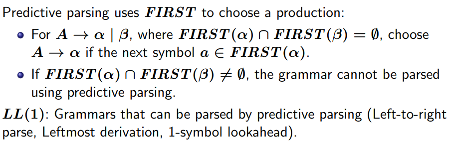
Build table M[A, a]: A is nonterminal, and a is a terminal or $ <br>

Idea:
- Choose A → α, if the next symbol a is in FIRST(α)
- If α =>* ϵ, choose A → α if a ∈ FOLLOW(A)

Algorithm
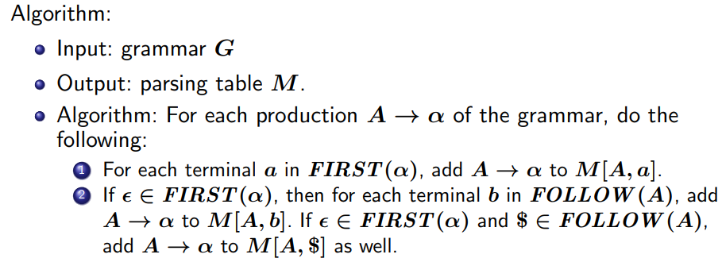

# Lecture 5
Bottom Up is more powerful. Just making unambiguous is fine
```
1. E -> E+T
2. E -> T
3. T -> T * F
4. T -> F
5. F -> (E)
6. F -> id
```

Bottom-Up Parsing: Construct a parse tree beginning at the leaves and working up toward the root

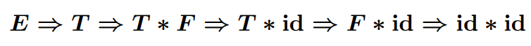
Construct rightmost-derivation in reverse

## Handle
Have to make choice when to **reduce** and when to **match** <br>

Ex: When T * id, 2 or 6 <br>

Handle: Substring that matches the body of a production and whose production leads to a right-sentential form <br>

**Find a handle and reduce!**

## LR Parsing
- L : Left-to-right scanning of the input
- R : Rightmost-derivation in reverse
- k : k-tokens lookahead 

Handles are recognized by a DFA 

### LR Parsing Overview
LR parser has **stack** and **input**. Based on the lookahead and stack, perform two actions: <br>

- Shift: Performed when the top of the stack is not a handle
Move the first input token to the stack
- Reduce: Performed when the top of the stack is a handle
Choose a rule X -> A B C; pop C,B,A; push X <br>

Example
```
1. E -> E+T
2. E -> T
3. T -> T * F
4. T -> F
5. F -> (E)
6. F -> id
```
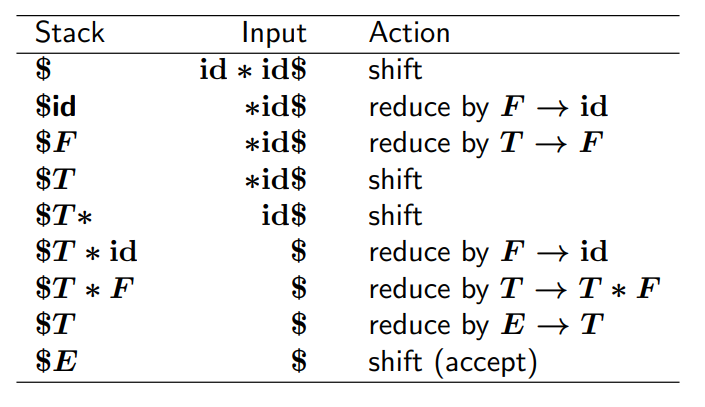

### Recognizing Handles
With DFA, can make transition table for expression grammar <br>

For non-terminal symbols, **goto** are defined(State transition) <br>

acc (accept) only exists where endmarker is.

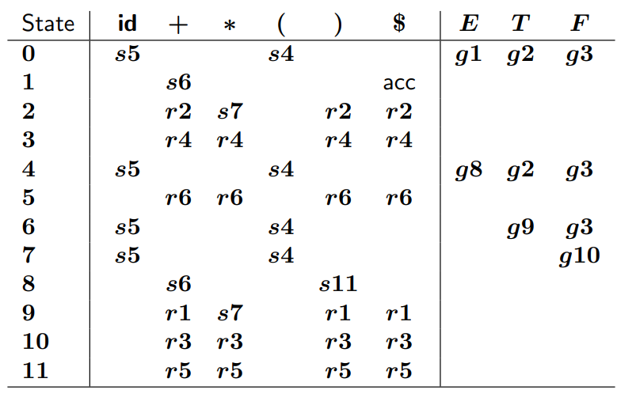

- Parse state:
Stack: T*, Input: id$
Run the DFA on stack, treating shift/goto actions as edges of the DFA: 0 -> 2 -> 7
Look up the entry (7, id) -> shift 5(not a handle)
Push id onto the stack
-Parse state:
Stack: T*id, Input: $
Run the DFA on stack: 0 -> 2 -> 7 -> 5
Look up the entry (5, $) -> reduce 6(handle)
Reduce by rule 6: F -> id

### LR Parsing Process
Stack maintains DFA states:
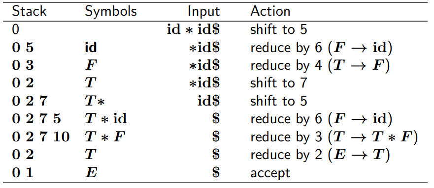

Algorithm is like below
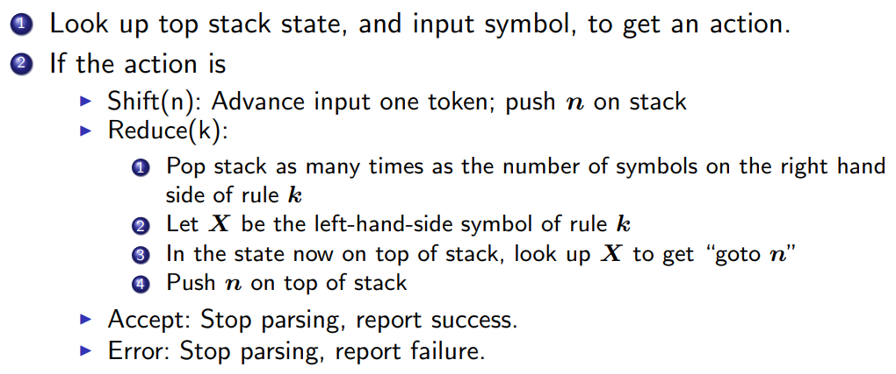

## LR(0) and SLR Parser Generation
We can make a parsing table only if we make a corresponding automata <br>

Node is set of some rules, and edges consists of symbols and $(accept) <br>

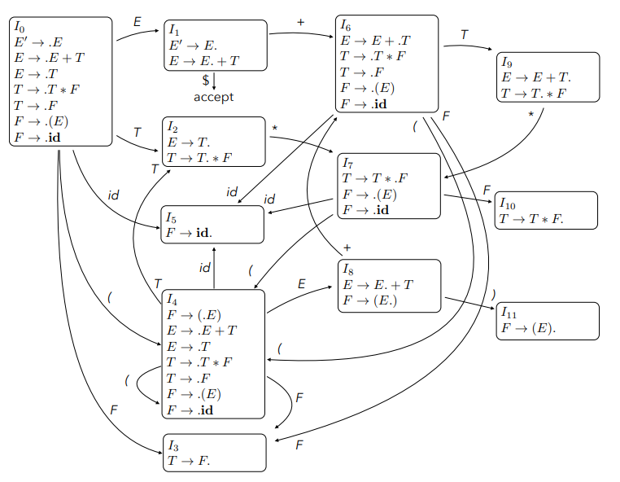

### LR(0) Items
State => Set of **items** <br>

Item => Production with a dot somewhere on the body

```
<Items for A -> XYZ >
A -> .XYZ
A -> X.YZ
A -> XY.Z
A -> XYZ.
```
Dot => Denoting progress of parsing. How far it read, and how many left.... <br>

A -> ϵ has only one item: A -> ·

### The Initial Parse Stat
Before making automata, we usually append Rule 0: E' -> E, for convenience <br>

Initially, parser will have empty stack, and input will be complete E-sentence indicated by item **E' -> .E** <br>

Collect all of the items reachable from initial item without consuming any input tokens
```
E' -> .E
E  -> .E + T
E  -> .T
T  -> .T * F
T  -> .F
F  -> .(E)
F  -> .id
```
This is I0. Parser cannot distinguish among I0's items without consuming any symbol 

### Closure of Item Sets
If I is a set of items for a grammar G, then CLOSURE(I) is the set of items constructed from I by the two rules:
- Initially, add every item in I to CLOSURE(I)
- If A -> α.Bβ is in CLOSURE(I) and B -> γ is a production, then add the item B → .γ to CLOSURE(I), if it is not already there. Apply this rule until no more new itmes can be added(Fixed Point)

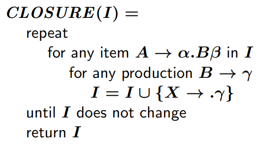

### Construction of LR(0) Automaton
After making I0, construct the next states for each grammar symbol(goto function) <br>

To goto I1 consuming E, **E'->.E** -> **E'->E.**. Can make I1 with closure <br>

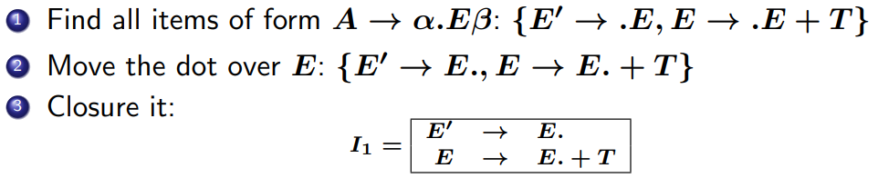

### Goto
I: set of items, X: symbol <br>

GOTO(I,X) => Closure of the set of all items A -> αX.β such that A -> α.Xβ is in I <br>

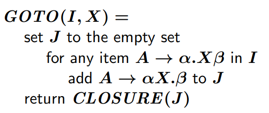

## Construction of LR(0) Automaton
T: set of states, E: set of edges

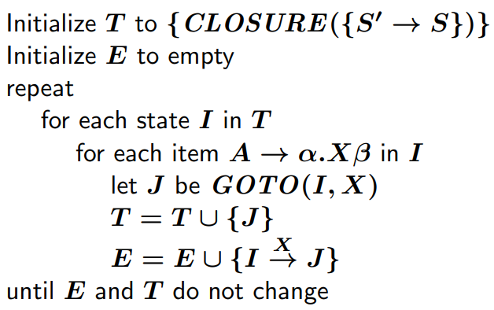

### Construction of LR(0) Parsing Table
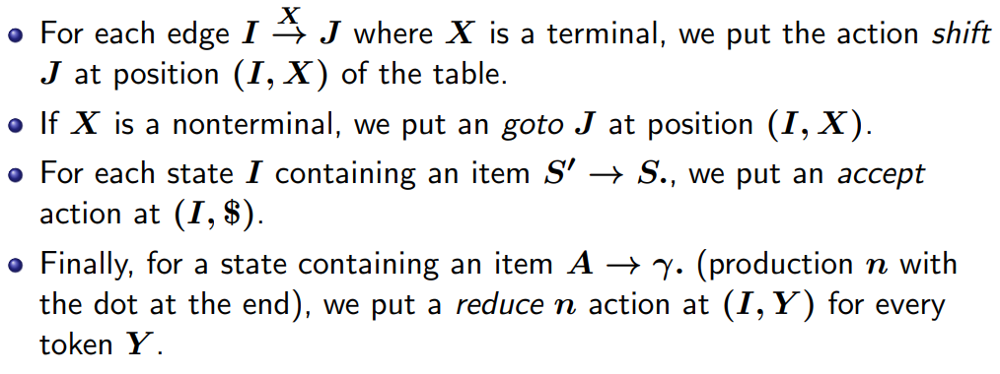
For any token X, if there is item like **A -> X.**, automatically add reduce

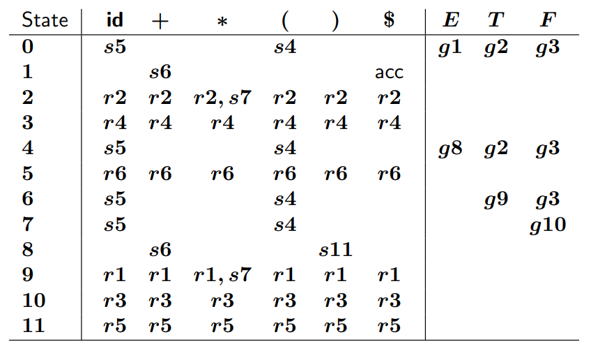

## Conflicts
Duplicated entries => Conflict <br>

- Shift/reduce => Parser cannot decide whether to shift or reduce
- Reduce/reduce => Parser cannot decide which reduction to perform

If no conlict in LR(0) parsing table => LR(0) Grammar

## Construction of SLR Parsing Table
Let's think about **E->T.** case. According to LR(0) algorithm, it automatically add reduce to all I2 symbols. <br>

We can perform additional check with FOLLOW set <br>

Example: **T * id**. If we choose reduce, it becomes **E * id**. This occurs parsing error. 

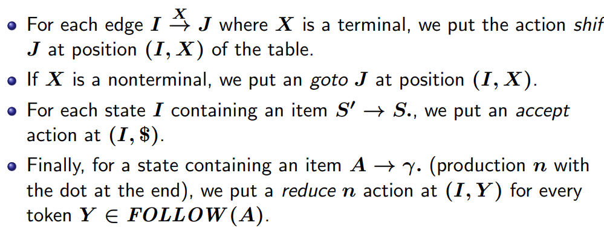

Following is SLR table

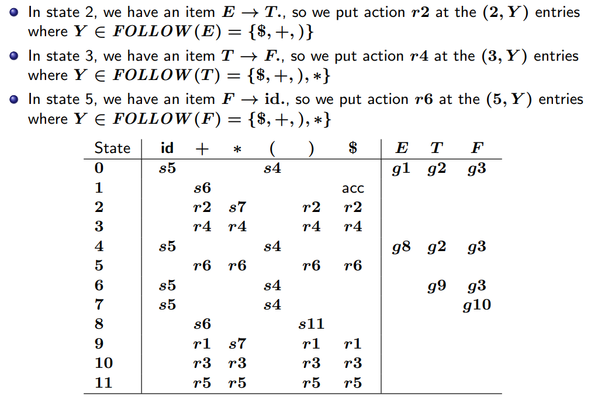

### Limitaions of SLR
Consider this unambiguous grammar
```
S -> L = R | R
L -> *R | id
R -> L
```

I2
```
S -> L. = R
R -> L.
```

I6
```
S -> L = .R
R -> .L
L -> .*R
L -> .id
```

Since **R -> L.** we can add r3 for the token inside FOLLOW(R) = {=,$}. <br>

But, we already made **=** entry from I2 to I6, so when given 
```
Stack: L
Input: = id
```
situation, we get shift/reduce conflict

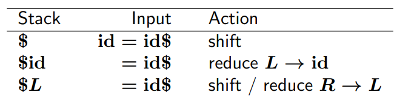

## More Powerful LR Parsers
- LR(1): Parsing table is based on LR(1) items.
(R->L,$): reduce with R->L when the next token is $ => Generate large set of states
- LALR(1): based on LR(0) items, introducing lookaheads into LR(0) items. 