# COSE-312
https://prl.korea.ac.kr/courses/cose312/2025/

# Index
- [1. Lecture 1](#lecture-1)
- [2. Lecture 2](#lecture-2)
- [3. Lecture 3](#lecture-3)
- [4. Lecture 4](#lecture-4)
- [5. Lecture 5](#lecture-5)
- [6. Lecture 6](#lecture-6)
- [7. Lecture 7](#lecture-7)
- [8. Lecture 8](#lecture-8)
- [9. Lecture 9](#lecture-9)
- [10. Lecture 10](#lecture-10)

# Lecture 1
Compiler: Software that **tranlates** source language into target language <br>

Target language is usually machine language(x86), but not always <br>

Java => First compiles into intermediate form named **bytecodes** 


Compiler should preserve the meaning(semantics) of the source program


## Structure of Compilers


## Front End
Input : source program(character string) => Translate into **Intermediate Representation(IR)** <br>

IR: An internal representation of the source program. A common example is an Abstract Syntax Tree (AST), which is a tree structure. Other forms, such as Three-Address Code, are more linear. <br>

### Lexical Analyzer
Character Stream -> Token Stream <br>

Token: Defined as pair of **Type** and **Value**


### Syntax Analyzer
Token Stream -> Syntax Tree <br>

The Syntax Tree primarily represents the grammatical structure of the token stream. This structure is then utilized by the Semantic Analyzer to derive and verify the program's meaning (semantics).


### Semantic Analyzer
Check semantic correctness of input program(very hard) <br>

Syntactic correctness can be checked perfectly with parser <br>

Semantic correctness is much more complicated and tricky <br>

Type checking is important. Make sure every operator has **matching operand**


### IR Translator
Syntax Tree -> IR (IR is also tree structure) <br>

Intermediate Representation:
- lower-level than source language
- higher-level than target language

Three-Address Code (TAC) instructions typically involve at most three addresses: one for the result and up to two for the source operands. A common form is `x = y op z` (e.g., `t1 = a + b`), which clearly uses three addresses. Other forms include `x = op y` (e.g., `t2 = -c`) and `x = y` (e.g., `t3 = d`). <br>

Why using IR? -> Reuse, Optimization...

### Optimizer
Consists of multiple optimizers


Let's look at a simple example


The transformation involves several optimization techniques:
1. Original IR: `t1=10; t2=rate*t1; t3=init+t2; pos=t3`
2. After Constant Propagation (substituting `t1`'s value): `t1=10; t2=rate*10; t3=init+t2; pos=t3`
3. After Dead Code Elimination (removing `t1` as it's no longer used): `t2=rate*10; t3=init+t2; pos=t3`
4. After Copy Propagation (replacing `t3` in `pos=t3` with `init+t2`) and subsequent Dead Code Elimination (removing `t3=init+t2`): `t2=rate*10; pos=init+t2` (This is the Final IR shown in the diagram).

## Back End
IR -> Target machine code <br>

Difference between high-level and low-level: <br>

Register Allocation Problem: Target machines have a finite number of registers, while programs may use many variables. Efficiently mapping these variables to registers is crucial. Finding an optimal register allocation is an NP-hard problem, so compilers typically use heuristics to find good, practical solutions.

## Summary


# Lecture 2
The lexical analyzer converts a stream of input characters into a stream of tokens. It identifies tokens by matching patterns (e.g., for identifiers, keywords, numbers) and uses delimiters such as whitespace, punctuation, and the start of other recognizable patterns to separate them. <br>

parenthesis, char(keyword), star, if -> Thing like this are counted separately <br>

```
float match0 (char *s) /* find a zero */
{if (!strncmp(s, "0.0", 3))
    return 0.0;
}
```

Given this code... <br>


EOF: End Of File <br>

To do lexing...
- Specification: How to specify lexical patterns (Regular Expression)
- Recognition: How to **recognize** lexical patterns (DFA)
- Automation: How to automatically generate string recognizer from spec
(Thompson's construction and subset construction)

## Specification
### Alphabet
Alpabet Σ is a **finite, non-empty** set of symbols <br>

### Strings
String: finite sequence of symbols chosen from alphabet <br>

For example: 1, 01, 10110 are strings over Σ = {0, 1} <br>


### Languages
Language L is a subset of Σ∗: L ⊆ Σ∗


### Regular Expressions
Meta language that specifies another language <br>

Since regular expression is language, it has syntax and semantics <br>

Syntax: Usually define with **context free grammar** <br>
 <br>
- Regular expressions (R) are defined recursively, with simpler regular expressions as components.
- The set of strings described by a regular expression forms a regular language, which is a specific type of formal language that can be recognized by a finite automaton. <br>

Semantics: L(R) => Meaning of Regular Expression R. L(R) is subset of Σ* <br>


### Regular Definitions
It's inconvenient to express all the specifications with Regular Expressions <br>

Regular Definition: Give names to regular expressions and use the names in subsequent expressions <br>


### Extensions of Regular Expressions


## String Recognition by Finite Automata
Implement recognized pattern with finite automata

### NFA
NFA eventually means set of strings that NFA accepts(recognizable strings) <br>

The process of building a lexical analyzer from a set of regular expressions (which define token specifications) typically involves these steps:
1. Each regular expression is converted into an NFA (e.g., using Thompson's construction).
2. These individual NFAs are combined (if there are multiple token types).
3. The resulting NFA is then converted into an equivalent DFA (e.g., using subset construction).
This DFA is then used by the lexical analyzer at runtime to recognize tokens in the input character stream. <br>


-2Q -> Power set of Q. Set of every subset of Q
-if Q={q0, q1, q2}, 2^Q =  { {}, {q0}, {q1}, {q2}, {q0,q1}, {q0,q2}, {q1,q2}, {q0,q1,q2}}

### DFA
DFA is special case of NFA
- No moves on ϵ
- For each state and input symbol, next state is unique 


## Automation
RE --- Thompson's contruction ---> NFA --- subset construction ---> DFA <br>

### Principles of Compilation
Every automatic compilation 
- is done **compositionally** and
- maintains some **invariants** during compilation 

If program looks like this: R1|R2 <br>
- Compilation of R1|R2 is defined in terms of compilation of R1 and R2
- Compiled NFAs for R1 and R2 satisfy the invariants:
    - NFA has only one accepting state
    - no arc into initial state, and out of accepting state 

Source Language:


### Compilation(Base Cases)


### ϵ-Closures
$\epsilon\text{-Closure}(I)$ => Set of states reachable from $I$ without consuming any symbols <br>

### Running Example
This example demonstrates the subset construction algorithm, which converts an NFA to an equivalent DFA.
Let's consider an NFA (not explicitly drawn here due to space, but assume it's defined) with the following characteristics relevant to this example:
  - A set of states $Q_\text{NFA}$ includes $\{0, 1, 2, 3, 4, 5, 6, 7, 8, 9, ...\}$.
  - State $\{0\}$ is the start state of this NFA.
  - The input alphabet $\Sigma = \{a, b, c\}$.
  - A transition function $\delta_{NFA}$ and $\epsilon$-transitions, which lead to the results shown in the steps below.

The goal is to construct a $\text{DFA } D = (Q_\text{DFA}, \sum, \delta_\text{DFA}, d_0, F_\text{DFA})$.

1. **Initial DFA state $d_0$:** <br>
The initial state of the DFA, $d_0$, is the $\epsilon\text{-closure}$ of the NFA's start state. <br>
For our assumed NFA, let the start state be $q_0 = \{0\}$. <br>
If there are no $\epsilon$-transitions from state $0$ to other states that would expand this set, then: <br>
$d_0 = \epsilon\text{-closure}(\{0\}) = \{0\}$ <br>

2.  **Compute transitions from $d_0$ (which is $S = \{0\}$ in this step):** <br>
    For $d_0 = \{0\}$ and each input symbol $x \in \Sigma$, we compute $\delta_{DFA}(d_0, x) = \epsilon\text{-closure}(\text{move}(d_0, x))$. <br>
    The operation $\text{move}(S', \text{input})$ is defined as $\bigcup_{s \in S'} \delta_{NFA}(s, \text{input})$.

    The general formula for this step is shown in the image: <br>
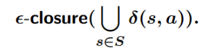

    * For input symbol 'a': <br>
        Let $S = \{0\}$. We need $\text{move}(\{0\}, a) = \bigcup_{s \in \{0\}} \delta_{NFA}(s, a)$. <br>
        The example states: $\epsilon\text{-closure}(\bigcup_{s \in \{0\}} \delta_{NFA}(s, a)) = \{1, 2, 3, 4, 6, 9\}$. <br>
        Let this new DFA state be $d_1 = \{1, 2, 3, 4, 6, 9\}$. So, $\delta_{DFA}(\{0\}, a) = d_1$. <br>

    * For input symbol 'b': <br>
        The example states: $\epsilon\text{-closure}(\bigcup_{s \in \{0\}} \delta_{NFA}(s, b)) = \emptyset$. <br>
        This means $\text{move}(\{0\}, b)$ must have been $\emptyset$.
        So, $\delta_{DFA}(\{0\}, b) = \emptyset$. (This often implies a transition to a non-accepting "dead state" in the DFA, or an error if no transition is defined). <br>

    * For input symbol 'c': <br>
        The example states: $\epsilon\text{-closure}(\bigcup_{s \in \{0\}} \delta_{NFA}(s, c)) = \emptyset$. <br>
        So, $\delta_{DFA}(\{0\}, c) = \emptyset$. <br>
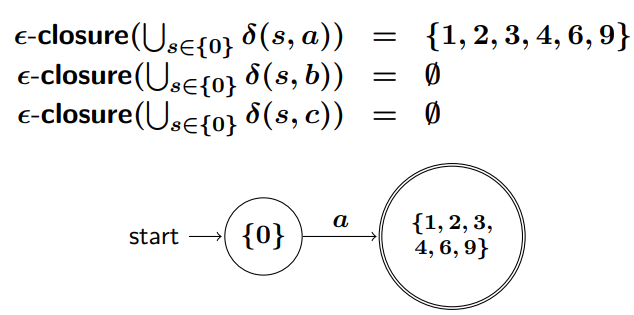
<br>
3. **Compute transitions from new DFA states (e.g., $d_1 = \{1, 2, 3, 4, 6, 9\}$):** <br>
    Now consider the new (unmarked) DFA state $d_1 = \{1, 2, 3, 4, 6, 9\}$. For each input symbol $x \in \Sigma$, compute $\delta_{DFA}(d_1, x) = \epsilon\text{-closure}(\text{move}(d_1, x))$.

    * For input symbol 'a' from state $d_1$: <br>
        The example states: $\epsilon\text{-closure}(\bigcup_{s \in \{1,2,3,4,6,9\}} \delta_{NFA}(s, a)) = \emptyset$. <br>
        So, $\delta_{DFA}(d_1, a) = \emptyset$. <br>

    * For input symbol 'b' from state $d_1$: <br>
        The example states: $\epsilon\text{-closure}(\bigcup_{s \in \{1,2,3,4,6,9\}} \delta_{NFA}(s, b)) = \{3, 4, 5, 6, 8, 9\}$. <br>
        Let this new DFA state be $d_2 = \{3, 4, 5, 6, 8, 9\}$. So, $\delta_{DFA}(d_1, b) = d_2$.

    * For input symbol 'c' from state $d_1$: <br>
        The example states: $\epsilon\text{-closure}(\bigcup_{s \in \{1,2,3,4,6,9\}} \delta_{NFA}(s, c)) = \{3, 4, 6, 7, 8, 9\}$. <br>
        Let this new DFA state be $d_3 = \{3, 4, 6, 7, 8, 9\}$. So, $\delta_{DFA}(d_1, c) = d_3$. <br>


This process of taking new DFA states, computing their transitions for each symbol in $\Sigma$, and identifying further new DFA states continues until no new DFA states are generated. The set of all NFA states within a DFA state $d_i$ that are final states in the NFA determines if $d_i$ is a final state in the DFA.

### Subset Construction Algorithm


### Algorithm for computing ϵ-Closures
The $\epsilon$-closure of a set of NFA states $I$, denoted $\epsilon$-closure($I$), is the set of all NFA states reachable from any state $s \in I$ by following zero or more $\epsilon$-transitions.

Formal definitions: (Inductive)<br>
$\epsilon\text{-closure}(I)$ is defined as the smallest set of NFA states $T$ such that:
1. Base Case: Every state in $I$ is in $T$ (i.e., $I \subseteq T$).
2. Inductive Step: If a state $s$ is in $T$, and there is an $\epsilon$-transition from $s$ to $s'$ (i.e., $s' \in \delta(s, \epsilon)$ in the NFA's transition function), then $s'$ is also in $T$.
<br>

This set $T$ contains all states reachable from any state in $I$ by following zero or more $\epsilon$-transitions. <br>
The property that $T$ is the smallest such set, closed under $\epsilon$-transitions starting from $I$, can also be characterized by the condition: <br>
 <br>
This signifies that $T$ must include $I$, and any state reachable by one $\epsilon$-move from any state already in $T$ must also be part of $T$ (implying no further expansion is possible beyond $T$). <br>
<br>
Alternatively, as a Least Fixed Point: <br>
We can define a function $F(X)$ that computes the set $I$ along with all states reachable in one $\epsilon$-step from states in $X$: <br>
 <br>
The $\epsilon\text{-closure}(I)$ is the smallest set $T$ that satisfies the equation $T = F(T)$. <br>
This solution T is called the least fixed point of F.<br>
<br>
This least fixed point can be found by iterative application of F, as shown in the algorithm below.<br>

The following iterative algorithm computes this least fixed point: <br>


# Lecture 3
Build parse tree (syntax tree) 

## Context-Free Grammar
Regular is weak to express 2-dimensional structure. Have ot use Context-Free Grammar<br>

Palindrome(w∈{0,1}∗|w=wR) is representative example of CFG. Not regular but context-free <br>

Every context-free grammar is defined by recursive definition 
- Bases: ϵ, 0, 1 -> palindromes
- Induction: If w is palindrome, so are 0w0, 1w1


## Derivation 


To check if a string is contained in some grammar, can do it by derivation <br>

From the start variable, if the string can be derived, that string is contained in grammar <br>

Parsing => Doing derivation in reverse 


- Leftmost Derivation(=>l): **Leftmost non-terminal** in each sentential is always chosen
- Rightmost Derivation(=>r): **Rightmost non-terminal** in each sentential is always chosen 

If S ⇒∗l α,α is left sentential form. =>*r -> right sentential form

## Parse Tree
Graphical tree-like representation of derivation <br>

Parse tree ignores variations in the order in which symbols are replaced <br>

```
E ⇒ −E ⇒ −(E) ⇒ −(E + E) ⇒ −(id + E) ⇒ −(id + id)
E ⇒ −E ⇒ −(E) ⇒ −(E + E) ⇒ −(E + id) ⇒ −(id + id)
```


If derivation use same set of rules -> parse tree is identical 

## Ambiguity
Grammar is **ambiguous** if
- Produces more than one parse tree for some sentence
- Has multiple leftmost derivations
- Has multiple rightmost derivations

## Eliminating Ambiguity
E → E + E | E ∗ E | (E) | id -> Make layers of grammar 

1. Precedence: bind * tighter than +
1 + 2 * 3 => Always parse by 1 + (2 * 3)
2. Associativity: * and + associate to the left
1 + 2 + 3 => Always parse by (1 + 2) + 3

## Eliminating Left-Recursion
E -> E + T | T : left-recursive form <br>

Rewrite grammar using right recursion

```
E -> T E'
E' -> + T E'
E' -> ϵ
```

In general,
```
A → Aα | β 
```

can change like below
```
A → βA′
A′ → αA′| ϵ
```

### Left Factoring
```
S → if E then S else S
S → if E then S
```
This grammar has rules with the same prefix. => **Left Fator**

```
S → if E then S X
X → ϵ
X → else S
```

In general, if A → αβ1 | αβ2 are two A-productions, can refactor like this
```
A → αA′
A′ → β1 | β2
```

## Non-Context-Free Language Constructs
Case 1: <br>


First w => Declaration of identifier w <br>
Second w => Use of identifier <br>

This problem is about checking identifier before using it <br>

However, CFG cannot handle this <br>

Case 2: <br>


Modeling of checking function's parameter number <br>

Checking these properties is usually done during **semantic-analysis** 

# Lecture 4
Top-Down Parsing : Constructing parse tree starting from the root -> leaf <br>

Key Problem: When doing leftmost derivation, which rule should be selected? 

Expression Grammar:
```
E → T E′
E′ → + T E′| ϵ
T → F T′
T′ → ∗ F T′| ϵ
F → (E) | id
```

## Parsing Table
Parsing table for expression grammar looks like this

- $ -> endmarker <br>

Sequence of predictive parsing for **id + id * id** <br>


Following is predictive parsing algorithm
- Input: string w and paring table M for grammar G
- Output: leftmost derivation of w or error


## Construct Parsing Table
- Compute FIRST and FOLLOW sets of the grammar
- Contruct the parsing table using these sets

### FIRST and FOLLOW


Let's calculate for example grammar
```
E → T E′          -> 1
E′ → + T E′| ϵ    -> 2
T → F T′          -> 3 
T′ → ∗ F T′| ϵ    -> 4
F → (E) | id      -> 5
```

- FIRST(F):
{'(', 'id'} by rule 5
- FIRST(T):
Look at rule 3 => Get FIRST(F) => {'(', 'id'}
- FIRST(E):
By rule 1, goto rule 3, and then look up FIRST(F) => {'(', 'id'}
- FIRST(E'):
By rule 2, {'+', 'ϵ'}
- FIRST(T'):
By rule 4, {'*', 'ϵ'}
- FOLLOW(E): Add endmaker to FOLLOW set of start symbol
By rule 5, {'$', ')'}
- FOLLOW(E')
In rule 1, nothing behind E', so add FOLLOW(E) to FOLLOW(E'). {'$', ')'}
- FOLLOW(T)
In rule 1, there are two cases. Since ϵ contained in FIRST(E'), can add FOLLOW(E) to FOLLOW(T). And, by rule 2, add (FIRST(E') - ϵ) also. {'$', ')', '+'}
- FOLLOW(T')
By rule 3, add FOLLOW(T) into FOLLOW(T'). {'$', ')', '+'}
- FOLLOW(F)
In rule 3, if T' goes to ϵ, add FOLLOW(T) into FOLLOW(F). If not, add FIRST(T') also. {'$', ')', '+', '*'}

### Algorithm for computing FIRST

### Algorithm for computing FOLLOW
 <br>

Exercise: <br>
```
X → Y | a
Y → c | ϵ
Z → d | X Y Z
```

FIRST(X): {'a', 'c', 'ϵ'} <br>
FIRST(Y): {'c', 'ϵ'} <br>
FIRST(Z): {'d', 'a', 'c'} <br>
FOLLOW(X): {'$', 'c', 'a', 'd'} <br>
FOLLOW(Y): {'$', 'd', 'a', 'c'} From X->Y, add FOLLOW(X) to FOLLOW(Y)<br>
FOLLOW(Z): {'$'} <br>

### Construction of Parsing Table
 <br>
Build table M[A, a]: A is nonterminal, and a is a terminal or $ <br>

Idea:
- Choose A → α, if the next symbol a is in FIRST(α)
- If α =>* ϵ, choose A → α if a ∈ FOLLOW(A)


# Lecture 5
Bottom Up is more powerful. Just making unambiguous is fine
```
1. E -> E+T
2. E -> T
3. T -> T * F
4. T -> F
5. F -> (E)
6. F -> id
```

Bottom-Up Parsing: Construct a parse tree beginning at the leaves and working up toward the root <br>

 <br>
Construct rightmost-derivation in reverse

## Handle
Have to make choice when to **reduce** and when to **match** <br>

Ex: When T * id, 2 or 6 <br>

Handle: Substring that matches the body of a production and whose production leads to a right-sentential form <br>

**Find a handle and reduce!**

## LR Parsing
- L : Left-to-right scanning of the input
- R : Rightmost-derivation in reverse
- k : k-tokens lookahead 

Handles are recognized by a DFA 

### LR Parsing Overview
LR parser has **stack** and **input**. Based on the lookahead and stack, perform two actions: <br>

- Shift: Performed when the top of the stack is not a handle
Move the first input token to the stack
- Reduce: Performed when the top of the stack is a handle
Choose a rule X -> A B C; pop C,B,A; push X <br>

Example
```
1. E -> E+T
2. E -> T
3. T -> T * F
4. T -> F
5. F -> (E)
6. F -> id
```


### Recognizing Handles
With DFA, can make transition table for expression grammar <br>

For non-terminal symbols, **goto** are defined(State transition) <br>

acc (accept) only exists where endmarker is.


- Parse state:
Stack: T*, Input: id$
Run the DFA on stack, treating shift/goto actions as edges of the DFA: 0 -> 2 -> 7
Look up the entry (7, id) -> shift 5(not a handle)
Push id onto the stack
-Parse state:
Stack: T*id, Input: $
Run the DFA on stack: 0 -> 2 -> 7 -> 5
Look up the entry (5, $) -> reduce 6(handle)
Reduce by rule 6: F -> id

### LR Parsing Process
Stack maintains DFA states:


Algorithm is like below


## LR(0) and SLR Parser Generation
We can make a parsing table only if we make a corresponding automata <br>

Node is set of some rules, and edges consists of symbols and $(accept) <br>


### LR(0) Items
State => Set of **items** <br>

Item => Production with a dot somewhere on the body

```
<Items for A -> XYZ >
A -> .XYZ
A -> X.YZ
A -> XY.Z
A -> XYZ.
```
Dot => Denoting progress of parsing. How far it read, and how many left.... <br>

A -> ϵ has only one item: A -> ·

### The Initial Parse State
Before making automata, we usually append Rule 0: E' -> E, for convenience <br>

Initially, parser will have empty stack, and input will be complete E-sentence indicated by item **E' -> .E** <br>

Collect all of the items reachable from initial item without consuming any input tokens
```
E' -> .E
E  -> .E + T
E  -> .T
T  -> .T * F
T  -> .F
F  -> .(E)
F  -> .id
```
This is I0. Parser cannot distinguish among I0's items without consuming any symbol 

### Closure of Item Sets
If I is a set of items for a grammar G, then CLOSURE(I) is the set of items constructed from I by the two rules:
- Initially, add every item in I to CLOSURE(I)
- If A -> α.Bβ is in CLOSURE(I) and B -> γ is a production, then add the item B → .γ to CLOSURE(I), if it is not already there. Apply this rule until no more new itmes can be added(Fixed Point)


### Construction of LR(0) Automaton
After making I0, construct the next states for each grammar symbol(goto function) <br>

To goto I1 consuming E, **E'->.E** -> **E'->E.**. Can make I1 with closure <br>


### Goto
I: set of items, X: symbol <br>

GOTO(I,X) => Closure of the set of all items A -> αX.β such that A -> α.Xβ is in I <br>


## Construction of LR(0) Automaton
T: set of states, E: set of edges


### Construction of LR(0) Parsing Table

For any token X, if there is item like **A -> X.**, automatically add reduce


## Conflicts
Duplicated entries => Conflict <br>

- Shift/reduce => Parser cannot decide whether to shift or reduce
- Reduce/reduce => Parser cannot decide which reduction to perform

If no conlict in LR(0) parsing table => LR(0) Grammar

## Construction of SLR Parsing Table
Let's think about **E->T.** case. According to LR(0) algorithm, it automatically add reduce to all I2 symbols. <br>

We can perform additional check with FOLLOW set <br>

Example: **T * id**. If we choose reduce, it becomes **E * id**. This occurs parsing error. 


Following is SLR table


### Limitaions of SLR
Consider this unambiguous grammar
```
S -> L = R | R
L -> *R | id
R -> L
```

I2
```
S -> L. = R
R -> L.
```

I6
```
S -> L = .R
R -> .L
L -> .*R
L -> .id
```

Since **R -> L.** we can add r3 for the token inside FOLLOW(R) = {=,$}. <br>

But, we already made **=** entry from I2 to I6, so when given 
```
Stack: L
Input: = id
```
situation, we get shift/reduce conflict


## More Powerful LR Parsers
- LR(1): Parsing table is based on LR(1) items.
(R->L,$): reduce with R->L when the next token is $ => Generate large set of states
- LALR(1): based on LR(0) items, introducing lookaheads into LR(0) items. 

## Lecture 6
```
0: E' -> E
1: E -> E + E
2: E -> E * E
3: E -> (E)
4: E -> id
```

This grammar is unambiguous, but looks much more friendly <br>

Following is LR(0) items <br>

 <br>

SLR Parsing Table looks like this <br>

 <br>

I7, I8 => 2 conflicts occur(when next input is + and *, shift/reduce)

### Resolving Conflicts with Precedence
Conflicts -> Resolved by assuming that precedence and left-associative <br>

 <br>

SHIFT is correct: **reduce** means changing **E+E** into E, we should handle * first <br>

Shift -> "I will read the latter first and then reduce the latter first" <br>

Take shift action when the parser is at state 7 and the next input symbol is * <br>

 <br>


### Resolving Conflicts with Associativity


REDUCE is correct: To make left-associative, we have to do reduce first <br>


### Exercise
Suppose the parse is at state 8 <br>

#### 1. Which is correct when the next input is +?
I8 has these items
```
E -> E * E.
E -> E. + E
E -> E. * E
```

**id * id + id** can bring us to state 8. Let's check 
```
Stack     Symbols     Input
0                     id*id+id
0 3       id          *id+id
0 1       E           *id+id
0 1 5     E*          id+id
0 1 5 3   E*id        +id
0 1 5 8   E*E         +id
```
Now we are at state 8 and next input is **+** <br>

In this situation, we have to select **reduce** <br>

Selecting reduce means, handling * first than + <br>

If we choose shift, 
```
id * id + id
```
will be interpreted like

```
0 1 5 8 4 7   E * E + E   $ => E + E handled first! 

id * (id + id)
```

To implement precedence, we have to choose **reduce**

#### 2. Which is correct when the next input is *?
```
Stack     Symbols     Input
0                     id*id*id
0 3       id          *id*id
0 1       E           *id*id
0 1 5     E*          id*id
0 1 5 3   E*id        *id
0 1 5 8   E*E         *id
```
Again, we have to choose **reduce**, because of left-associativity <br>

### The "Dangling-Else" Ambiguity
Let's say grammar for conditional statements is like below
```
stmt -> if expr then stmt
     |  if expr then stmt else stmt
     | other
```

This grammar is ambiguous since
```
if E1 then if E2 then S1 else S2
```
has two parse trees <br>

Following is simplified and augmented version. i: if expr then, S: stmt, e: else 
```
S' -> S 
S  -> i S e S | i S | a
```

These are LR(0) states <br>


We can guess that there will be shift/reduce conflict in I4 <br>

FOLLOW set of S is {e, $}, so if we make SLR parsing table, shift/reduce happen in (4, e) entry <br>

 <br>

r2, s5 goes into (4,e) and r2 goes into (4, $)

```
Stack      Symbols      Input
0                       i S e s
0 2        i            S e S
0 4        i S          e S
```

In this situation, we have to select **shift** <br>

If we reduce, else is connected to outer-if statement, but shift can connect **else** to closest if <br>

```
if(condition1) {
    if(condition2) {
        statement;
    } else {
        statement2;
    }
}

If we select reduce, becomes if(condition1) { if(condition2) statement;} else statement2;
```

Intuitively, else is connected to closest-if statement

#### Example
```
Stack       Symbols      Input      action
0                        iiaea$     shift
0 2         i            iaea$      shift
0 2 2       ii           aea$       shift
0 2 2 3     iia          ea$        shift
0 2 2 4     iiS          ea$        reduce 3
0 2 2 4 5   iiSe         a$         shift
0 2 2 4 5 3 iiSea        $          shift
0 2 2 4 5 6 iiSeS        $          reduce 1
0 2 4       iS           $          reduce 2
0 1         S            $          acc
```

#### Exercise
Grammar was ambiguous becuase of dangling-else problem. <br>

```
if expr1 then if expr2 then stmt1 else stmt2
```
This can be parsed in two different ways <br>

We can remove ambiguity by applying rule of "else is connected to closest if" <br>

Ambiguity of above grammar can be removed by introducing auxiliary nonterminals <br>
- M: matched statement (if - else)
- U: unmatched statement (only if)

```
S → M
S → U
M → if expr then M else M  //If unmatched exists, entire statement becomes unmatched
M → other
U → if expr then S
U → if expr then U else S
```

# Lecture 7
Yacc: **Yet Another Compiler-Compiler** <br>

ocamlyacc -> parser generator for OCaml <br>
 <br>

## Example: Calculator
- ast.ml: abstract Syntax
- eval.ml: evaluator implementation
- parser.mly: input to ocamlyacc
- lexer.mll: input to ocamllex
- main.ml: driver routine

### ast.ml
```
type expr =
   Num of int
 | Add of expr * expr
 | Sub of expr * expr
 | Mul of expr * expr
 | Div of expr * expr
 | Pow of expr * expr
```

Expression of below AST <br>


### Grammar Specification
```
%{
    User declarations
}%
    Parser declarations
%%
    Grammar rules
```

- User declarations: OCaml declarations usable from the parser
- Parser declarations: symbols, precednece, associativity (token)
- Grammar rules: productions of the grammar

**parser.mly** looks like this
```
%{
%}

%token NEWLINE LPAREN RPAREN PLUS MINUS MULTIPLY DIV POW
%token <int> NUM

%start program
%type <Ast.expr> program

%%

program : exp NEWLINE { $1 }
exp : NUM { Ast.Num ($1) }
| exp PLUS exp { Ast.Add ($1, $3) }
| exp MINUS exp { Ast.Sub ($1, $3) }
| exp MULTIPLY exp { Ast.Mul ($1, $3) }
| exp DIV exp { Ast.Div ($1, $3) }
| exp POW exp { Ast.Pow ($1, $3) }
| LPAREN exp RPAREN { $2 }

```

NUM -> int type value that has sementic value <br>

start program -> Start variable of CFG <br>

<Ast.expr> -> Denotes that this type of value is generated when program is read <br>

$1 -> Keyword of yacc <br>

```
NUM { Ast.Add ($1)}
```
NUM goes to $1 <br>

```
exp PLUS exp { Ast.Add ($1, $3)} 
```
first exp goes to $1 and second exp goes to $3, second token PLUS is not used

**lexer.mll** looks like this
```
{
  open Parser
  exception LexicalError
}

let number = [’0’-’9’]+
let blank = [’ ’ ’\t’]

rule token = parse
  | blank { token lexbuf }
  | ’\n’ { NEWLINE }
  | number { NUM (int_of_string (Lexing.lexeme lexbuf)) }
  | ’+’ { PLUS }
  | ’-’ { MINUS }
  | ’*’ { MULTIPLY }
  | ’/’ { DIV }
  | ’^’ { POW }
  | ’(’ { LPAREN }
  | ’)’ { RPAREN }
  | _ { raise LexicalError }
```

This is mapping defined token. <br>

Open Parser is for using defined tokens <br>

When faced **\n**, return NEWLINE <br>

**eval.ml** looks like this
```
open Ast

let rec eval : expr -> int
=fun e ->
  match e with
  | Num n -> n
  | Add (e1, e2) -> (eval e1) + (eval e2)
  | Sub (e1, e2) -> (eval e1) - (eval e2)
  | Mul (e1, e2) -> (eval e1) * (eval e2)
  | Div (e1, e2) -> (eval e1) / (eval e2)
  | Pow (e1, e2) -> pow (eval e1) (eval e2)
and pow a b =
  if b = 0 then 1 else a * pow a (b-1)
```

**main.ml**
```
let main () =
  let lexbuf = Lexing.from_channel stdin in
  let ast = Parser.program Lexer.token lexbuf in
  let num = Eval.eval ast in
    print_endline (string_of_int num)

let _ = main ()
```

**Makefile**
```
all:
  ocamlc -c ast.ml
  ocamlyacc parser.mly
  ocamlc -c parser.mli
  ocamllex lexer.mll
  ocamlc -c lexer.ml
  ocamlc -c parser.ml
  ocamlc -c eval.ml
  ocamlc -c main.ml
  ocamlc ast.cmo lexer.cmo parser.cmo eval.cmo main.cmo

clean:
  rm -f *.cmo *.cmi a.out lexer.ml parser.ml parser.mli
```

### Conflicts
```
$ make
ocamlc -c ast.ml
ocamlyacc parser.mly
25 shift/reduce conflicts.  => ocamlycc tells if there is conflicts
ocamlc -c parser.mli
ocamllex lexer.mll
12 states, 267 transitions, table size 1140 bytes
...
```

Can resolve conflicts like this
```
%left PLUS MINUS
%left MULTIPLY DIV
%right POW
```

Precedence goes up as it go down (PLUS < DIV < POW) <br>

left, right means associativity <br>

### Example: The While Language
Following is sample usage

```
// sum.c
n := 10; i := 1;
fact := 1;
while (i <= n) {
    fact := fact * i;
    i := i + 1;
}
print (fact);

// fact.c
n := 10; i := 1;
evens := 0; // sum of even numbers
odds := 0; // sum of odd numbers
while (i <= n)
{
    if (!(i % 2 == 1) && i % 2 == 0) {
        evens := evens + i;
}   else {
        odds := odds + i;
    }
    i := i + 1;
}
print (evens);
print (odds);
```

AST looks like this

```
type var = string

type aexp =
| Int of int | Var of var
| Add of aexp * aexp | Sub of aexp * aexp
| Mul of aexp * aexp | Div of aexp * aexp | Mod of aexp * aexp

type bexp =
| Bool of bool
| Eq of aexp * aexp
| Le of aexp * aexp
| Neg of bexp
| Conj of bexp * bexp

type cmd =
| Assign of var * aexp
| Skip
| Seq of cmd * cmd
| If of bexp * cmd * cmd
| While of bexp * cmd
| Print of aexp

type program = cmd
```

### Grammar specification
**parser.mly**
```
%{
%}

%token <string> IDENT
%token <int> NUMBER
%token <bool> BOOLEAN
%token LPAREN RPAREN LBRACE RBRACE SEMICOLON EOF
%token BAND NOT LE EQ PLUS MINUS STAR SLASH MOD ASSIGN SKIP PRINT IF ELSE WHILE

%left BAND
%left EQ
%left LE
%left PLUS MINUS
%left STAR SLASH MOD
%right NOT

%type <Ast.cmd> cmd
%type <Ast.aexp> aexp
%type <Ast.bexp> bexp
%type <Ast.program> program

%start program

%%
```

Let's implement rest of the parser.mly
```
$start program

%% 

program: cmd EOF {$1}

cmd :
	| IDENT ASSIGN aexp SEMICOLON { Ast.Assign ($1, $3)}
	| SKIP SEMICOLON { Ast.Skip }
	| cmd cmd { Ast.Seq ($1, $2) }
	| IF LPAREN bexp RPAREN LBRACE cmd RBRACE ELSE LBRACE cmd RBRACE { Ast.If ($3, $6, $10) }
	| WHILE LPAREN bexp RPAREN LBRACE cmd RBRACE { Ast.WHILE ($3, $6) }
	| PRINT LPAREN aexp RPAREN SEMICOLON {Ast.Print $2}

aexp:
  | NUMBER { Ast.Int $1 }
  | IDENT { Ast.Var $1 }
  | aexp PLUS aexp { Ast.Add ($1, $3) }
  | aexp MINUS aexp { Ast.Sub ($1, $3) }
  | aexp STAR aexp { Ast.Mul ($1, $3) }
  | aexp SLASH aexp { Ast.Div ($1, $3) }
  | aexp MOD aexp { Ast.Mod ($1, $3) }
  | LPAREN aexp RPAREN { $2 }  => Don't consider parenthesis, just evaluate 
	
bexp:
	| BOOLEAN {Ast.Bool $1}
	| aexp EQ aexp {Ast.Eq ($1, $3) }
	| aexp LE aexp {Ast.Le ($1, $3) }
	| NOT bexp {Ast.Neg $2}
	| bexp BAND bexp {Ast.Conj ($1, $3) }
	| LPAREN bexp RPAREN { $2 }
```

For simplicity, this grammar only considers if-statement like
```
if (bexp1) {
    cmd
}
else{
    cmd
}
```

**lexer.mll**
```
{
  open Parser
  exception LexingError of string
  let kwd_list : (string * Parser.token) list =
    [
      ("true", BOOLEAN true);
      ("false", BOOLEAN false);
      ("if", IF);
      ("else", ELSE);
      ("while", WHILE);
      ("skip", SKIP);
      ("print", PRINT)
    ]
  let id_or_kwd (s : string) : Parser.token =
    match List.assoc_opt s kwd_list with
    | Some t -> t
    | None -> IDENT s
}

let letter = [’a’-’z’ ’A’-’Z’]
let digit = [’0’-’9’]
let number = digit+
let space = ’ ’ | ’\t’ | ’\r’
let blank = space+
let new_line = ’\n’ | "\r\n"
let ident = letter (letter | digit | ’_’)*

let comment_line_header = "//"

rule next_token = parse
  | comment_line_header { comment_line lexbuf }
  | blank { next_token lexbuf }
  | new_line { Lexing.new_line lexbuf; next_token lexbuf }
  | ident as s { id_or_kwd s }
  | number as n { NUMBER (int_of_string n) }
  | ’(’ { LPAREN }
  | ’)’ { RPAREN }
  | ’{’ { LBRACE }
  | ’}’ { RBRACE }
  | ’;’ { SEMICOLON }
  | "==" { EQ }
  | "<=" { LE }
  | ’!’ { NOT }
  | ’+’ { PLUS }
  | ’-’ { MINUS }
  | ’*’ { STAR }
  | ’/’ { SLASH }
  | ’%’ { MOD }
  | "&&" { BAND }
  | ":=" { ASSIGN }
  | eof { EOF }
  | _ as c
    { LexingError (": illegal character \’" ^ (c |> String.make 1) ^ "\’")
        |> Stdlib.raise }

and comment_line = parse
  | new_line { Lexing.new_line lexbuf; next_token lexbuf }
  | eof { EOF }
  | _ { comment_line lexbuf }
```

**eval.ml**
```
open Ast

module State = struct
  type t = (var * int) list
  let empty = []
  let rec lookup s x =
  match s with
  | [] -> raise (Failure (x ^ " is not bound in state"))
  | (y,v)::s’ -> if x = y then v else lookup s’ x
  let update s x v = (x,v)::s
end

let rec eval_a : aexp -> State.t -> int
=fun a s ->
match a with
  | Int n -> n
  | Var x -> State.lookup s x
  | Add (a1, a2) -> (eval_a a1 s) + (eval_a a2 s)
  | Sub (a1, a2) -> (eval_a a1 s) - (eval_a a2 s)
  | Mul (a1, a2) -> (eval_a a1 s) * (eval_a a2 s)
  | Div (a1, a2) -> (eval_a a1 s) / (eval_a a2 s)
  | Mod (a1, a2) -> (eval_a a1 s) mod (eval_a a2 s)

let rec eval_b : bexp -> State.t -> bool
=fun b s ->
match b with
  | Bool true -> true
  | Bool false -> false
  | Eq (a1, a2) -> (eval_a a1 s) = (eval_a a2 s)
  | Le (a1, a2) -> (eval_a a1 s) <= (eval_a a2 s)
  | Neg b’ -> not (eval_b b’ s)
  | Conj (b1, b2) -> (eval_b b1 s) && (eval_b b2 s)

let rec eval_c : cmd -> State.t -> State.t
=fun c s ->
  match c with
  | Assign (x, a) -> State.update s x (eval_a a s)
  | Skip -> s
  | Seq (c1, c2) -> eval_c c2 (eval_c c1 s)
  | If (b, c1, c2) -> eval_c (if eval_b b s then c1 else c2) s
  | While (b, c) ->
    if eval_b b s then eval_c (While (b,c)) (eval_c c s)
    else s
  | Print a -> print_endline (string_of_int (eval_a a s)); s

let eval : program -> State.t
=fun p -> eval_c p State.empty
```

# Lecture 8
We used CFG to specify grammar when performing Syntax analysis <br>

To perform semantic analysis, first have to define the meaning <br>

There are two approaches to specify program semantics <br>

1. Operational Semantics: The meaning is specified by the computation steps executed on a machine 
2. Denotational semantics: The meaning is modelled by mathematical objects that represent the effect of executing the program

## The While Language
**AST** <br>
 <br>

We can make program like this
```
y:=1; while ¬(x=1) do (y:=y⋆x; x:=x-1)
```
Although it is written like this, actually we can consider this as parsed tree form <br>

## Semantics of Expressions
To define program, have to define **State** <br>

State: Mapping Var to int value 
```
s ∈ State = Var → Z
```

 <br>

 <br>

### Free Variables
Meaning set of variables that appears in expression. Can be defined inductively <br>

No FV for constant and Boolean value
```
FV(n) = ∅
FV(true) = ∅, FV(false) = ∅
```

FV for a varaible is variable itself
```
FV(X) = {X}
```

FV for aexp
```
FV (a1 + a2) = FV (a1) ∪ FV (a2)
FV (a1 ⋆ a2) = FV (a1) ∪ FV (a2)
FV (a1 − a2) = FV (a1) ∪ FV (a2)
```

FV for bexp
```
FV (a1 = a2) = FV (a1) ∪ FV (a2)
FV (a1 ≤ a2) = FV (a1) ∪ FV (a2)
FV (¬b) = FV (b)
FV (b1 ∧ b2) = FV (b1) ∪ FV (b2)
```

Only the free variables influence the value of an expression <br>

 <br>

If two states have same value for all free variable, then evaluation result is also same <br>

 <br>

Similar lemma but about boolean expression

#### Substitution
a[y ↦ a0]: Aexp that is obtained by replacing each occurrence of y in a by a0 <br>

 <br>

s[y ↦ v]: state s except that the value bound to y is v (Assignment)

## Operational Semantics
- Big-step: Describes how the overall results of executions are obtained(focus on big picture..)
- Small-step: Describes how the **individual** steps of the computations take place(focus on single step)

Semantics is specified by a transition system (S, →) where S is the set of states (configurations) with two types <br>

- <S, s>: non terminal state(statement S is to be executed from the state s)
- s: terminal state

Transition relation **(→) ⊆ S × S** : describe how the execution take place 

## Bit-Step Operational Semantics
Transition relation specifies the relationship between initial state and final state
```
⟨S, s⟩ → s'
```

Transition relation is defined with inference rule of the form: <br>

 <br>

S1 ~ Sn => Statements that constitute S <br>

Rule has a number of premises and one conclusion <br>

May also have a number of conditions that have to be fulfulled whenever the rule is applied <br>

Rules without premises: **axioms**

### Big-Step Operational Semantics for While
 <br>

Example1 <br>
 <br>

#### Execution Types
Execution <S, s>...
- Terminates -> if and only if there is state s' such that <S, s> -> s'(Derivation tree is finished)
- Loops -> if and only if there is no state s' (Derivation tree not finishing) <br>

### Semantic Equivalence
S1 = S2: Syntatically equivalent <br>
S1 ≡ S2: Semantically equivalent, if the following is true
```
⟨S1, s⟩ → s'  if and only if ⟨S2, s⟩ → s
```

 <br>

## Semantic Function for Statements
Semantics of statements can be defined by the partial function <br>

Partial function(↪): Cannot be defined for all possible input <br>

 <br>

## Small-Step Operational Semantics
Individual computation steps are described by the transition relation:
```
<S,s> => γ
```

Where γ is non-terminal state <S',s'> or terminal state s' <br>

If γ is non-terminal, then execution of S from s is not completed <br>

If γ is terminal, then exeuction has terminated and final state is s' <br>

<S, s> is stuck if there is no γ such that <S, s> => γ

### Small-Step Operational Semantics for While
 <br>

## Derivation Sequence
Derivation sequence of statement S starting from state s is either: finite sequence, infinite sequence

### Finite sequence
```
γ0, γ1, γ2, ... , γk
```

sometimes written
```
γ0 => γ1 => γ2 => ... => γk
```

consisting of configurations satisfying
```
γ0 = ⟨S, s⟩, γi ⇒ γi+1 for 0 ≤ i < k where k ≥ 0 and γk is either terminal or stuck configuration 
```

### Infinite sequence
```
γ0, γ1, γ2, ...
```

sometimes written as
```
γ0 => γ1 => γ2 => ...
```
consisting of configurations satisfying 
```
γ0 = <S, s> and γi => γi+1 for 0 ≤ i
```

Example <br>
 <br>

### Other Notations
γ0 ⇒k γk : Can reach γk after k steps of execution <br>

γ ⇒∗ γ' : Indicate that there are finite number of steps <br>

Execution of a statement S on a state s terminates if and only if there is a finite derivation sequence starting from <S, s> <br>

Infinite derivation sequnce => **loop**

## Semantic Function(Small-step)
 <br>

Sb -> big-step, Ss -> small-step 

## Equivalence of Big-Step and Small-Step Semantics
 <br>

 <br>
 <br>
 <br>
 <br>

# Lecture 9
While: Syntax <br>
 <br>

While: Semantics
 <br>
 <br>

## Abstract Machine M
```
inst → push(n)
    | add
    | mult
    | sub
    | true
    | false
    | eq
    | le
    | and
    | neg
    | fetch(x)
    | store(x)
    | noop
    | branch(c, c)
    | loop(c, c)

Code ∋ c → ϵ
        | inst :: c
```

## Small-Step Operational Semantics
Configuration of M consists of three components
```
⟨c, e, s⟩ ∈ Code × Stack × State
```

c: sequence of instructions to be executed <br>

e: evaluation stack, Evaluation stack is a list of value:
```
Stack = (Z ∪ T)∗
```
used to evaluate arithmetic and boolean expressions

s: memory state, maps variables to values
```
State = Var → Z
```

A configuration is a terminal, if code component is empty 

## Transition Relation


## Semantic Function
semantcis of code c ∈ Code is deinfed by partial function <br>

 <br>

and Compilation Rules <br>
 

## Compiler correctness
 <br>
 <br>


# Lecture 10
왜 AST에서 바로 실행가능한 기계어로 변환하지 않고 **IR (Intermidiate Language)**을 사용할까요? 

일단 AST에서 기계어로의 직접적인 변환은 쉬운 작업이 아닙니다. 또한 IR은 분석과 최적화에 더 용이하며 IR의 도입은 컴파일러 설계의 복잡성을 낮춰주는 효과도 갖고 있습니다.
## Source Language S
```
{
    int x;
    x = 0;
    print (x+1);
}

{
    int x;
    x = -1;
    if (x) { print (-1); }
    else { print (2); }
}

{
    int x;
    read (x); -> User input 
    if (x == 1 || x == 2) print (x); else print (x+1);
}

{ int sum; int i;
    i = 0; sum = 0;
    while (i < 10) {
        sum = sum + i;
        i++;
    }
    print (sum);
}
{ int[10] arr; int i;
    i = 0;
    while (i < 10) {
        arr[i] = i;
        i++;
    }
    print (i);
}
```
이번에는 while보다 조금 더 복잡한 언어를 정의해봅시다. 

이 언어에서는 변수를 초기화하면 항상 그 값을 0으로 설정하고 boolean 값 없이 0이 아니면 true로 간주합니다. read는 사용자 입력을 받는 명령어입니다.

## Intermidiate Language T
```
{
    int x;
    x = 0;
    print (x+1);
}

0 : x = 0
0 : t1 = 0
0 : x = t1
0 : t3 = x
0 : t4 = 1
0 : t2 = t3 + t4
0 : write t2
0 : HALT
```
중간 언어 

```
{
    int x;
    x = -1;
    if (x) {
        print (-1);
    } else {
        print (2);
    }
}

0 : x = 0
0 : t2 = 1
0 : t1 = -t2
0 : x = t1
0 : t3 = x
0 : if t3 goto 2
0 : goto 3
2 : SKIP
0 : t5 = 1
0 : t4 = -t5
0 : write t4
0 : goto 4
3 : SKIP
0 : t6 = 2
0 : write t6
0 : goto 4
4 : SKIP
0 : HALT
```
중간 언어 T에서는 각 명령어 (instruction)마다 label을 고유하게 할당합니다. 이때 label이 0이라는 것은 dummy label, 즉 goto 문의 대상이 아니라는 뜻입니다.

write는 출력을 의미하는 명령어로 표현식 (expression)을 넣을 수 없기 때문에 `t3, t4, t2`로 쪼개서 계산하고 있습니다.

T 언어는 **three-address code** 구조를 가지며 오른쪽에는 변수가 두개까지 오고 왼쪽은 항상 변수가 하나인 구조입니다.

## Abstract Syntax of S
 <br>
프로그램은 `block`으로 정의가 되고 block은 **선언 (declaration)** 과 **명령문 (statement)** 으로 정의가 됩니다. 먼저 변수나 배열 선언이 다 된 후에 명령문을 실행한다는 뜻입니다.

lvalue에 할당을 하는 방식은 `x | x[e]`만 존재합니다. 즉 nested array를 직접적으로 막아두었습니다.

그리고 표현식 (expression)은 정수나 lvalue나 연산들로 이뤄집니다.

## Semantics of S 
```
int i;
int[10] arr;
i = 1;
arr[i] = 2;
```
명령문은 프로그램의 메모리 상태를 변화시킵니다. 그리고 배열은 $arr \mapsto (l, size)$ 와 같이 튜플의 형태를 가지며 `(Address, Size)`의 쌍을 이룹니다. <br>

 <br>

메모리는 위치로부터 값(value)으로의 매핑을 뜻합니다. 

`+` union 기호에서도 알 수 있듯이 value는 정수 뿐만 아니라 (주소, 크기) 쌍을 가지는 **포인터** 도 존재합니다. 위치 (Location) 역시 변수 뿐만 아니라 **(주소, 오프셋)** 형태의 값도 존재합니다. 

`int[10] arr`을 실행하면 `(l,0), (l,1), ... ,(l,9)`가 생성이 될텐데, 이 주소는 배열의 각 원소를 담고 있는 주소힙니다.

S 언어의 Semantic rules는 다음과 같이 정의가 됩니다. <br>


### Runtime Errors in S
For example, 
```
M(x) = (a, n2),0<=n1<n2
```
This means array and range both should be valid 

## Syntax of T

## Semantics
 <br>

# Lecture 12
## Denotational Semantics
**표시적 의미론 (Denotational semantics)** 은 결과를 수학적으로 정의하는 의미론입니다. 실행시키는 관점보다 수학적인 의미에 더 무게를 두고 있습니다.

`Compositional semantics`라고도 부릅니다. 

표현식의 표시적 의미론은 다음과 같습니다. 이전의 while 언어와 같습니다. <br>

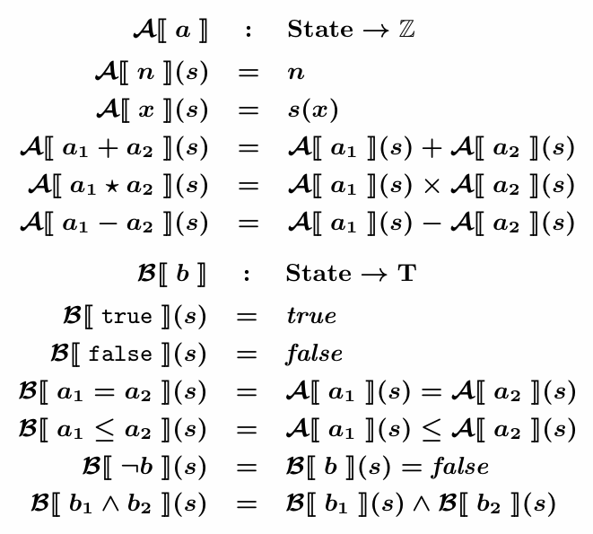 <br>

Command의 표시적 의미론은 조금 다릅니다. <br>

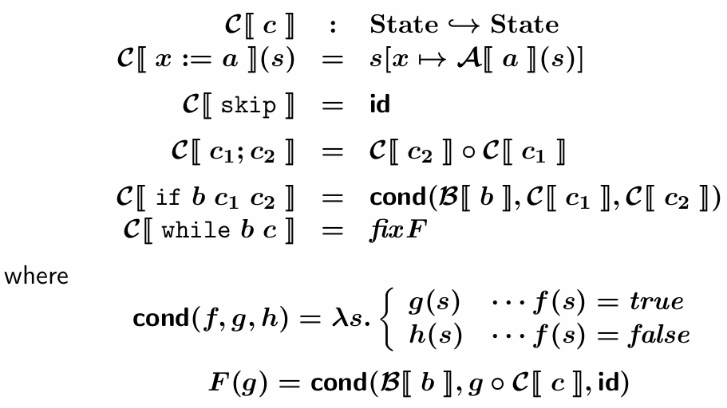 <br>

`◦`는 합성을 의미하며 $\mathcal{C}[[c_1;c_2]]$를 더 직접적으로 표현하면 $\mathcal{C}[\![c_2]\!](\mathcal{C}[\![c_1]\!])$ 이렇게 나타낼 수 있습니다.

`cond`는 일종의 **고차 함수** 로 의미를 `f, g, h`에 전달해주면 s를 받아서 f(s)가 true면 g(s), false라면 h(s)를 반환합니다.

`while`은 함수 F의 **fix point** 로 정의합니다. F의 고정점 g는 $F(g) = g$를 만족하는데, 즉 $g = cond(\mathcal{B}[\![b]\!], g ◦ \mathcal{C}[\![c]\!], id)$를 만족한다는 것입니다. 조건 b가 참이면 body c를 실행하고 다시 g (자기 자신)을 호출하고, 거짓이라면 아무것도 하지 않습니다. (id)

### Denotational Semantics of Loops
**while** 반복문의 의미는 다음 방정식을 만족하는 $State \hookrightarrow State$ 형태의 state에서 state로 가는 partial function입니다.

$\mathcal{C}[\![\text{while}\;b\;c]\!] = cond(\mathcal{B}[\![b]\!],\mathcal{C}[\![\text{while}\;b\;c]\!]◦\mathcal{C}[\![c]\!],id)$ 

이 방정식을 다시 써보면 $\mathcal{C}[\![\text{while}\;b\;c]\!] = F(\mathcal{C}[\![\text{while}\;b\;c]\!])$ 이고 이 때 $F : (State \hookrightarrow State) \to (State \hookrightarrow State)$ 는 $F(g) = cond(\mathcal{B}[\![b]\!], g ◦ \mathcal{C}[\![c]\!], id)$ 입니다. 

`while loop`의 의미는 **F의 least fixed point** 로 정의가 됩니다.

$\mathcal{C}[\![\text{while}\;b\;c]\!] = fixF$ 이때 $fixF$는 `least fixed point of F`를 의미하고 $fix : ((State \hookrightarrow State) \to (State \hookrightarrow State)) \to (State \hookrightarrow State)$ 와 같이 `fixF`는 F를 적용해도 변하지 않는 함수를 찾아줍니다.

### Example: while ¬(x = 0) skip
일단 $\mathcal{C}[\![\text{while}\;¬(x\;=\;0)\;\text{skip}]\!]$, 이 command를 상식적인 선에서 정의를 해봅시다. 그리고 의미를 기계적으로 찾아봅시다.
$\lambda s. \begin{cases}
s & \text{if } s(x) = 0 \\
\text{undef} & \text{if } s(x) \neq 0
\end{cases}$

먼저 loop에 대한 F를 찾아야 합니다. `F(g)`의 정의를 그대로 가져옵시다.
$F(g) = \text{cond}(\mathcal{B}[\![b]\!], g \circ \mathcal{C}[\![c]\!], \text{id})$
$\phantom{F(g)} = \text{cond}(\lambda s. s(x) \neq 0, g, \text{id})$
$\phantom{F(g)} = \lambda s. \begin{cases}
g(s) & \text{if } s(x) \neq 0 \\
\text{id}(s) & \text{if } s(x) = 0
\end{cases}$
$\phantom{F(g)} = \lambda s. \begin{cases}
g(s) & \text{if } s(x) \neq 0 \\
s & \text{if } s(x) = 0
\end{cases}$

아까 상식적으로 찾은 loop의 의미를 `g1`이라고 할 때, F의 **least fixed point** 가 `g1`인지 확인을 해봅시다.

일단 **fix point** 가 존재하는지부터 봅시다.

$F(g_1) = \lambda s. \begin{cases}
g_1(s) & \text{if } s(x) \neq 0 \\
s & \text{if } s(x) = 0
\end{cases}$
$\phantom{F(g_1)} = \lambda s. \begin{cases}
\text{undef} & \text{if } s(x) \neq 0 \\
s & \text{if } s(x) = 0
\end{cases}$
$\phantom{F(g_1)} = g_1$

Fix point 가 맞다는 걸 확인했습니다. 사실 `g1`말고도 무한히 많은 fix point가 존재합니다. 
$\lambda s. \begin{cases}
s & \text{if } s(x) = 0 \\
s & \text{if } s(x) = 1 \\
\text{undef} & \text{otherwise}
\end{cases}$

이걸 직접 대입해서 계산해보면 $F(g_2)=g_2$임을 확인할 수 있습니다. 이런식으로 무한히 많은 entry를 넣어 fix point를 만들 수 있습니다.

이때 $g_1 \sqsubseteq g_2$으로 표현하고, 이는 `g1`이 `g2`보다 작다고 얘기합니다. 즉 `g1`이 정보를 덜 갖고 있다는 뜻입니다. `g1`이 undefined인 곳에서 `g2`가 정의되어 있습니다. 반대로 `id`는 정보가 제일 많습니다. 

그럼 이러한 **fix point** 는 어떻게 찾아야 할까요? 이걸 대답하는 것이 **Domain theory** 입니다.

## Fixed Point Theory
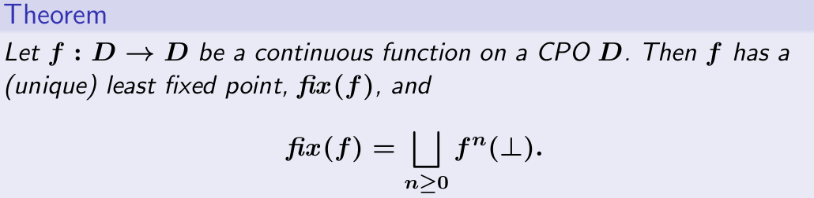 <br>
임의의 집합이 아니라 **CPO (Complete Partial Order)** 라는 특성을 만족하는 집합에 대해서 성립합니다.

$\mathcal{f}\text{ : }\mathcal{D}\;\to\;\mathcal{D}$ 인 함수 f가 연속함수라면 항상 **least fixed point** 를 가지고 계산은 이렇게 할 수 있다는 뜻입니다.

프로그램으로 따져보면 **CPO D** 는 프로그램의 의미 공간, 의미들은 **continuoun function f** 로 모델링 됩니다. 그렇기에 함수의 fixed point가 항상 존재하게 됩니다.

## Partially Orderd Set
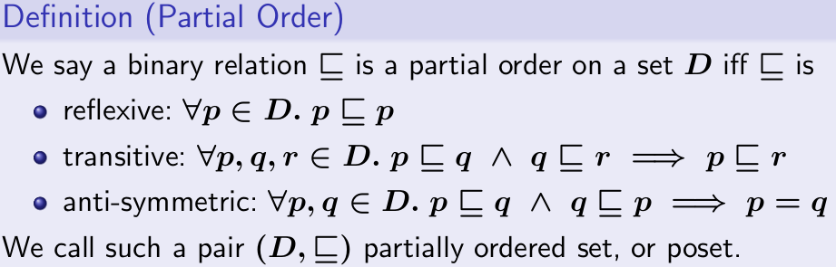<br>

각 조건을 살펴보면
- Reflexive: $\forall p \in D. p \sqsubseteq p$, 모든 원소는 자기 자신과 관계를 가집니다.
- Transitive: $\forall p, q, r \in D. p \sqsubseteq q \land q \sqsubseteq r \Rightarrow p \sqsubseteq r$ p가 q보다 작고, q가 r보다 작으면, p가 r보다 작다는 뜻입니다.
- Anti-symmetric: $\forall p, q \in D. p \sqsubseteq q \land q \sqsubseteq p \Rightarrow p = q$, 서로 작으면 합니다. 

이때 이 조건을 만족하는 $(D, \sqsubseteq)$를 **poset** 이라고 부릅니다. 

### Exercise 1
S가 공집합이 아닐 때 $(\mathcal{P}(S), \subseteq)$가 poset임을 보여봅시다.

$S = {1, 2}$ 라고 한다면 $\mathcal{P}(\mathcal{S})$는 ${\emptyset, {1}, {2}, {1,2}}$가 됩니다.

집합 S에 대해서 **Hasse diagram**을 그리면 partial order임을 쉽게 알 수 있습니다. <br>
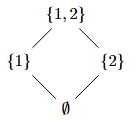 <br>

이 때 1과 2 사이에는 order가 존재하지 않기 때문에 `total order`가 아닌 `partial order`라고 할 수 있습니다.

이때 공집합 (가장 작은 원소)를 **bottom**, 가장 큰 원소를 **top** 이라고 부릅니다.

### Exercise 2
$X \hookrightarrow Y$를 집합 X로부터 집합 Y를 향하는 모든 partial function들의 집합이라고 하고 (이게 위에서 본 D의 역할을 합니다다) $\mathcal{f} \sqsubseteq \mathcal{g}$를 다음과 같이 정의합시다.

$\text{Dom}(f) \subseteq \text{Dom}(g) \land \forall x \in \text{Dom}(f). f(x) = g(x)$

이때 $(X \hookrightarrow Y,\sqsubseteq )$ 가 poset인지 증명해봅시다.

#### Reflexive
정의된 식에 넣어보면 자명하게 성립함을 알 수 있습니다.

#### Transitive
$\mathcal{f} \sqsubseteq \mathcal{g}$, $\mathcal{g} \sqsubseteq \mathcal{h}$ 라고 가정을 합시다.
이러면 $\text{Dom}(\mathcal{f}) \subseteq \text{Dom}(\mathcal(g))$, $\text{Dom}(\mathcal{g}) \subseteq \text{Dom}(\mathcal(h))$ 이고 모든 x에 대해서 $\forall x \in \text{Dom}(f). f(x) = g(x)$, $\forall x \in \text{Dom}(g). g(x) = h(x)$ 입니다.

이때 $\forall x \in \text{Dom}(f). f(x) = g(x) = h(x)$가 **집합의 이행성**에 의해 성립하므로 Transitive 조건도 만족을 합니다.

#### Anti-symmetric
$\text{Dom}(\mathcal{f}) \subseteq \text{Dom}(\mathcal(g))$, $\text{Dom}(\mathcal{g}) \subseteq \text{Dom}(\mathcal(f))$가 성립하고 $\forall x \in \text{Dom}(f). f(x) = g(x)$, $\forall x \in \text{Dom}(g). g(x) = f(x)$가 성립한다고 가정한다면

`f, g`의 정의역 (Domain)이 같고, 정의역의 모든 원소에 대해 함숫값이 같기에 f와 g는 같습니다.

따라서 **poset**이 맞습니다.

D를 $\text{X} \to \text{y}$라고 한다면 가장 작은 함수는 뭘까요? **bottom**입니다. 모든 입력에 대해 **undef** 상태이므로 정보를 가장 적게 갖고 있습니다. 즉, 모든 경우에 대해 무한 루프인 프로그램이 가장 정보가 적다고 할 수 있습니다.

## Least Upper Bound
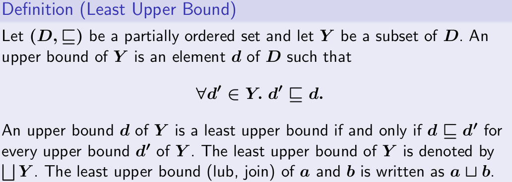 <br>

$(\text({D},\sqsubseteq))$가 **poset** 이고 `D`의 부분집합 `Y`가 존재할 때 Y에 있는 어떠한 원소 d'를 선택해도 $d'\;\sqsubseteq\;d$라면 이게 **Y의 upper bound** 입니다. 이때 `d`는 Y에 있지 않아도 되고 집합 D에 속해있으면 됩니다.

Y의 모든 upper bound d'에 대해서 $d \sqsubseteq d'$가 성립할 때 d를 Y의 **least upper bound**라고 부릅니다. 

**Least Upper Bound Y**는 이렇게 나타낼 수 있습니다. $\sqcup Y$ 

lub를 **join**이라고도 부르는데, $a \bigsqcup b$는 둘을 합칠 때 가장 노이즈 (불필요한 정보)가 적은 상태로 합치는 것을 뜻합니다.

## Greatest Lower Bound
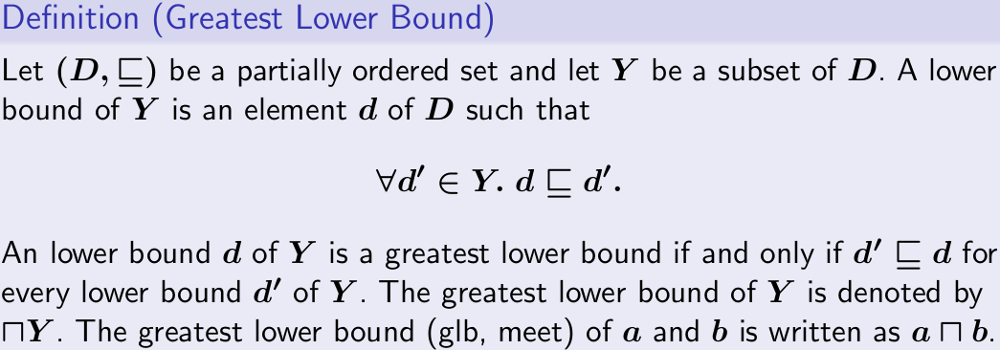 <br>

$(\text({D},\sqsubseteq))$가 **poset** 이고 `D`의 부분집합 `Y`가 존재할 때 Y에 있는 어떠한 원소 d'를 선택해도 $d\;\sqsubseteq\;d'$라면 이게 **Y의 lower bound** 입니다. 이때 `d`는 Y에 있지 않아도 되고 집합 D에 속해있으면 됩니다.

Y의 lower bound d가 Y의 모든 lower bound d'에 대해서 $d' \sqsubseteq d$를 성립하면 d가 **Y의 greatest lower bound**입니다.

**Greatest Lower Bound Y**는 이렇게 나타낼 수 있습니다. $\sqcap Y$ 

glb를 **meet**이라고도 부르며 $a \sqcap b$와 같이 사용합니다.

## Chain
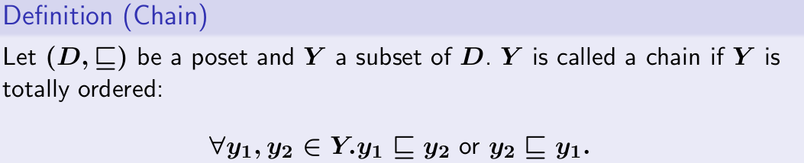 <br>

$(\text{D},\sqsubseteq)$가 **poset** 이고 `D`의 부분집합 `Y`가 존재할 때, Y가 **totally ordered** 되어 있다면 Y를 **chain**이라고 부릅니다.

$\forall y_1, y_2 \in Y. y_1 \sqsubseteq y_2 \text{ or } y_2 \sqsubseteq y_1$, 이는 즉 모든 원소간의 관계가 정의가 되어 있다는 뜻입니다. 

다음과 같은 poset을 생각해봅시다. $(\mathcal{P}({a, b, c})), \subseteq$

$Y_1 = {\emptyset,{a},{a,c}}$: 이건 chain이 맞습니다
$Y_2 = {\emptyset,{a},{c},{a,c}}$: 이건 {a}와 {c} 사이의 관계가 정의가 안 되어 있기 때문에 chain이 아닙니다.

## Complete Partial Order (CPO)
poset $(D,\sqsubseteq)$는 D에 속한 모든 chain Y의 least upper bound가 D에 속할 때 **CPO** 의 성질을 만족합니다. 어떤 chain을 선택해도 그 나열 (sequence)이 무한히 늘어나는게 아니라 끝이 정해져 있다 이렇게 생각할 수 있습니다. 프로그램의 의미가 굉장히 특수한 공간에서 정의가 되는 것입니다. <br>

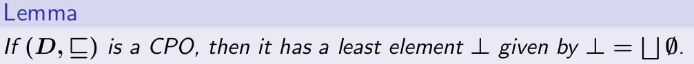 <br>

poset의 가장 작은 원소를 $\bot$, 가장 큰 원소를 $\top$으로 나타낸다면, CPO일 때 bottom이 **항상** 존재하고 empty set의 least upper bound로 정의할 수 있다는 것입니다.

이를 직관적으로 증명하자면, 일단단 $\emptyset$은 원소가 없기 때문에 자명하게 chain이 됩니다. (chain의 조건이 모든 원소에 대한 관계가 존재해야 하는건데, 어차피 공집이라 가정 자체가 거짓이 됩니다.)

그리고 D가 CPO이기 때문에 모든 chain의 lub가 존재하고, 그렇기에 $\bigsqcup \emptyset$ 역시 D에 존재합니다.

$\bigsqcup \emptyset$의 모든 원소보다 D의 bottom이 크냐?는 또다시 전제가 되어 조건을 만족하게 됩니다.

### Example 1
S가 공집합이 아닐 때 $(\mathcal{P}(S),\sqsubseteq)$는 CPO입니다. lub $\sqcup Y$는 $\cup Y$입니다. 가장 작은 원소는 $\emptyset$입니다.

lub는 모든 원소의 union으로 하고 least element가 공집합이 됩니다. 생각해보면 매우 당연하다는 것을 알 수 있습니다.

### Example 2
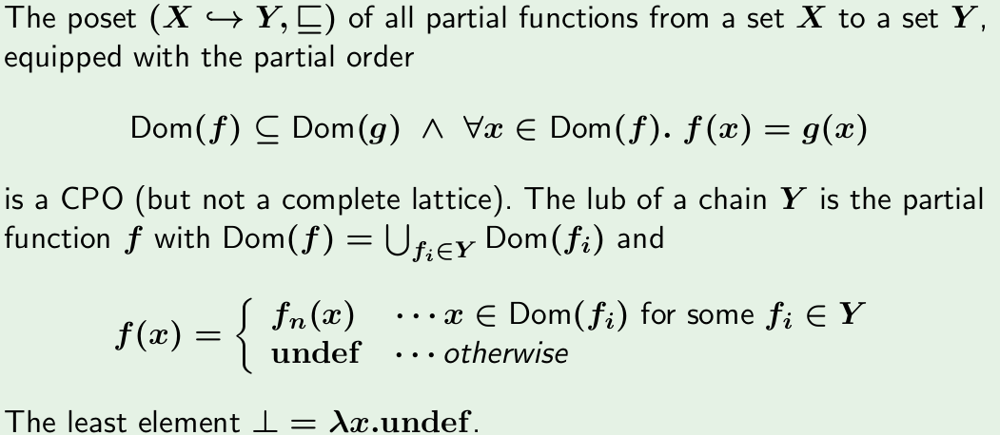 <br>

$(X \hookrightarrow Y, \sqsubseteq)$가 CPO이고, 
- 집합: X에서 Y로의 모든 partial function
- 순서: 정보 순서

인 상황입니다.

Chain Y의 lub인 함수 f는 위와 같이 계산할 수 있고 **Y 전체의 정보를 통합한 새로운 함수**를 의미하고 있습니다.

## Lattices
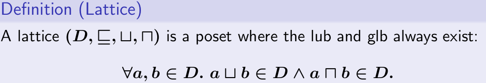 <br>
Lattice는 모든 두 원소의 join과 meet이 항상 존재하는 poset을 의미합니다. 

CPO랑 비슷한 개념으로 **complete lattice** 가 있습니다. <br>
 <br>
Complete lattice는 **모든 부분집합의 lub와 glb** 가 존재하는 poset을 의미합니다. 

poset이 제일 가볍고, CPO, Complete lattice 순으로 조건이 붙습니다. CPO는 top이 없을 수도 있지만, lattice는 반드시 있어야 합니다. 그리고 모든 subset에 대해서 lub를 가지도록 해두었습니다. 따라서 complete lattice라면 자동으로 CPO를 만족하고, 가장 큰 원소도 존재합니다.

CPO는 **모든 chain**의 lub가 집합 내에 존재하지만, Lattice는 **모든 두 원소** 의 lub와 glb가 존재합니다. 더 강한 조건이라고 볼 수 있습니다. Complete lattce는 **모든 부분집합** 에 대해서 lub와 glb가 존재해야 하기 때문에 훨씬 강력합니다.

## Derived Ordered Structures
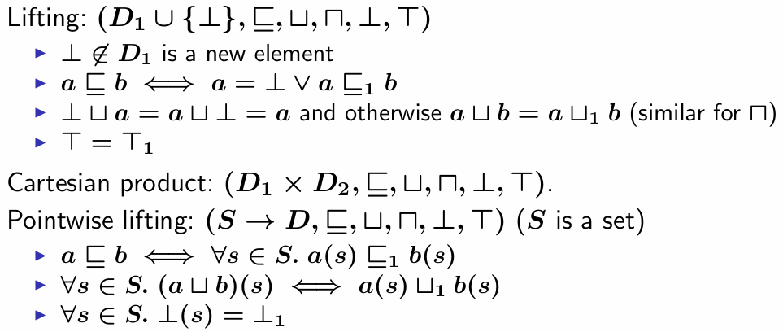 <br>
$(D_1,\sqsubseteq_1,\sqcup_1,\sqcap_1,\bot_1,\top_1)$과 $(D_2,\sqsubseteq_2,\sqcup_2,\sqcap_2,\bot_2,\top_2)$, 이 둘이 **complete lattice** 라면 다음 집합들도 complete lattice입니다.

**Lifting:** $(D_1 \cup \{\bot\},\sqsubseteq,\sqcup,\sqcap,\bot,\top)$

`bottom`을 추가하여 기존의 모든 원소보다 작게 만들고, 기존 순서 관계를 유지하되 $\bot$은 모든 원소보다 작다는 관계를 새로 넣고, $\sqcup$ 역시 $\bot$에 대해서 새로 연산을 정의한 다음음 $\top = \top_1$을 적용하면 새로운 complete lattice를 만들 수 있습니다.

**Cartesian Prodect**: $(D_1 \text{ X }D_2,\sqsubseteq,\sqcup,\sqcap,\bot,\top)$ 역시 complete lattice입니다.

**Pointwise liefting**: $(S \to D,\sqsubseteq,\sqcup,\sqcap,\bot,\top)$, S는 집합입니다. 모든 입력에 대해 f가 g보다 작거나 같다면 $f \sqsubseteq g$ 가 성립하고 lub와 glb를 각 점에서의 `lub,glb`로 새로 정의해주면 됩니다. 

## Monotone Functions
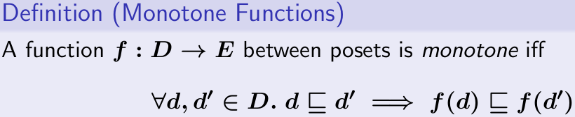 <br>

프로그램의 semantics를 정의하는 함수들은 기본적으로 **단조 증가 (monotone)** 한다고 생각할 수 있습니다. 입력의 순서가 보존되면 출력의 순서도 보존된다는 의미입니다. 

### Example
$(\mathcal{P}({a,b,c}),\sqsubseteq)$와 $(\mathcal{P}({d,e}),\sqsubseteq)$가 있고 $f_1,f_2\;\text{: }\mathcal{P}(\{a,b,c\}) \to \mathcal{P}(\{d,e\})$가 있다고 생각해봅시다. 다음과 같이 두 함수가 주어질 때 `f1,f2`가 **단조 증가** 하는지 확인해봅시다. <br>

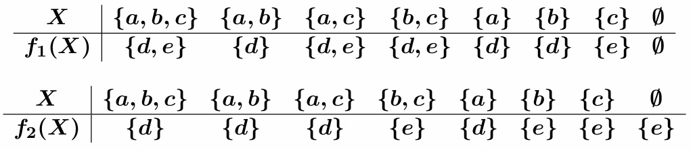 <br>

`f1`의 경우 단조 증가 하고 있는 것을 쉽게 확인할 수 있습니다.

`f2`의 경우 $f2(\emptyset) = {e}$ 인데 $f2(\{a\}) = \{d\}$ 부분에서 {e}와 {d}는 비교가 불가능하기에 **monotone 조건을 위반**합니다.

### Exercise
$(\text{State} \hookrightarrow \text{State}) \to (\text{State} \hookrightarrow \text{State})$ 형태의 함수들 중 어떤 함수들이 **단조 증가** 하는지 확인해봅시다.

$F_0(g) = g$: $g_1 \sqsubseteq g_2$라고 가정할 때 $F_0(g_1) = g_1, F_0(g_2) = g_2$ 입니다. $F_0(g_1) \sqsubseteq F_0(g_2)$가 성립하므로 $F_0$은 단조 증가 합니다.

$F_1(g) = \begin{cases} g_1 & \text{if } g = g_2 \\ g_2 & \text{otherwise} \end{cases}$: $g_1 \sqsubseteq g_2$라고 할 때 $F_1(g_1) = g_2, F_1(g_2) = g_1$이 욉니다. 순서가 뒤바뀌었기 때문에 단조 증가 하지 않습니다.

$F_2(g) = \lambda s. \begin{cases} g(s) & \text{if } s(x) \neq 0 \\ s & \text{if } s(x) = 0 \end{cases}$ 이 경우는 $g_1 \sqsubseteq g_2$를 가정한 다음 `s(x)`가 0일 경우, 아닐 경우, 또 s가 $Dom(g_1)$에 속하거나 $Dom(g_2)$에만 속하는 경우 들을 나누어 확인할 수 있고, 직접 계산을 해보면 **단조 증가** 하고 있음을 알 수 있습니다.

### Properties of Monotone Functions
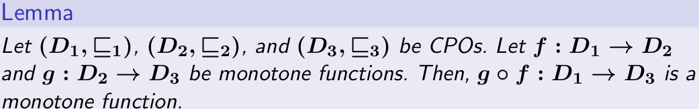 <br>

이 정리는 직관적으로 생각했을 때 당연하다는 사실을 알 수 있습니다. <br>

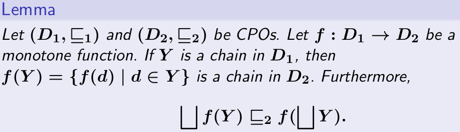 <br>
$D_1,D_2$가 CPO이고, $f: D_1 \to D_2$가 단조 증가합니다. Y가 $D_1$의 chain이라고 할 때 $f(Y) = \{f(d)\;\text{|}\;d \in Y\}$ 역시 $D_2$에서의 chain이 됩니다. 이때 $\sqcup f(Y) \sqsubseteq_2 f(\sqcup Y)$가 성립합니다.

오른쪽부터 보면, Y가 chain이고 $D_1$이 CPO이므로 chain Y 역시 **least upper bound** 를 가집니다. 거기에 함수 f를 적용한 것입니다. 

왼쪽은 chain f(Y)의 lub를 의미합니다. 즉 chain Y의 lub에 함수 f를 적용한 것이 chain f(Y)에 lub를 적용한 것보다 크다는 것입니다. 

chain Y이 다음과 같다고 합시다. $Y = {d_1, d_2, d_3, ...}$ 임의의 $f(d_i) \in f(Y)$에 대해:
1. Y가 chain이므로 $d_i \in Y$
2. $\sqcup Y$는 Y의 upper bound이므로 $d_i \sqsubseteq_1 \sqcup\;Y$
3. f가 단조 증가 하기 때문에 $d_i \sqsubseteq_1 \sqcup Y \Rightarrow f(d_i) \sqsubseteq_2 f(\sqcup Y)$

이를 통해 $f(\sqcup Y)$가 $f(Y)$의 **upper bound** 임을 알 수 있습니다.

$\sqcup f(Y)$는 $f(Y)$의 **least** upper bound 입니다. 그렇기에 $\sqcup f(Y) \sqsubseteq_2 f(\sqcup Y)$ 임을 알 수 있습니다. 

직관적인 예를 들어보자면, if 문이 있다고 할 때 true branch의 의미를 `d1`, false branch의 의미를 `d2`라고 합시다. if 문이 합쳐져서 실행이 될 텐데, 이때의 실행 의미를 `f`라고 한다면 true branch는 **f(d1)**, false branch는 **f(d2)** 가 됩니다. 

위 그림에서의 우항은 d1, d2를 먼저 합친 다음에 f를 적용하는 $f(d_1 \sqcup d_2)$ 를 의미하고, 좌항은 따로 실행한 다음에 합치는 $f(d_1) \sqcup f(d_2)$를 의미합니다. 그러면 **먼저 합친 쪽이 더 커집니다**. 크다는 것은 정보가 불명확하다는 것을 의미합니다. CPO에서는 올라갈수록 **top**에 가까워지는데 이 경우 top에 더 가까워져서 노이즈가 많아지게 됩니다.  

## Continuous Functions
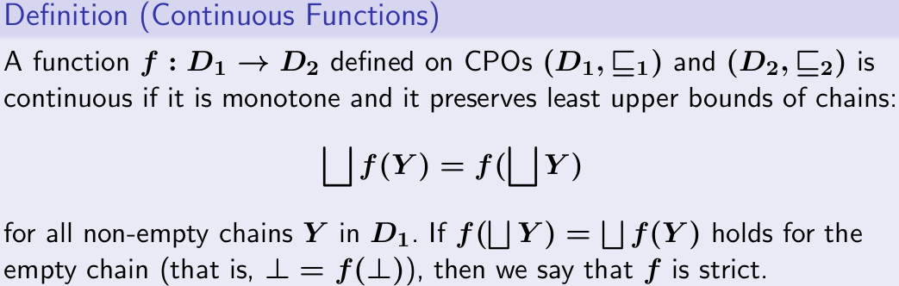 <br>

연속 함수에서는 $\sqcup f(Y)$와 $f(\sqcup Y)$가 같습니다. 또한 $\bot$을 적용했을 때 $\bot$이 나온다면 f가 **strict** 하다고 표현합니다.

이는 당연한 것이 `bottom`은 보통 프로그램 오류, undef 같은 것을 의미합니다. $\bot$이 들어왔는데 다른 정상 상태가 나오는 것은 결코 정상적이라고 할 수 없습니다. 

### Properties of Continuous Functions
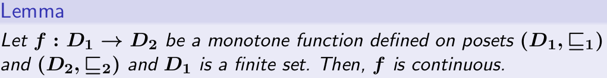 <br>

모든 유합집합에서 정의된 단조 증가 (monotone) 함수 는 항상 **연속 (continuouns) 함수** 입니다. 

Y가 길이가 유한한 chain이라면 lub는 항상 가장 큰 원소가 될텐데, f에 이걸 넣은 거랑 f를 적용한 다음 올라온 거랑 같을 수 밖에 없습니다. <br>

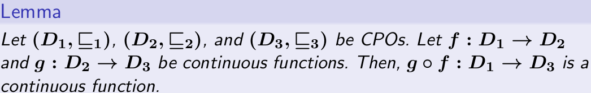 <br>

역시 상식적인 정리입니다. 연속 함수를 합성해도 여전히 연속 함수라는 뜻입니다.

## Least Fixed Points
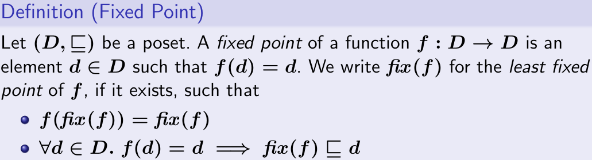 <br>

**Fixed point** 는 f의 정의역과 치역이 같을 때만(ex: $f: D \to D$) 정의가 됩니다. $f(d) = d$를 만족하는 집합 D의 원소 d를 함수 $f: D \to D$의 **fixed point** 라고 부릅니다. **Least fixed point of f** 에 대해서는 $fix(F)$와 같이 표현합니다. $fix(F)$는 다음 조건을 만족합니다.

$f(fix(f)) = fix(f)$
$\forall d \in D.f(d) = d \Rightarrow fix(f) \sqsubseteq d$
S
## Fixed Point Theorem
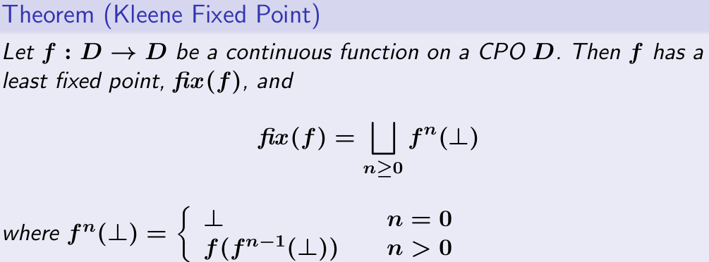 <br>

즉, 어떤 함수의 fixed point를 구할 때는 $\bot$부터 시작해서 f에 계속 적용시키다가 $f_i(\bot)$과 $f_i+1(\bot)$이 같아지는 순간이 **least fixed point** 라고 할 수 있습니다. 둘이 같다는건 chain이 유한하다는 것으로 계산을 마칠 수 있습니다.

## Well-definedness of the Semantics
함수 $F(g) = \text{cond}(\mathcal{B}[\![b]\!],g◦\mathcal{C}[\![c]\!],\text{id})$ 는 연속 함수 입니다. 

일단 $g_0 : \text{State} \hookrightarrow \text{State},p : \text{State} \to T$ 라고 하고 $F(g) = \text{cond}(p,g,g_0)$를 정의하면 F는 연속 함수 입니다. (**lemma 1**)

그리고 $g_0 : \text{State} \hookrightarrow \text{State}$ 이고 $F(g) = g ◦ g_0$로 정의하면 F가 연속 함수 입니다. (**lemma 2**)

원래 함수를 다시보면 $F(g) = \text{cond}(\mathcal{B}[\![b]\!], g ◦ \mathcal{C}[\![c]\!], \text{id})$, 이렇게 되어 있는데

이를 다음과 같이 분해할 수 있습니다.

1. $h(g) = g ◦ \mathcal{C}[\![c]\!]$ : 두번째 lemma에 의해 연속
2. $F(g) = \text{cond}(\mathcal{B}[\![b]\!], h(g), \text{id})$ : 첫번째 lemma에 의해 연속

연속함수의 합성 역시 연속함수 이므로, $F$는 연속 함수 입니다. CPO에서 연속함수는 **least fixed point** 를 가지기 때문에 함수 F가 잘 정의되며 while 문의 **표시적 의미론** 이 수학적으로 올바르게 정의 됩니다.

# Lecture 13
## Principles of Static Analysis
간단한 계산식을 생각해봅시다.
```
30 x 12 + 11 x 9 = ?
```

**동적 분석 (Dynamic analysis)** : 459 임을 쉽게 알 수 있습니다.

그러나 **정적 분석 (Static analysis)** 의 결과는 여러 가지가 될 수 있습니다. 