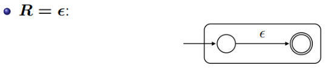
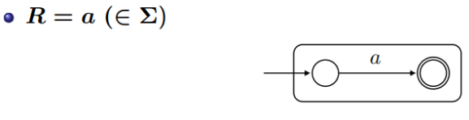
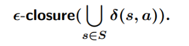
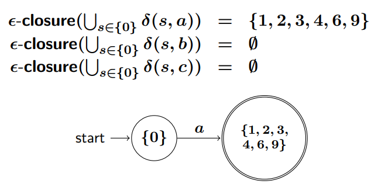

# COSE-312
https://prl.korea.ac.kr/courses/cose312/2025/

# Index
- [1. Lecture 1](#lecture-1)
- [2. Lecture 2](#lecture-2)
- [3. Lecture 3](#lecture-3)
- [4. Lecture 4](#lecture-4)
- [5. Lecture 5](#lecture-5)
- [6. Lecture 6](#lecture-6)
- [7. Lecture 7](#lecture-7)
- [8. Lecture 8](#lecture-8)
- [9. Lecture 9](#lecture-9)
- [10. Lecture 10](#lecture-10)

# Lecture 1
우리가 프로그래밍 언어로 작성한 코드는 컴퓨터가 직접 이해할 수 없습니다. 이를 컴퓨터가 이해할 수 있는 형태로 바꾸어주는 소프트웨어가 필요한데, 그중 하나가 바로 **컴파일러(Compiler)** 입니다. 컴파일러는 특정 프로그래밍 언어, 즉 소스 언어(source language)로 작성된 프로그램을 다른 언어인 목표 언어(target language)로 번역하는 역할을 합니다.

목표 언어는 대부분 컴퓨터의 중앙 처리 장치(CPU)가 직접 실행할 수 있는 기계어(machine language), 예를 들어 인텔 계열의 x86 명령어 집합 같은 것입니다. 하지만 항상 기계어만을 목표로 하는 것은 아닙니다. 대표적인 예로 자바(Java)를 들 수 있는데, 자바 컴파일러는 소스 코드를 자바 가상 머신(JVM)이 이해할 수 있는 바이트코드(bytecode)라는 중간 형태(intermediate form)로 우선 번역합니다.


컴파일러는 복잡한 번역 과정을 효율적으로 수행하기 위해 여러 단계(phase)로 나뉘어 구성되는 것이 일반적입니다. 각 단계는 이전 단계의 출력을 입력으로 받아 특정 작업을 수행하고, 그 결과를 다음 단계로 전달합니다. 크게 프론트엔드(Front End), 미들엔드(Middle End), 그리고 백엔드(Back End)로 구분할 수 있습니다.


## 컴파일러의 구조 (Structure of Compilers)
프론트엔드는 소스 프로그램을 분석하여 그 구조와 의미를 파악하고, 이를 후속 단계를 위한 내부 표현 방식인 **중간 표현(Intermediate Representation, IR)** 으로 변환하는 역할을 담당합니다. 입력으로는 프로그래머가 작성한 문자열 형태의 소스 코드가 주어집니다.


## 1. 프론트엔드 (Front End)
프론트엔드는 소스 프로그램을 분석하여 그 구조와 의미를 파악하고, 이를 후속 단계를 위한 내부 표현 방식인 **중간 표현(Intermediate Representation, IR)** 으로 변환하는 역할을 담당합니다. 입력으로는 프로그래머가 작성한 문자열 형태의 소스 코드가 주어집니다.

IR은 컴파일러 내부에서 프로그램을 나타내는 방식으로, 다양한 형태가 존재합니다. 가장 잘 알려진 예로는 프로그램의 문법적 구조를 나무 형태로 표현한 **추상 구문 트리(Abstract Syntax Tree, AST)** 가 있으며, 이는 2차원적인 구조로 이해할 수 있습니다. 또 다른 형태로는 기계어 명령어와 유사하게 각 명령어가 간단한 연산들로 구성된 **3-주소 코드(Three-Address Code, TAC)** 처럼 보다 선형적인 표현 방식도 널리 사용됩니다.

### 1.1. 어휘 분석기 (Lexical Analyzer)
어휘 분석기는 소스 코드 문자 스트림(Character Stream)을 읽어들여 문법적으로 의미 있는 최소 단위인 **토큰(Token)** 들의 스트림(Token Stream)으로 분해합니다. 토큰은 일반적으로 **타입(Type)** 과 필요한 경우 그 **값(Value)** 을 쌍으로 가집니다.


예를 들어, `pos = init + rate * 10`라는 코드가 있다면, 어휘 분석기는 이를 `(ID, pos), ASSIGN, (ID, init), PLUS, (ID, rate), MULT, (NUM, 10)`과 같은 토큰의 연속으로 변환합니다.

### 1.2. 구문 분석기 (Syntax Analyzer)
구문 분석기는 어휘 분석기가 생성한 토큰 스트림을 입력으로 받아, 소스 코드의 문법적 구조를 분석합니다. 이 과정에서 토큰들이 프로그래밍 언어의 문법 규칙에 맞게 배열되었는지를 검사하며, 그 결과로 일반적으로 구문 트리(Syntax Tree) 또는 파스 트리(Parse Tree)를 생성합니다. 이 구문 트리는 프로그램의 구조를 명확하게 보여주며, 이후 의미 분석 단계에서 프로그램의 의미를 파악하고 검증하는 기초 자료로 활용됩니다.


### 의미 분석기 (Semantic Analyzer)
의미 분석기는 구문 트리를 바탕으로 프로그램의 의미론적 정확성(semantic correctness)을 검사합니다. 구문적으로는 올바르더라도 의미적으로는 말이 되지 않는 경우를 찾아내는 과정으로, 이는 상당히 어렵고 복잡한 작업이 될 수 있습니다. 예를 들어, 구문 분석기는 문법 규칙만을 검사하므로 타입 오류까지는 잡아내지 못하지만, 의미 분석기는 선언되지 않은 변수의 사용, 타입 불일치, 함수의 인자 개수 불일치 등을 검사합니다.

**타입 검사(Type checking)**는 의미 분석의 중요한 부분으로, 모든 연산이 호환되는 타입의 피연산자들과 함께 사용되었는지 확인합니다.


예를 들어, 정수형 변수와 문자열 변수를 직접 더하려고 하는 `int z = x + y;` (여기서 x는 정수, y는 문자열)와 같은 코드는 타입 오류로 진단됩니다. 이 외에도 배열의 범위를 벗어난 접근이나 null 포인터 역참조와 같은 메모리 관련 오류 (Safety errors), 또는 프로그램이 의도한 대로 동작하는지 확인하기 위한 사전/사후 조건 검사 (Functional errors) 등도 의미 분석의 범주에 포함될 수 있습니다.

### 1.4. IR 번역기 (IR Translator)
IR 번역기는 구문 분석기와 의미 분석기를 거친 구문 트리(또는 이전 단계에서 생성된 IR)를 컴파일러의 다음 단계를 위해 설계된 특정 중간 표현(IR)으로 변환하는 역할을 합니다. 이 새로운 IR은 기존의 구문 트리보다 더 추상적이거나 특정 분석 및 최적화에 더 적합한 형태일 수 있으며, 또 다른 트리 구조이거나 3-주소 코드와 같이 보다 선형적인 구조일 수도 있습니다.

일반적으로 IR은 소스 언어보다는 저수준(lower-level)의 특성을 가지면서도, 목표 기계어보다는 고수준(higher-level)의 추상화를 유지합니다. **3-주소 코드(TAC)** 를 예로 들면, 각 명령어는 보통 최대 하나의 연산자와 세 개의 주소(결과를 저장할 주소 하나, 피연산자를 위한 주소 최대 두 개)를 갖는 형태로 표현됩니다. 가령 `t1 = a + b`와 같은 명령어는 `t1, a, b`라는 세 개의 주소를 명확히 사용합니다. `t2 = -c` (단항 연산) 또는 `t3 = d` (값 복사) 같은 형태도 가능합니다.

IR을 사용하는 주된 이유는 다양한 소스 언어와 목표 아키텍처에 대해 컴파일러의 일부를 재사용할 수 있게 하고, 다양한 최적화(Optimization) 기법을 언어나 기계에 독립적으로 적용하기 용이하게 만들기 위함입니다.

## 2. 미들엔드 (Middle End) - 최적화기 (Optimizer)
미들엔드는 주로 IR을 입력으로 받아 다양한 분석과 변환을 통해 프로그램의 효율성을 향상시키는 최적화(Optimizer) 과정을 수행합니다. 최적화는 프로그램의 의미를 변경하지 않으면서 실행 속도를 높이거나 메모리 사용량을 줄이는 것을 목표로 합니다. 하나의 최적화기가 여러 종류의 최적화를 수행하거나, 여러 개의 최적화기가 순차적으로 또는 반복적으로 IR을 개선해 나갈 수 있습니다.


간단한 최적화 예시를 통해 IR이 어떻게 변화하는지 살펴보겠습니다:


1. 원본 IR: `t1=10; t2=rate*t1; t3=init+t2; pos=t3`
2. 상수 전파 (Constant Propagation) 적용 후: t1의 값 10이 t2의 정의에 직접 사용됩니다. `t1=10; t2=rate*10; t3=init+t2; pos=t3`
3. 죽은 코드 제거 (Dead Code Elimination) 적용 후: t1이 t2의 정의에 사용된 후 더 이상 참조되지 않는다면 제거될 수 있습니다. `t2=rate*10; t3=init+t2; pos=t3`
4. 복사 전파 (Copy Propagation) 및 죽은 코드 제거 적용 후: `pos=t3`에서 `t3`의 값인 `init+t2`가 직접 pos에 대입되고, 이후 t3의 정의는 불필요해져 제거됩니다. `t2=rate*10; pos=init+t2` (다이어그램에 표시된 최종 IR과 일치)

## 3. 백엔드 (Back End)
백엔드는 최적화된 IR을 입력으로 받아 실제 목표 기계에서 실행될 수 있는 목표 프로그램(일반적으로 기계어)을 생성하는 역할을 담당합니다. 이 과정에는 목표 기계의 명령어 집합을 선택하는 명령어 선택(instruction selection), 한정된 수의 CPU 레지스터에 변수를 할당하는 레지스터 할당(register allocation), 그리고 실제 기계 코드를 생성하는 코드 생성(code generation) 등의 작업이 포함됩니다.

고수준 언어와 저수준 기계어의 중요한 차이점 중 하나는 변수를 다루는 방식과 메모리 접근입니다. 특히 레지스터 할당 문제는 매우 중요합니다. 최신 CPU는 매우 빠른 소량의 저장 공간인 레지스터를 가지고 있지만, 프로그램은 그보다 훨씬 많은 변수를 사용할 수 있습니다. 자주 사용되는 변수를 레지스터에 효과적으로 할당하면 프로그램 성능을 크게 향상시킬 수 있습니다. 하지만 최적의 레지스터 할당 방법을 찾는 것은 계산적으로 매우 어려운 NP-난해(NP-hard) 문제로 알려져 있습니다. 따라서 실제 컴파일러는 최적의 해를 보장하지는 않지만 합리적인 시간 내에 좋은 결과를 내는 휴리스틱(heuristics) 기법들을 사용합니다.

## 요약 (Summary)
지금까지 살펴본 컴파일러의 전체 구조를 요약하면 다음과 같습니다.


프론트엔드: 소스 프로그램의 구문(syntax)과 의미(semantics)를 이해하여 IR을 생성합니다.
미들엔드 (최적화기): IR을 분석하고 변환하여 프로그램의 효율성을 향상시킵니다.
백엔드: 최적화된 IR로부터 목표 기계에서 실행 가능한 프로그램을 생성합니다.

# Lecture 2

컴파일러의 첫 번째 단계인 어휘 분석(Lexical Analysis)은 소스 프로그램을 문자(character)의 스트림으로 받아, 이를 문법적으로 의미 있는 최소 단위인 **토큰(token)** 의 스트림으로 변환하는 과정입니다. 어휘 분석기는 흔히 **렉서(lexer)** 또는 **스캐너(scanner)** 라고도 불립니다.

어휘 분석기는 미리 정의된 **패턴(pattern)** 들을 사용하여 입력 문자열에서 토큰을 식별합니다. 예를 들어, 프로그래밍 언어에서 식별자(identifier), 키워드(keyword), 숫자(number), 연산자(operator) 등은 각각 고유한 패턴을 가집니다. 어휘 분석기는 이러한 패턴을 인식하고, 공백(whitespace), 탭, 줄 바꿈 문자나 구두점(punctuation), 또는 다른 토큰의 시작과 같은 **구분자(delimiter)** 를 기준으로 문자열을 분리하여 토큰을 추출합니다.

예를 들어, 아래와 같은 C 언어 코드가 주어졌다고 가정해 봅시다.

```c
float match0 (char *s) /* find a zero */
{
    if (!strncmp(s, "0.0", 3))
        return 0.0;
}
```

어휘 분석기는 이 코드를 다음과 같은 토큰의 연속으로 변환합니다:


여기서 `ID(match0)`는 `match0`이라는 값을 가진 식별자(Identifier) 타입의 토큰을, `NUM(3)`은 값 3을 가진 숫자(Number) 타입의 토큰을 나타냅니다. `EOF`는 파일의 끝(End Of File)을 나타내는 특수한 토큰입니다.

어휘 분석 과정을 이해하고 구현하기 위해서는 다음 세 가지 핵심 요소를 알아야 합니다:

- 명세 (Specification): 토큰과 같은 어휘적 패턴을 어떻게 정확하게 정의하고 명시할 것인가? (이를 위해 주로 **정규 표현식(Regular Expression)** 이 사용됩니다.)
- 인식 (Recognition): 명시된 어휘 패턴을 입력 문자열에서 어떻게 효율적으로 인식할 것인가? (이를 위해 주로 **결정적 유한 오토마타(Deterministic Finite Automaton, DFA)** 가 사용됩니다.)
- 자동화 (Automation): 주어진 명세(정규 표현식)로부터 패턴 인식기(DFA)를 어떻게 자동으로 생성할 것인가? (이를 위해 **톰슨 구성법(Thompson's construction)** 으로 정규 표현식에서 NFA를 만들고, **부분집합 구성법(subset construction)** 으로 NFA에서 DFA를 만듭니다.)

## 1. 명세 (Specification): 어휘 패턴의 정의
어휘 분석의 가장 기본적인 출발점은 토큰으로 인식될 문자열 패턴을 정의하는 것입니다. 이를 위해 형식 언어 이론의 개념들이 사용됩니다.

### 1.1. 알파벳 (Alphabet)
알파벳(alphabet) $\Sigma$는 문자(character) 또는 기호(symbol)들의 유한하고 비어있지 않은 집합(finite, non-empty set)을 의미합니다. 예를 들어, C 언어의 알파벳은 ASCII 문자 집합이 될 수 있고, 이진수를 다룬다면 알파벳은 $\left\lbrace0, 1\right\rbrace$이 됩니다.

### 1.2. 문자열 (Strings)
문자열(string)은 특정 알파벳 $\Sigma$에 속한 기호들을 유한하게 나열한 순서(finite sequence)입니다.

- 길이가 0인 문자열, 즉 아무 기호도 포함하지 않는 문자열을 **빈 문자열(empty string)** 이라고 하며, 보통 $\epsilon$ (입실론)으로 표기합니다.
- 두 문자열 $w$와 $v$를 이어 붙이는 것을 **연결(concatenation)** 이라고 하며 $wv$로 나타냅니다.
- 문자열 $w$의 기호 순서를 거꾸로 뒤집은 것을 $w$의 **역순(reverse)** 이라 하고 $w^R$로 씁니다.
- 문자열 $w$에 포함된 기호의 개수를 $w$의 **길이(length)** 라고 하며 $|w|$로 표기합니다. 빈 문자열의 길이는 $|\epsilon|=0$이며, 어떤 문자열 $v$에 기호 하나 $a$를 연결한 $va$의 길이는 $|v|+1$입니다 (여기서 $a$는 단일 기호).
- 문자열 $w$가 $vu$의 형태로 표현될 때, $v$를 $w$의 접두사(prefix), $u$를 $w$의 **접미사(suffix)** 라고 합니다.
- $\Sigma^k$는 알파벳 $\Sigma$에 속한 기호들로 만들 수 있는 길이가 정확히 $k$인 모든 문자열의 집합을 나타냅니다.
- $\Sigma^*$는 알파벳 $\Sigma$로 만들 수 있는 모든 길이의 문자열 집합을 의미하며, 빈 문자열 $\epsilon$을 포함합니다 ($\Sigma^* = \Sigma^0 \cup \Sigma^1 \cup \Sigma^2 \cup \dots = \bigcup_{i \in \mathbb{N}} \Sigma^i$).
- $\Sigma^+$는 $\Sigma^*$에서 빈 문자열 $\epsilon$을 제외한, 즉 길이가 1 이상인 모든 문자열의 집합입니다 ($\Sigma^+ = \Sigma^1 \cup \Sigma^2 \cup \dots = \Sigma^* \setminus \lbrace\epsilon\rbrace$).

### 1.3. 언어 (Languages)
형식 언어 이론에서 언어(language) $L$은 특정 알파벳 $\Sigma$로부터 생성될 수 있는 모든 문자열의 집합인 $\Sigma^*$의 부분집합($L \subseteq \Sigma^*$)으로 정의됩니다. 즉, 어떤 규칙이나 조건을 만족하는 문자열들의 모임입니다.

언어들 사이에는 다음과 같은 연산들이 정의될 수 있습니다:

- 합집합 (Union): $L_1 \cup L_2 = \left\lbracew \mid w \in L_1 \text{ or } w \in L_2\right\rbrace$
- 교집합 (Intersection): $L_1 \cap L_2 = \left\lbracew \mid w \in L_1 \text{ and } w \in L_2\right\rbrace$
- 차집합 (Difference): $L_1 - L_2 = \left\lbracew \mid w \in L_1 \text{ and } w \notin L_2\right\rbrace$
- 역순 (Reverse): $L^R = \left\lbracew^R \mid w \in L\right\rbrace$
- 여집합 (Complement): $\overline{L} = \Sigma^* - L$
- 연결 (Concatenation): $L_1 L_2 = \left\lbracexy \mid x \in L_1 \text{ and } y \in L_2\right\rbrace$ (언어 $L_1$의 문자열과 언어 $L_2$의 문자열을 순서대로 연결하여 만들 수 있는 모든 문자열의 집합)
- 거듭제곱 (Power): $L^n$은 언어 $L$을 $n$번 연결한 것입니다.
$L^0 = {\epsilon}$ (정의에 따라 빈 문자열만을 원소로 가짐)
$L^n = L L^{n-1}$ (또는 $L^{n-1}L$) ($n \ge 1$)
- 스타 클로저 (Star-closure 또는 Kleene closure): $L^*$는 언어 $L$의 문자열들을 0번 이상 연결하여 만들 수 있는 모든 문자열의 집합입니다. 즉, $L^* = L^0 \cup L^1 \cup L^2 \cup \dots = \bigcup_{i \ge 0} L^i$.
- 양성 클로저 (Positive closure): $L^+$는 언어 $L$의 문자열들을 1번 이상 연결하여 만들 수 있는 모든 문자열의 집합입니다. 즉, $L^+ = L^1 \cup L^2 \cup L^3 \cup \dots = \bigcup_{i \ge 1} L^i$. 이는 $L^* = L^+ \cup \left\lbrace\epsilon\right\rbrace$ (단, $L$이 $\epsilon$을 포함하지 않을 경우) 또는 $L^+ = L L^*$ 관계를 가집니다.

### 1.4. 정규 표현식 (Regular Expressions)
정규 표현식(Regular Expression, RE)은 특정 규칙을 가진 문자열의 집합, 즉 **정규 언어(Regular Language)** 를 간결하게 명시하기 위해 사용되는 **메타 언어(meta-language)** 입니다. 어휘 분석에서는 다양한 토큰의 패턴(예: 식별자, 숫자, 특정 키워드)을 정의하는 데 주로 활용됩니다. 정규 표현식 자체도 하나의 언어이므로, 고유한 구문(syntax)과 의미(semantics)를 가집니다. 

#### 정규 표현식의 구문 (Syntax)
정규 표현식 $R$은 더 단순한 정규 표현식들을 조합하여 재귀적으로 정의됩니다. 일반적인 정규 표현식의 구문은 다음과 같은 규칙으로 정의될 수 있습니다 (여기서 $R, R_1, R_2$는 정규 표현식을 나타냅니다):

* **기본 심볼 (Base Symbols):**
    * $\emptyset$: 빈 집합(empty set)을 나타내는 정규 표현식. 어떤 문자열도 포함하지 않는 언어를 의미합니다.
    * $\epsilon$: 빈 문자열(empty string) $\epsilon$만을 포함하는 언어를 나타내는 정규 표현식입니다.
    * $a$: 알파벳 $\Sigma$에 속하는 임의의 단일 기호 $a$에 대해, $a$는 문자열 $a$만을 포함하는 언어를 나타내는 정규 표현식입니다.
* **연산 (Operations):**
    * $R_1 | R_2$ (선택, Alternation): $R_1$이 나타내는 언어와 $R_2$가 나타내는 언어의 **합집합** 을 의미합니다. 즉, $R_1$에 속하거나 $R_2$에 속하는 문자열들을 나타냅니다. (때로는 $R_1 + R_2$로 표기하기도 합니다.)
    * $R_1 R_2$ (연결, Concatenation): $R_1$이 나타내는 언어의 문자열 뒤에 $R_2$가 나타내는 언어의 문자열을 이어 붙여 만들어지는 모든 문자열의 집합을 의미합니다. (때로는 $R_1 \cdot R_2$로 표기하기도 합니다.)
    * $R^*$ (스타 클로저, Star Closure 또는 Kleene Closure): $R$이 나타내는 언어의 문자열을 0번 이상 반복하여 연결한 모든 문자열의 집합을 의미합니다. (예: $a^*$는 $\epsilon, a, aa, aaa, \dots$를 포함합니다.)
* **괄호 (Parentheses):**
    * $(R)$: 정규 표현식 $R$과 동일한 언어를 나타내며, 연산의 우선순위를 명확히 하거나 그룹핑하는 데 사용됩니다.

정규 표현식으로 기술된 문자열의 집합은 **정규 언어(regular language)** 를 형성하며, 이는 유한 오토마타(finite automaton)에 의해 인식될 수 있는 형식 언어의 한 종류입니다. 

#### 정규 표현식의 의미 (Semantics)

정규 표현식 $R$의 의미는 $R$이 나타내는 언어, 즉 문자열의 집합 $L(R)$로 정의됩니다. $L(R)$은 항상 $\Sigma^*$의 부분집합입니다. 

* $L(\emptyset) = \emptyset$ (빈 집합) 
* $L(\epsilon) = \left\lbrace\epsilon\right\rbrace$ (빈 문자열만을 원소로 갖는 집합) 
* 알파벳 기호 $a \in \Sigma$에 대해, $L(a) = \left\lbracea\right\rbrace$ (문자열 $a$만을 원소로 갖는 집합) 
* $L(R_1 | R_2) = L(R_1) \cup L(R_2)$ (두 언어의 합집합) 
* $L(R_1 R_2) = L(R_1)L(R_2)$ (두 언어의 연결) 
* $L(R^*) = (L(R))^*$ (언어 $L(R)$의 스타 클로저) 
* $L((R)) = L(R)$ (괄호는 언어의 의미를 바꾸지 않음) 

### 1.5. 정규 정의 (Regular Definitions)
모든 명세를 기본적인 정규 표현식만으로 표현하는 것은 때때로 매우 번거롭고 가독성이 떨어질 수 있습니다. **정규 정의(Regular Definition)** 는 이러한 불편함을 해소하기 위해 정규 표현식에 이름을 부여하고, 이후 다른 정규 표현식에서 그 이름을 참조하여 사용할 수 있도록 하는 방법입니다. 

형식적으로 정규 정의는 다음과 같은 형태의 정의들의 나열입니다: <br> 
$d_1 \rightarrow r_1$ <br>
$d_2 \rightarrow r_2$ <br>
$\dots$ <br>
$d_n \rightarrow r_n$ <br>

여기서 각 $d_i$는 새로운 이름(토큰 이름 등)이며, 알파벳 $\Sigma$에는 속하지 않는 기호여야 합니다 ($d_i \notin \Sigma$). 각 $r_i$는 알파벳 $\Sigma$와 이전에 정의된 이름들 $\left\lbraced_1, d_2, \dots, d_{i-1}\right\rbrace$을 사용하여 구성된 정규 표현식입니다. 

예를 들어, 파스칼(Pascal) 언어의 식별자를 정의한다면 다음과 같이 할 수 있습니다: <br>
`letter_` $\rightarrow A | B | \dots | Z | a | b | \dots | z | \_$ (밑줄 문자도 허용하는 경우) <br>
`digit` $\rightarrow 0 | 1 | \dots | 9$ <br>
`id` $\rightarrow$ `letter_` (`letter_` | `digit`)$^*$

여기서 `letter_`와 `digit`은 보조적인 이름이며, `id`가 최종적으로 식별자 토큰을 정의하는 이름이 됩니다.

### 1.6. 정규 표현식의 확장 (Extensions of Regular Expressions)
가독성과 편의성을 위해 기본적인 정규 표현식 외에 다음과 같은 확장된 표기법들이 자주 사용됩니다: 

* **양성 클로저 (Positive Closure) $R^+$**: $R$이 한 번 이상 반복되는 것을 의미합니다. 즉, $L(R^+) = L(R)^+ = L(R R^*) = L(R^* R)$ 입니다. 
* **선택적 발생 (Zero or One Instance) $R?$**: $R$이 0번 또는 1번 발생하는 것을 의미합니다. 즉, $L(R?) = L(R) \cup \left\lbrace\epsilon\right\rbrace$ 입니다. 
* **문자 클래스 (Character Classes) `[a_1a_2...a_n]`**: $a_1 | a_2 | \dots | a_n$을 간략하게 표현한 것입니다. 예를 들어 `[abc]`는 `a|b|c`와 같습니다. 
* **범위 지정 문자 클래스 `[a_1-a_n]`**: 연속된 기호들을 나타냅니다. 예를 들어 `[a-z]`는 `a|b|\dots|z`와 같으며, 보통 알파벳 소문자 전체를 의미합니다. `[0-9]`는 숫자 하나를 의미합니다.

이러한 확장 표기법들은 기본적인 정규 표현식 연산들(선택, 연결, 스타 클로저)을 사용하여 모두 동등한 기본 정규 표현식으로 변환될 수 있습니다. 예를 들어, $R^+ = R R^*$ 이고, $R? = R | \epsilon$ 입니다.

## 2. 문자열 인식과 유한 오토마타 (String Recognition by Finite Automata) 💻

정규 표현식으로 토큰의 패턴을 명세했다면, 다음 단계는 주어진 문자열이 해당 패턴에 속하는지, 즉 특정 정규 언어에 속하는지를 **인식(recognize)**하는 메커니즘을 구현하는 것입니다. 이를 위해 **유한 오토마타(Finite Automata, FA)**가 사용됩니다. 유한 오토마타는 정규 언어를 인식할 수 있는 가장 간단한 계산 모델입니다.

유한 오토마타에는 크게 두 가지 종류가 있습니다:

* **비결정적 유한 오토마타 (Nondeterministic Finite Automaton, NFA)**
* **결정적 유한 오토마타 (Deterministic Finite Automaton, DFA)**

어휘 분석기를 실제로 구현할 때는 주로 DFA를 사용하지만, 정규 표현식에서 오토마타를 구축하는 과정은 NFA를 중간 단계로 거치는 것이 더 쉽고 직관적입니다.

### 2.1. 비결정적 유한 오토마타 (NFA)

**NFA(Nondeterministic Finite Automaton)** 는 입력 문자열에 대해 다음 상태가 유일하게 결정되지 않을 수 있는 유한 오토마타입니다. 즉, 특정 상태에서 같은 입력 기호에 대해 여러 다음 상태로 전이(transition)할 수 있거나, 입력 기호 없이도 ($\epsilon$-전이) 상태를 변경할 수 있습니다. NFA가 어떤 문자열을 받아들인다는 것은 그 문자열을 처리하는 여러 가능한 경로 중 하나라도 최종적으로 **종료 상태(accepting state 또는 final state)** 에 도달하는 경로가 존재한다는 의미입니다. 

어휘 분석기를 구축하는 과정은 보통 다음과 같습니다:
1.  정규 표현식으로 정의된 각 토큰 패턴을 NFA로 변환합니다 (예: 톰슨 구성법 사용).
2.  생성된 NFA들을 (필요하다면) 하나로 결합합니다.
3.  결합된 NFA를 이와 동등한 DFA로 변환합니다 (예: 부분집합 구성법 사용).
이 최종 DFA가 어휘 분석기에서 토큰을 인식하는 데 사용됩니다. 

#### NFA의 정의

NFA는 5개의 구성요소로 이루어진 튜플(tuple) $M = (Q, \Sigma, \delta, q_0, F)$로 정의됩니다: 

* $Q$: 유한한 **상태(state)** 들의 집합입니다.
* $\Sigma$: 유한한 **입력 기호(input symbol)** 들의 집합, 즉 **입력 알파벳(input alphabet)** 입니다. $\epsilon$ (빈 문자열)은 입력 알파벳에 포함되지 않는다고 가정합니다 ($\epsilon \notin \Sigma$). 
* $\delta$: **전이 함수(transition function)** 이며, $Q \times (\Sigma \cup \left\lbrace\epsilon\right\rbrace) \rightarrow 2^Q$ 형태를 가집니다. 즉, 특정 상태에서 특정 입력 기호(또는 $\epsilon$)를 받았을 때, 전이할 수 있는 다음 상태들의 **집합**(멱집합 $2^Q$의 원소)을 반환합니다. 이것이 NFA의 비결정성을 나타내는 핵심 부분입니다. (예를 들어, $Q = \left\lbraceq_0, q_1, q_2\right\rbrace$일 때, $2^Q = \left\lbrace\emptyset, \left\lbraceq_0\right\rbrace, \left\lbraceq_1\right\rbrace, \left\lbraceq_2\right\rbrace, \left\lbraceq_0, q_1\right\rbrace, \left\lbraceq_0, q_2\right\rbrace, \left\lbraceq_1, q_2\right\rbrace, \left\lbraceq_0, q_1, q_2\right\rbrace\right\rbrace$ 입니다.) 
* $q_0 \in Q$: **초기 상태(initial state)** 입니다. 
* $F \subseteq Q$: **종료 상태(final state 또는 accepting state)** 들의 집합입니다. 이 상태들 중 하나에서 입력 문자열 처리가 끝나면 해당 문자열은 NFA에 의해 인식(수용)됩니다.


### 2.2. 결정적 유한 오토마타 (DFA)
**DFA(Deterministic Finite Automaton)** 는 NFA의 특별한 경우로, 다음과 같은 두 가지 주요 특징을 가집니다: 

1.  $\epsilon$-전이가 없습니다. 즉, 입력 기호 없이 상태를 변경할 수 없습니다.
2.  각 상태와 각 입력 기호에 대해, 다음으로 전이할 상태가 **유일하게 하나로 결정**됩니다.

이러한 결정성 때문에 DFA는 문자열을 인식하는 알고리즘을 구현하기에 더 직접적이고 효율적입니다. 어휘 분석기의 실제 실행 엔진은 주로 DFA 형태로 구현됩니다.

#### DFA의 정의

DFA 또한 5개의 구성요소로 이루어진 튜플 $M = (Q, \Sigma, \delta, q_0, F)$로 정의됩니다: 

* $Q$: 유한한 **상태(state)** 들의 집합입니다.
* $\Sigma$: 유한한 **입력 기호(input symbol)** 들의 집합 (입력 알파벳)입니다.
* $\delta$: **전이 함수(transition function)** 이며, $Q \times \Sigma \rightarrow Q$ 형태를 가집니다. 즉, 특정 상태에서 특정 입력 기호를 받았을 때, 다음 상태가 **단 하나** 로 결정됩니다. (NFA와 달리 $2^Q$가 아닌 $Q$로 매핑됩니다.) 이 함수는 모든 상태와 모든 입력 기호의 쌍에 대해 정의된 전체 함수(total function)여야 합니다. (만약 특정 입력에 대한 전이가 없다면, 보통 오류 상태 또는 "죽은 상태(dead state)"로 가는 전이가 있다고 가정합니다.)
* $q_0 \in Q$: **초기 상태(initial state)** 입니다. 
* $F \subseteq Q$: **종료 상태(final state)** 들의 집합입니다. 

## 3. 자동화 (Automation): 정규 표현식에서 DFA까지 ⚙️

지금까지 정규 표현식으로 어휘 패턴을 명세하고, 유한 오토마타(NFA, DFA)로 이를 인식하는 방법을 살펴보았습니다. 실제 어휘 분석기를 개발할 때는 이러한 변환 과정을 자동화하는 도구를 사용합니다. 이 자동화 과정은 일반적으로 다음의 두 주요 단계를 거칩니다: 

1.  **정규 표현식(RE) $\rightarrow$ NFA 변환**: 각 정규 표현식을 그와 동등한 NFA로 변환합니다. (예: **톰슨 구성법 (Thompson's Construction)**)
2.  **NFA $\rightarrow$ DFA 변환**: 생성된 NFA(또는 여러 NFA를 결합한 NFA)를 이와 동등한 DFA로 변환합니다. (예: **부분집합 구성법 (Subset Construction)**)

### 3.1 톰슨 구성법 (Thompson's Construction): RE $\rightarrow$ NFA

톰슨 구성법은 정규 표현식의 구조에 따라 재귀적으로 NFA를 구축하는 알고리즘입니다. 이 방법의 핵심 원리는 다음과 같습니다: 

* **합성성(Compositionality)**: 복잡한 정규 표현식에 대한 NFA는 그보다 단순한 부분 정규 표현식들에 대한 NFA들을 결합하여 만듭니다. 
* **불변 조건(Invariants)**: 구성되는 각 NFA 조각(fragment)은 다음과 같은 불변 조건을 만족하도록 설계됩니다: 
    * **단 하나의 종료 상태(accepting state)**만을 가집니다. 
    * 초기 상태(initial state)로 들어오는 전이(arc)가 없습니다. 
    * 종료 상태에서 나가는 전이가 없습니다. 

이러한 불변 조건 덕분에 작은 NFA 조각들을 새로운 초기 상태와 종료 상태를 추가하고 $\epsilon$-전이를 이용하여 쉽게 결합할 수 있습니다.

#### 톰슨 구성법의 기본 단계 (Base Cases and Inductive Steps)

톰슨 구성법은 정규 표현식의 기본 요소와 연산에 대해 NFA를 구성하는 방법을 정의합니다.

1.  **정규 표현식 $R = \epsilon$ (빈 문자열):** 
    새로운 초기 상태 $i$와 새로운 종료 상태 $f$를 만들고, $i$에서 $f$로 가는 $\epsilon$-전이를 추가합니다.
    $L(N(R)) = \left\lbrace\epsilon\right\rbrace$

    

2.  **정규 표현식 $R = a$ (알파벳 $\Sigma$에 속하는 단일 기호):** 
    새로운 초기 상태 $i$와 새로운 종료 상태 $f$를 만들고, $i$에서 $f$로 가는 입력 기호 $a$에 대한 전이를 추가합니다.
    $L(N(R)) = \left\lbracea\right\rbrace$

    

3.  **정규 표현식 $R = R_1 | R_2$ (선택, Alternation):** 
    $R_1$에 대한 NFA $N(R_1)$과 $R_2$에 대한 NFA $N(R_2)$를 먼저 구성합니다.
    새로운 초기 상태 $i$와 새로운 종료 상태 $f$를 만듭니다.
    * $i$에서 $N(R_1)$의 초기 상태로 $\epsilon$-전이를 추가합니다.
    * $i$에서 $N(R_2)$의 초기 상태로 $\epsilon$-전이를 추가합니다.
    * $N(R_1)$의 종료 상태에서 $f$로 $\epsilon$-전이를 추가합니다.
    * $N(R_2)$의 종료 상태에서 $f$로 $\epsilon$-전이를 추가합니다.
    $L(N(R)) = L(N(R_1)) \cup L(N(R_2))$

    

4.  **정규 표현식 $R = R_1 R_2$ (연결, Concatenation):** 
    $R_1$에 대한 NFA $N(R_1)$과 $R_2$에 대한 NFA $N(R_2)$를 먼저 구성합니다.
    $N(R_1)$의 초기 상태가 $N(R)$의 초기 상태가 됩니다.
    $N(R_1)$의 종료 상태를 $N(R_2)$의 초기 상태와 $\epsilon$-전이로 (또는 직접 상태를 합쳐서) 연결합니다.
    $N(R_2)$의 종료 상태가 $N(R)$의 종료 상태가 됩니다.
    $L(N(R)) = L(N(R_1)) L(N(R_2))$
    
    

5.  **정규 표현식 $R = R_1^*$ (스타 클로저, Kleene Closure):** 
    $R_1$에 대한 NFA $N(R_1)$을 먼저 구성합니다.
    새로운 초기 상태 $i$와 새로운 종료 상태 $f$를 만듭니다.
    * $i$에서 $f$로 $\epsilon$-전이를 추가합니다 (0번 반복을 위함).
    * $i$에서 $N(R_1)$의 초기 상태로 $\epsilon$-전이를 추가합니다.
    * $N(R_1)$의 종료 상태에서 $f$로 $\epsilon$-전이를 추가합니다.
    * $N(R_1)$의 종료 상태에서 $N(R_1)$의 초기 상태로 $\epsilon$-전이를 추가합니다 (1번 이상 반복을 위함).
    $L(N(R)) = (L(N(R_1)))^*$

    

*(참고: $R = \emptyset$ 에 대한 NFA는 시작 상태와 도달 불가능한 종료 상태, 또는 종료 상태가 없는 형태로 구성하여 어떤 문자열도 받아들이지 않도록 합니다. )*

### 3.2 부분집합 구성법 (Subset Construction): NFA $\rightarrow$ DFA

톰슨 구성법으로 얻은 NFA는 비결정성과 $\epsilon$-전이 때문에 직접 어휘 분석기로 사용하기에는 비효율적일 수 있습니다. 따라서 이를 효율적인 DFA로 변환하는 과정이 필요하며, 이때 **부분집합 구성법(Subset Construction)** 알고리즘이 사용됩니다.

부분집합 구성법의 핵심 아이디어는 DFA의 각 상태가 NFA 상태들의 **부분집합**에 해당하도록 만드는 것입니다. 즉, DFA의 한 상태는 NFA에서 동시에 존재할 수 있는 여러 상태의 모음을 나타냅니다.

#### $\epsilon$-클로저 ($\epsilon$-Closure)

부분집합 구성법을 이해하기 위해서는 먼저 **$\epsilon$-클로저** 개념을 알아야 합니다. 
NFA 상태들의 집합 $I$에 대한 $\epsilon\text{-Closure}(I)$는 $I$에 속한 임의의 상태 $s$에서 출발하여 $\epsilon$-전이만을 0번 이상 따라갔을 때 도달할 수 있는 모든 NFA 상태들의 집합입니다. 

* **$\epsilon\text{-Closure}(I)$ 계산 알고리즘 (정의):**
  $\epsilon\text{-closure}(I)$는 다음 두 조건을 만족하는 가장 작은 NFA 상태 집합 $T$입니다: 
  1.  기본 경우(Base Case): $I$에 속한 모든 상태는 $T$에 포함됩니다 (즉, $I \subseteq T$).
  2.  귀납적 단계(Inductive Step): 만약 상태 $s$가 $T$에 있고, $s$에서 상태 $s'$로 가는 $\epsilon$-전이 (즉, $s' \in \delta_{NFA}(s, \epsilon)$)가 존재한다면, $s'$ 또한 $T$에 포함됩니다.
  이 집합 $T$는 $I$에 있는 임의의 상태에서 $\epsilon$-전이만을 0번 이상 따라 도달할 수 있는 모든 상태를 포함합니다. $T$가 $I$에서 시작하는 $\epsilon$-전이에 대해 닫혀있는(closed) 가장 작은 집합이라는 속성은 다음 조건으로도 특징지을 수 있습니다: 
      [이미지: Lec2_19.png ($I \cup \bigcup_{s \in T} \delta(s, \epsilon) \subseteq T$)]
  이는 $T$가 반드시 $I$를 포함해야 하며, 이미 $T$에 있는 어떤 상태에서든 단일 $\epsilon$-이동으로 도달할 수 있는 모든 상태 또한 $T$의 일부여야 함을 의미합니다 (이는 $T$를 넘어서는 더 이상의 확장이 불가능함을 암시합니다). 

* **$\epsilon\text{-Closure}(I)$ 계산 알고리즘 (최소 고정점):**
  함수 $F(X) = I \cup \left\lbraces' \mid s \in X \text{ and } s' \in \delta_{NFA}(s, \epsilon)\right\rbrace$를 정의할 수 있습니다. (이 함수는 집합 $I$와 집합 $X$의 상태들로부터 단일 $\epsilon$-단계로 도달 가능한 모든 상태들을 계산합니다.) 
      [이미지: Lec2_20.png ($F(X) = I \cup \bigcup_{s \in X} \delta(s, \epsilon)$)]
  그러면 $\epsilon\text{-closure}(I)$는 $T = F(T)$ 방정식을 만족하는 가장 작은 집합 $T$입니다. 이 해 $T$를 $F$의 **최소 고정점(least fixed point)**이라고 부릅니다. 
  이 최소 고정점은 아래 제시된 반복 알고리즘처럼 $F$를 반복적으로 적용하여 찾을 수 있습니다.

* **$\epsilon\text{-Closure}(I)$ 계산을 위한 반복 알고리즘:** 
    ```
    T = I;
    WorkList = I; // 처리할 상태들을 담는 작업 목록
    while WorkList is not empty do
    remove some state s from WorkList;
    for each state s' such that s' ∈ δ_NFA(s, ε) do // s에서 s'로 가는 모든 ε-전이에 대해
    if s' is not in T then
    add s' to T;
    add s' to WorkList;
    end if
    end for
    end while
    return T;
    ```

#### 부분집합 구성 알고리즘 (Subset Construction Algorithm)

DFA의 각 상태 $d$는 NFA 상태들의 집합 $S$에 대해 $d = \epsilon\text{-closure}(S)$로 표현됩니다. 알고리즘은 다음과 같이 진행됩니다: 

1.  **초기 상태 계산:** DFA의 초기 상태 $d_0$는 NFA의 초기 상태 $q_0$에 대한 $\epsilon\text{-closure}(\left\lbraceq_0\right\rbrace)$ 입니다. $d_0$를 DFA 상태 집합 $Q_D$에 추가하고, 처리해야 할 상태 목록(예: 워크리스트 $W$)에 추가합니다. 
2.  **반복:** 워크리스트 $W$가 비어있지 않은 동안 다음을 반복합니다: 
  a.  $W$에서 DFA 상태 $q_D$ (NFA 상태들의 집합임)를 하나 꺼냅니다.
  b.  입력 알파벳 $\Sigma$의 각 기호 $c$에 대해 다음을 수행합니다:
      i.  $\text{move}(q_D, c) = \bigcup_{s \in q_D} \delta_{NFA}(s, c)$. 즉, $q_D$에 속한 모든 NFA 상태에서 입력 $c$를 따라 전이할 수 있는 NFA 상태들의 집합을 구합니다.
      ii. $t_D = \epsilon\text{-closure}(\text{move}(q_D, c))$. 이 $t_D$가 $q_D$에서 $c$ 입력을 받았을 때 전이할 다음 DFA 상태입니다.
      iii. $\delta_{DFA}(q_D, c) = t_D$로 DFA의 전이 함수를 정의합니다.
      iv. 만약 $t_D$가 $Q_D$에 새롭게 추가된 상태라면, $t_D$를 $W$에도 추가합니다. 
3.  **종료 상태 결정:** DFA 상태 $q_D \in Q_D$가 종료 상태가 되는 조건은, $q_D$에 포함된 NFA 상태들 중 적어도 하나가 NFA의 종료 상태($N_A$)인 경우입니다. 즉, $F_D = \left\lbraceq_D \in Q_D \mid q_D \cap N_A \ne \emptyset\right\rbrace$ 입니다. 

    

#### 부분집합 구성 실행 예제 (Running Example)

이 예제는 부분집합 구성 알고리즘이 NFA를 DFA로 어떻게 변환하는지 보여줍니다. 여기서 사용되는 (명시적으로 그려지진 않았지만 가정된) NFA는 다음과 같은 특징을 가진다고 가정합니다:
* 상태 집합 $Q_{NFA}$는 $\left\lbrace0, 1, 2, 3, 4, 5, 6, 7, 8, 9, \dots\right\rbrace$를 포함합니다.
* 상태 $\left\lbrace0\right\rbrace$은 이 NFA의 시작 상태입니다.
* 입력 알파벳 $\Sigma = \left\lbracea, b, c\right\rbrace$ 입니다.
* NFA의 전이 함수 $\delta_{NFA}$와 $\epsilon$-전이는 아래 단계에서 보여지는 결과를 도출합니다.

목표는 DFA $D = (Q_{DFA}, \Sigma, \delta_{DFA}, d_0, F_{DFA})$를 구성하는 것입니다.

1.  **초기 DFA 상태 $d_0$:** 
  DFA의 초기 상태 $d_0$는 NFA 시작 상태의 $\epsilon\text{-closure}$입니다. NFA 시작 상태를 $q_0 = \lbrace0\rbrace$이라 하고, 이 상태에서 다른 상태로 가는 $\epsilon$-전이가 없어 확장되지 않는다고 가정하면:
  $d_0 = \epsilon\text{-closure}(\left\lbrace0\right\rbrace) = \left\lbrace0\right\rbrace$ <br>
    

2.  **$d_0$ (즉, $S = \left\lbrace0\right\rbrace$)로부터의 전이 계산:** 
  $d_0 = \left\lbrace0\right\rbrace$과 각 입력 $x \in \Sigma$에 대해 $\delta_{DFA}(d_0, x) = \epsilon\text{-closure}(\text{move}(d_0, x))$를 계산합니다.
  $\text{move}(S', \text{input}) = \bigcup_{s \in S'} \delta_{NFA}(s, \text{input})$입니다.

    일반적인 계산 단계는 다음 이미지의 수식으로 표현됩니다: <br>
    

    * 입력 'a':
        $S = \left\lbrace0\right\rbrace$이므로 $\text{move}(\left\lbrace0\right\rbrace, a) = \bigcup_{s \in \left\lbrace0\right\rbrace} \delta_{NFA}(s, a)$를 계산합니다.
        예제에 따르면, $\epsilon\text{-closure}(\bigcup_{s \in \left\lbrace0\right\rbrace} \delta_{NFA}(s, a)) = \left\lbrace1, 2, 3, 4, 6, 9\right\rbrace$입니다.
        이 새로운 DFA 상태를 $d_1 = \left\lbrace1, 2, 3, 4, 6, 9\right\rbrace$라고 하면, $\delta_{DFA}(\left\lbrace0\right\rbrace, a) = d_1$입니다.

    * 입력 'b':
        예제에 따르면, $\epsilon\text{-closure}(\bigcup_{s \in \left\lbrace0\right\rbrace} \delta_{NFA}(s, b)) = \emptyset$입니다.
        이는 $\text{move}(\left\lbrace0\right\rbrace, b)$가 $\emptyset$이었음을 의미합니다.
        따라서 $\delta_{DFA}(\left\lbrace0\right\rbrace, b) = \emptyset$입니다. (이는 DFA에서 비수용 "데드 상태"로의 전이를 의미하거나, 전이가 정의되지 않았음을 나타낼 수 있습니다.)

    * 입력 'c':
        예제에 따르면, $\epsilon\text{-closure}(\bigcup_{s \in \left\lbrace0\right\rbrace} \delta_{NFA}(s, c)) = \emptyset$입니다.
        따라서 $\delta_{DFA}(\left\lbrace0\right\rbrace, c) = \emptyset$입니다.

        

3.  **새로운 DFA 상태(예: $d_1 = \left\lbrace1, 2, 3, 4, 6, 9\right\rbrace$)로부터의 전이 계산:** 
  새로운 (아직 처리되지 않은) DFA 상태 $d_1 = \left\lbrace1, 2, 3, 4, 6, 9\right\rbrace$에 대해 각 입력 $x \in \Sigma$에 대한 전이를 계산합니다.

    * $d_1$에서 입력 'a':
        예제에 따르면, $\epsilon\text{-closure}(\bigcup_{s \in \left\lbrace1,2,3,4,6,9\right\rbrace} \delta_{NFA}(s, a)) = \emptyset$.
        따라서 $\delta_{DFA}(d_1, a) = \emptyset$.

    * $d_1$에서 입력 'b':
        예제에 따르면, $\epsilon\text{-closure}(\bigcup_{s \in \left\lbrace1,2,3,4,6,9\right\rbrace} \delta_{NFA}(s, b)) = \left\lbrace3, 4, 5, 6, 8, 9\right\rbrace$.
        이 새로운 DFA 상태를 $d_2 = \left\lbrace3, 4, 5, 6, 8, 9\right\rbrace$라고 하면, $\delta_{DFA}(d_1, b) = d_2$.

    * $d_1$에서 입력 'c':
        예제에 따르면, $\epsilon\text{-closure}(\bigcup_{s \in \left\lbrace1,2,3,4,6,9\right\rbrace} \delta_{NFA}(s, c)) = \left\lbrace3, 4, 6, 7, 8, 9\right\rbrace$.
        이 새로운 DFA 상태를 $d_3 = \left\lbrace3, 4, 6, 7, 8, 9\right\rbrace$라고 하면, $\delta_{DFA}(d_1, c) = d_3$.

        

이러한 과정은 새로운 DFA 상태가 더 이상 생성되지 않을 때까지 반복됩니다. 어떤 DFA 상태 $d_i$가 NFA의 종료 상태를 하나라도 포함하고 있다면, 그 DFA 상태 $d_i$는 DFA의 종료 상태가 됩니다. 