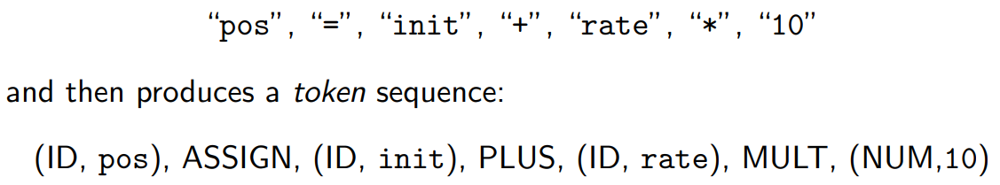
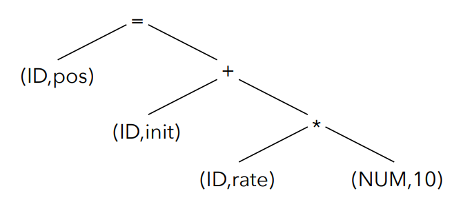

# COSE-312
https://prl.korea.ac.kr/courses/cose312/2025/

# Index
- [1. Lecture 1](#lecture-1)
- [2. Lecture 2](#lecture-2)
- [3. Lecture 3](#lecture-3)
- [4. Lecture 4](#lecture-4)
- [5. Lecture 5](#lecture-5)
- [6. Lecture 6](#lecture-6)
- [7. Lecture 7](#lecture-7)
- [8. Lecture 8](#lecture-8)
- [9. Lecture 9](#lecture-9)
- [10. Lecture 10](#lecture-10)

# Lecture 1
우리가 프로그래밍 언어로 작성한 코드는 컴퓨터가 직접 이해할 수 없습니다. 이를 컴퓨터가 이해할 수 있는 형태로 바꾸어주는 소프트웨어가 필요한데, 그중 하나가 바로 **컴파일러(Compiler)** 입니다. 컴파일러는 특정 프로그래밍 언어, 즉 소스 언어(source language)로 작성된 프로그램을 다른 언어인 목표 언어(target language)로 번역하는 역할을 합니다.

목표 언어는 대부분 컴퓨터의 중앙 처리 장치(CPU)가 직접 실행할 수 있는 기계어(machine language), 예를 들어 인텔 계열의 x86 명령어 집합 같은 것입니다. 하지만 항상 기계어만을 목표로 하는 것은 아닙니다. 대표적인 예로 자바(Java)를 들 수 있는데, 자바 컴파일러는 소스 코드를 자바 가상 머신(JVM)이 이해할 수 있는 바이트코드(bytecode)라는 중간 형태(intermediate form)로 우선 번역합니다.

컴파일러는 복잡한 번역 과정을 효율적으로 수행하기 위해 여러 단계(phase)로 나뉘어 구성되는 것이 일반적입니다. 각 단계는 이전 단계의 출력을 입력으로 받아 특정 작업을 수행하고, 그 결과를 다음 단계로 전달합니다. 크게 프론트엔드(Front End), 미들엔드(Middle End), 그리고 백엔드(Back End)로 구분할 수 있습니다.

## 컴파일러의 구조 (Structure of Compilers)
프론트엔드는 소스 프로그램을 분석하여 그 구조와 의미를 파악하고, 이를 후속 단계를 위한 내부 표현 방식인 **중간 표현(Intermediate Representation, IR)** 으로 변환하는 역할을 담당합니다. 입력으로는 프로그래머가 작성한 문자열 형태의 소스 코드가 주어집니다.

IR은 컴파일러 내부에서 프로그램을 나타내는 방식으로, 다양한 형태가 존재합니다. 가장 잘 알려진 예로는 프로그램의 문법적 구조를 나무 형태로 표현한 **추상 구문 트리(Abstract Syntax Tree, AST)** 가 있으며, 이는 2차원적인 구조로 이해할 수 있습니다. 또 다른 형태로는 기계어 명령어와 유사하게 각 명령어가 간단한 연산들로 구성된 **3-주소 코드(Three-Address Code, TAC)** 처럼 보다 선형적인 표현 방식도 널리 사용됩니다.

프론트엔드는 주로 다음과 같은 세부 단계들로 이루어집니다.

## 1. 프론트엔드 (Front End)
프론트엔드는 소스 프로그램을 분석하여 그 구조와 의미를 파악하고, 이를 후속 단계를 위한 내부 표현 방식인 **중간 표현(Intermediate Representation, IR)** 으로 변환하는 역할을 담당합니다. 입력으로는 프로그래머가 작성한 문자열 형태의 소스 코드가 주어집니다.

IR은 컴파일러 내부에서 프로그램을 나타내는 방식으로, 다양한 형태가 존재합니다. 가장 잘 알려진 예로는 프로그램의 문법적 구조를 나무 형태로 표현한 **추상 구문 트리(Abstract Syntax Tree, AST)** 가 있으며, 이는 2차원적인 구조로 이해할 수 있습니다. 또 다른 형태로는 기계어 명령어와 유사하게 각 명령어가 간단한 연산들로 구성된 **3-주소 코드(Three-Address Code, TAC)** 처럼 보다 선형적인 표현 방식도 널리 사용됩니다.

프론트엔드는 주로 다음과 같은 세부 단계들로 이루어집니다.

### 1.1. 어휘 분석기 (Lexical Analyzer)
어휘 분석기는 소스 코드 문자 스트림(Character Stream)을 읽어들여 문법적으로 의미 있는 최소 단위인 **토큰(Token)** 들의 스트림(Token Stream)으로 분해합니다. 토큰은 일반적으로 **타입(Type)** 과 필요한 경우 그 **값(Value)** 을 쌍으로 가집니다.

예를 들어, `pos = init + rate * 10`라는 코드가 있다면, 어휘 분석기는 이를 `(ID, pos), ASSIGN, (ID, init), PLUS, (ID, rate), MULT, (NUM, 10)`과 같은 토큰의 연속으로 변환합니다.

### 1.2. 구문 분석기 (Syntax Analyzer)
구문 분석기는 어휘 분석기가 생성한 토큰 스트림을 입력으로 받아, 소스 코드의 문법적 구조를 분석합니다. 이 과정에서 토큰들이 프로그래밍 언어의 문법 규칙에 맞게 배열되었는지를 검사하며, 그 결과로 일반적으로 구문 트리(Syntax Tree) 또는 파스 트리(Parse Tree)를 생성합니다. 이 구문 트리는 프로그램의 구조를 명확하게 보여주며, 이후 의미 분석 단계에서 프로그램의 의미를 파악하고 검증하는 기초 자료로 활용됩니다.

### 의미 분석기 (Semantic Analyzer)
의미 분석기는 구문 트리를 바탕으로 프로그램의 의미론적 정확성(semantic correctness)을 검사합니다. 구문적으로는 올바르더라도 의미적으로는 말이 되지 않는 경우를 찾아내는 과정으로, 이는 상당히 어렵고 복잡한 작업이 될 수 있습니다. 예를 들어, 구문 분석기는 문법 규칙만을 검사하므로 타입 오류까지는 잡아내지 못하지만, 의미 분석기는 선언되지 않은 변수의 사용, 타입 불일치, 함수의 인자 개수 불일치 등을 검사합니다.

**타입 검사(Type checking)**는 의미 분석의 중요한 부분으로, 모든 연산이 호환되는 타입의 피연산자들과 함께 사용되었는지 확인합니다.

예를 들어, 정수형 변수와 문자열 변수를 직접 더하려고 하는 `int z = x + y;` (여기서 x는 정수, y는 문자열)와 같은 코드는 타입 오류로 진단됩니다. 이 외에도 배열의 범위를 벗어난 접근이나 null 포인터 역참조와 같은 메모리 관련 오류 (Safety errors), 또는 프로그램이 의도한 대로 동작하는지 확인하기 위한 사전/사후 조건 검사 (Functional errors) 등도 의미 분석의 범주에 포함될 수 있습니다.

### 1.4. IR 번역기 (IR Translator)
IR 번역기는 구문 분석기와 의미 분석기를 거친 구문 트리(또는 이전 단계에서 생성된 IR)를 컴파일러의 다음 단계를 위해 설계된 특정 중간 표현(IR)으로 변환하는 역할을 합니다. 이 새로운 IR은 기존의 구문 트리보다 더 추상적이거나 특정 분석 및 최적화에 더 적합한 형태일 수 있으며, 또 다른 트리 구조이거나 3-주소 코드와 같이 보다 선형적인 구조일 수도 있습니다.

일반적으로 IR은 소스 언어보다는 저수준(lower-level)의 특성을 가지면서도, 목표 기계어보다는 고수준(higher-level)의 추상화를 유지합니다. **3-주소 코드(TAC)**를 예로 들면, 각 명령어는 보통 최대 하나의 연산자와 세 개의 주소(결과를 저장할 주소 하나, 피연산자를 위한 주소 최대 두 개)를 갖는 형태로 표현됩니다. 가령 `t1 = a + b`와 같은 명령어는 `t1, a, b`라는 세 개의 주소를 명확히 사용합니다. `t2 = -c` (단항 연산) 또는 `t3 = d` (값 복사) 같은 형태도 가능합니다.

IR을 사용하는 주된 이유는 다양한 소스 언어와 목표 아키텍처에 대해 컴파일러의 일부를 재사용할 수 있게 하고, 다양한 최적화(Optimization) 기법을 언어나 기계에 독립적으로 적용하기 용이하게 만들기 위함입니다.

## 2. 미들엔드 (Middle End) - 최적화기 (Optimizer)
미들엔드는 주로 IR을 입력으로 받아 다양한 분석과 변환을 통해 프로그램의 효율성을 향상시키는 최적화(Optimizer) 과정을 수행합니다. 최적화는 프로그램의 의미를 변경하지 않으면서 실행 속도를 높이거나 메모리 사용량을 줄이는 것을 목표로 합니다. 하나의 최적화기가 여러 종류의 최적화를 수행하거나, 여러 개의 최적화기가 순차적으로 또는 반복적으로 IR을 개선해 나갈 수 있습니다.

간단한 최적화 예시를 통해 IR이 어떻게 변화하는지 살펴보겠습니다:

1. 원본 IR: `t1=10; t2=rate*t1; t3=init+t2; pos=t3`
2. 상수 전파 (Constant Propagation) 적용 후: t1의 값 10이 t2의 정의에 직접 사용됩니다. `t1=10; t2=rate*10; t3=init+t2; pos=t3`
3. 죽은 코드 제거 (Dead Code Elimination) 적용 후: t1이 t2의 정의에 사용된 후 더 이상 참조되지 않는다면 제거될 수 있습니다. `t2=rate*10; t3=init+t2; pos=t3`
4. 복사 전파 (Copy Propagation) 및 죽은 코드 제거 적용 후: `pos=t3`에서 `t3`의 값인 `init+t2`가 직접 pos에 대입되고, 이후 t3의 정의는 불필요해져 제거됩니다. `t2=rate*10; pos=init+t2` (다이어그램에 표시된 최종 IR과 일치)

## 3. 백엔드 (Back End)
백엔드는 최적화된 IR을 입력으로 받아 실제 목표 기계에서 실행될 수 있는 목표 프로그램(일반적으로 기계어)을 생성하는 역할을 담당합니다. 이 과정에는 목표 기계의 명령어 집합을 선택하는 명령어 선택(instruction selection), 한정된 수의 CPU 레지스터에 변수를 할당하는 레지스터 할당(register allocation), 그리고 실제 기계 코드를 생성하는 코드 생성(code generation) 등의 작업이 포함됩니다.

고수준 언어와 저수준 기계어의 중요한 차이점 중 하나는 변수를 다루는 방식과 메모리 접근입니다. 특히 레지스터 할당 문제는 매우 중요합니다. 최신 CPU는 매우 빠른 소량의 저장 공간인 레지스터를 가지고 있지만, 프로그램은 그보다 훨씬 많은 변수를 사용할 수 있습니다. 자주 사용되는 변수를 레지스터에 효과적으로 할당하면 프로그램 성능을 크게 향상시킬 수 있습니다. 하지만 최적의 레지스터 할당 방법을 찾는 것은 계산적으로 매우 어려운 NP-난해(NP-hard) 문제로 알려져 있습니다. 따라서 실제 컴파일러는 최적의 해를 보장하지는 않지만 합리적인 시간 내에 좋은 결과를 내는 휴리스틱(heuristics) 기법들을 사용합니다.

## 요약 (Summary)
지금까지 살펴본 컴파일러의 전체 구조를 요약하면 다음과 같습니다.

프론트엔드: 소스 프로그램의 구문(syntax)과 의미(semantics)를 이해하여 IR을 생성합니다.
미들엔드 (최적화기): IR을 분석하고 변환하여 프로그램의 효율성을 향상시킵니다.
백엔드: 최적화된 IR로부터 목표 기계에서 실행 가능한 프로그램을 생성합니다.