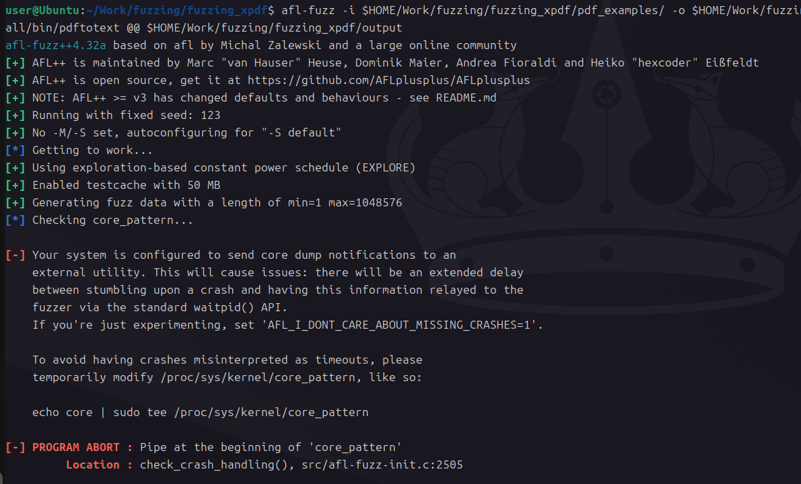
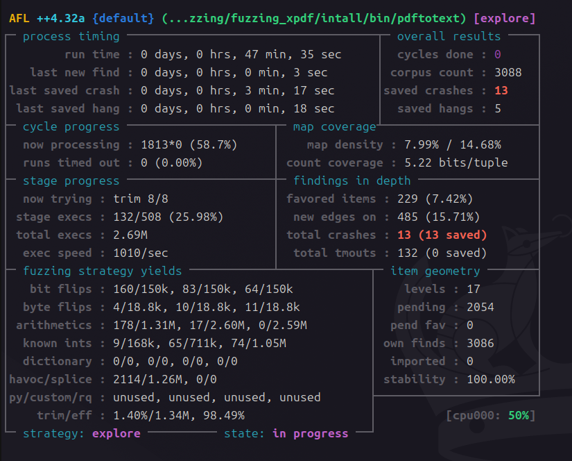
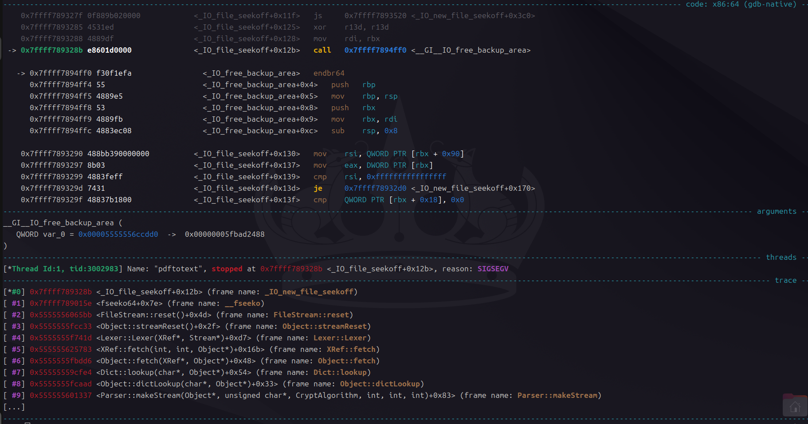
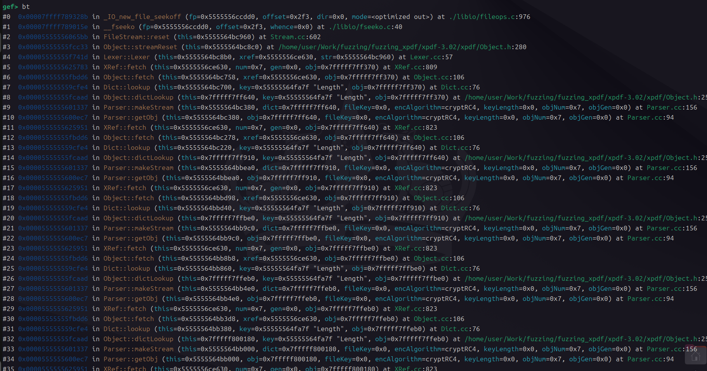
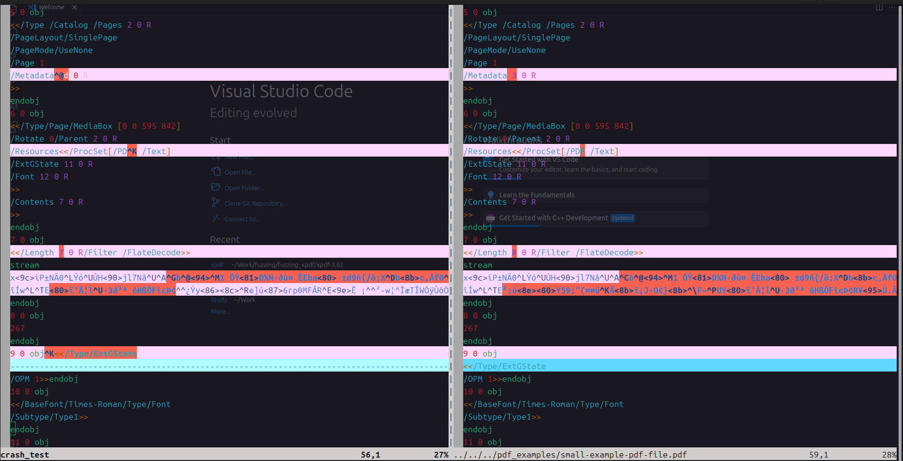

# Exercise 1 - Xpdf
Finding vulnerability in Xpdf PDF viewer, **CVE-2019-13288** <br>

## Environment setting
```
cd $HOME
mkdir fuzzing_xpdf && cd fuzzing_xpdf/

sudo apt install build-essential

(Download Xpdf 3.02)
wget https://dl.xpdfreader.com/old/xpdf-3.02.tar.gz
tar -xvzf xpdf-3.02.tar.gz

(Build Xpdf)
cd xpdf-3.02
sudo apt-get install libmotif-dev libfreetype-dev
sudo apt update && sudo apt install -y build-essential gcc
./configure --prefix="$HOME/fuzzing_xpdf/install/"
make
make install

(Get some pdf to test Xpdf)
cd $HOME/fuzzing_xpdf
mkdir pdf_examples && cd pdf_examples
wget https://github.com/mozilla/pdf.js-sample-files/raw/master/helloworld.pdf
wget http://www.africau.edu/images/default/sample.pdf
wget https://www.melbpc.org.au/wp-content/uploads/2017/10/small-example-pdf-file.pdf

(Xpdf test)
$HOME/fuzzing_xpdf/install/bin/pdfinfo -box -meta $HOME/fuzzing_xpdf/pdf_examples/helloworld.pdf
```

If xpdf has successfully builded, we can see result like below


## AFL installation
Below is local install procedure of afl
```
(Dependency install)
sudo apt-get update
sudo apt-get install -y build-essential python3-dev automake git flex bison libglib2.0-dev libpixman-1-dev python3-setuptools
sudo apt-get install -y lld-19 llvm-19 llvm-19-dev clang-19 || sudo apt-get install -y lld llvm llvm-dev clang 
sudo apt-get install -y gcc-$(gcc --version|head -n1|sed 's/.* //'|sed 's/\..*//')-plugin-dev libstdc++-$(gcc --version|head -n1|sed 's/.* //'|sed 's/\..*//')-dev

(Checkout + AFL++ build)
git clone https://github.com/AFLplusplus/AFLplusplus && cd AFLplusplus
export LLVM_CONFIG="llvm-config-19"
make distrib
sudo make install
```

## AFL++
AFL => **Coverage-guided fuzzer**, collects coverage information for each mutated input in order to discover new execution path and bugs <br>

When source code available => AFL can use **instrumentation**, Insert function call at the beginning of each basic blocks(functions, loops...) <br>

Have to compile target application with afl compiler

```
(Clean xpdf)
rm -r $HOME/fuzzing_xpdf/install
cd $HOME/fuzzing_xpdf/xpdf-3.02/
make clean

(Build xpdf using afl-clang-fast)
export LLVM_CONFIG="llvm-config-19"
CC=$HOME/AFLplusplus/afl-clang-fast CXX=$HOME/AFLplusplus/afl-clang-fast++ ./configure --prefix="$HOME/fuzzing_xpdf/install/"
sudo make
sudo make install
```

And after compile + installation, we can start fuzzing
```
afl-fuzz -i $HOME/Work/fuzzing/fuzzing_xpdf/pdf_examples/ -o $HOME/Work/fuzzing/fuzzing_xpdf/out/ -s 123 -- $HOME/Work/fuzzing/fuzzing_xpdf/install/bin/pdftotext @@ $HOME/Work/fuzzing/fuzzing_xpdf/output
```

- -i -> Directory that input cases locate(pdf example)
- -o -> Directory where AFL++ store mutated files
- -s -> Random static seed to use
- @@ -> Placeholder target's command line that AFL will substitute with each input file

So, basically fuzzer will run below command for each different input file
```
$HOME/fuzzing_xpdf/install/bin/pdftotext <input-file-name> $HOME/fuzzing_xpdf/output
```

If this error occur, do

```
sudo su
echo core >/proc/sys/kernel/core_pattern
exit
```

After several minutes, we can get results like this



Generated unique crashes can be found at **out** directory. Each one is mutated pdf files


## Crash Analysis
Let's analyze crash. I'll use crash below
```
id:000006,sig:11,src:001690,time:360722,execs:461233,op:havoc,rep:4
```

First, we have to check if the crashes can be reproduced. I changed the name of the crash into **crash_test**
```
$HOME/fuzzing_xpdf/intall/bin/pdftotext  $HOME/fuzzing/fuzzing_xpdf/out/default/crashes/crash_test
```

And we can see seg_fault happening


We can use gdb now. Before that, we have to build xpdf again in order to utilize **debug info** and remove optimizing options
```
rm -r $HOME/fuzzing_xpdf/install
cd $HOME/fuzzing_xpdf/xpdf-3.02/
make clean
CFLAGS="-g -O0" CXXFLAGS="-g -O0" ./configure --prefix="$HOME/fuzzing_xpdf/install/"
make
make install
```

Now, let's analyze crash with gdb
```
gdb --args $HOME/fuzzing_xpdf/install/bin/pdftotext $HOME/fuzzing_xpdf/out/default/crashes/<your_filename> $HOME/fuzzing_xpdf/output
```



We can find **SIVSEGV** occurred. Let's use **bt(backtrace)** to see what happened



We can see some kind of ifinite recursion is happening <br>

Using **vimdiff**, we can observe the difference between original and mutated file <br>



- Lengh 8 0 R => Length 7 0 R 
In pdf file, notation like **8 0 R** means indirect reference. For example **8 0 R** is saying, "Reference object whose object number is 8, and generation number is 0". <br> If we look at vimdiff screen, **8 0 R** is mutated to **7 0 R**, and object 7 is itself. So, by **7 0 R**, it keeps self referencing and this leads to stack overflow
