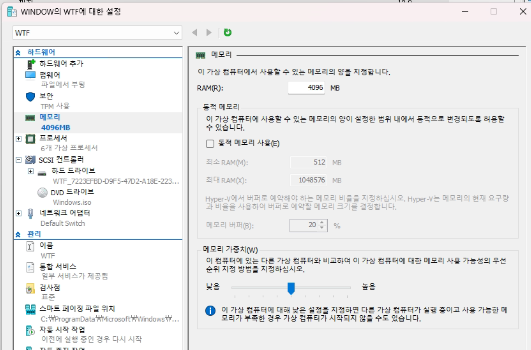
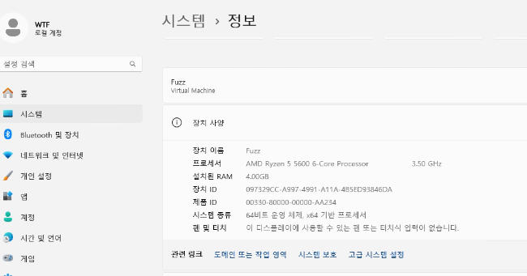
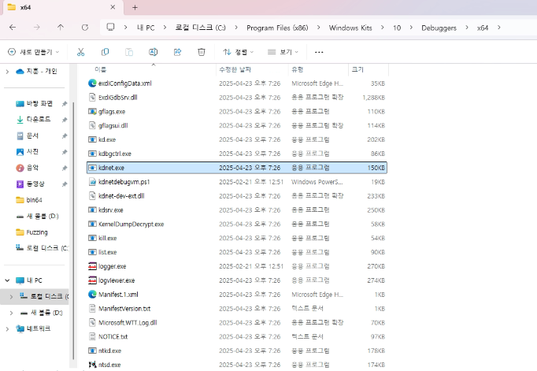
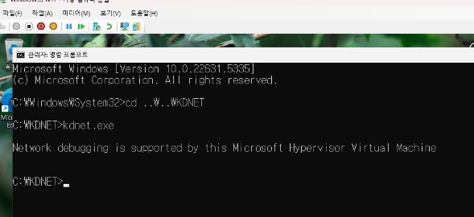
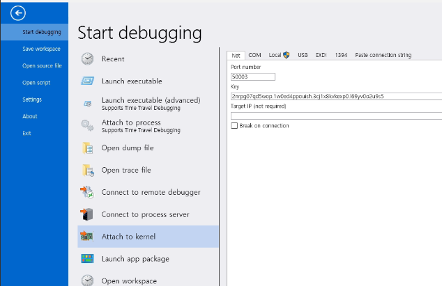

# Fuzzing
Studying WTF

## Configure Hyper-V VM
Prepare Windows image iso file from https://www.microsoft.com/ko-kr/software-download/windows11 <br> 
Enable Hyper-V, and make a virtual machine (Requires Gen2, and TPM enabled to install Windows 11) <br>
After finishing installation, go to VM configuration <br>
 <br>
Set memory to 4GB(4096MB) <br>
<br>
And then set the number of vCPU into one <br>

Turn on the target machine and go to **Advanced System Setting** <br>
 <br>

Advanced -> Performance -> Virtual Memory <br>
Turn off the paging <br>
 <br>

## KDNET setting
You can do it with following guide <br>
https://learn.microsoft.com/ko-kr/windows-hardware/drivers/debugger/setting-up-a-network-debugging-connection-automatically <br>

If you installed **Debugging Tools for Windows**, you can find 
```
kdnet.exe
VerifiedNICList.xml
```
these two files from debugger installation directory <br>

 <br>

Copy this to target machine's 
```
C:\KDNET
```
directory (mkdir if needed) <br>

Execute **kdnet.exe** to check if debugging is supported <br>
 <br>

And then enable network debugging with
```
kdnet.exe <HostComputerIPAddress> <YourDebugPort> 
```
you will get required key for debugging <br>

 <br>

Now we can attach debugger <br>

 <br>

## Prepare Harness
I will follow this: https://chp747.tistory.com/419 <br>

First, let's build target program that has vulnerability inside
```
#define _CRT_SECURE_NO_WARNINGS
#include <stdio.h>
#include <stdlib.h>
#include <string.h>

char buf[0x1000];

void fuzzme(char* buf) {
  char localbuf[0x200] = {0, };
  if (buf[0] == 'A')
    memcpy(localbuf, buf, strlen(buf)); // <- here is vuln
  else
    memcpy(localbuf, buf, 0x10);
  
  printf("%s\n", localbuf);
}

int main(int argc, char* argv[]) {
  if (argc < 2) {
    fprintf(stderr, "no input file\n");
    exit(-1);
  }

  FILE* f = fopen(argv[1], "rb");
  if (f == NULL) {
    fprintf(stderr, "failed to open file\n");
    exit(-1);
  }
  
  fgets(buf, 0x1000, f);
  fclose(f);
  
  fuzzme(buf);
  return 0;
}
```

Build this code with **Release** build and X64 <br>

