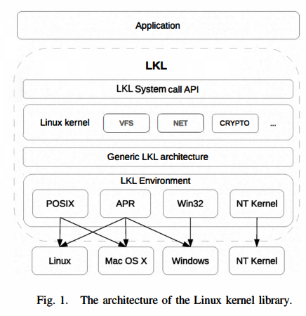
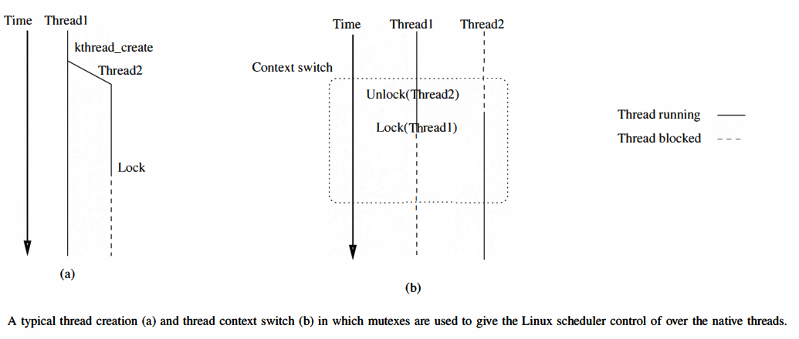

# Summary for LKL: The Linux Kernel Library

# Index
- [1. Introduction](#introduction)
- [2. Architecture](#architecture)
- [3. Anatomy of a LKL application](#anatomy-of-a-lkl-application)
- [4. Evalutation](#evaluation)

# Introduction
리눅스 커널은 세계에서 가장 큰 소프트웨어 프로젝트 중 하나로 복잡성과 고품질의 코드가 그 특징입니다.

리눅스 서브시스템의 특정 기능을 필요로 하는 어떤 프로젝트들은 처음부터 재구현을 하기도 합니다.

리눅스 커널의 코드를 다시 사용하지 않고 ext2를 구현한 사례는 여럿 존재합니다: Ext2 IFS 윈도우 드라이버, Ext2 IFS, Explore2fs Windows GUI 익스플로러, Haiku Ext2 파일 시스템 드라이버, 윈도우용 ext2lib 라이브러리

같은 종류의 기능이 다른 언어, 다른 운영체제에서 커널 모듈, 애플리케이션, 또는 라이브러리의 형태로 재구현 되었습니다. 하지만 이를 리눅스 커널의 다른 파일 시스템이나 서브 시스템 구현을 위해 재사용하는 것은 여러모로 어렵습니다.

리눅스 커널의 일부를 분리하여 추출하는 건 시간과 자원을 많이 소모하고, 분리에 성공하더라도 정체가 되어 커널의 최신 변경 사항이 반영이 굉장히 늦게 이뤄집니다. 반대의 경우도 마찬가지입니다.

**The Linux Kernel Library project**는 리눅스 커널의 코드를 애플리케이션이 쉽게 재사용할 수 있도록 구성하고자 하는 프로젝트입니다. 리눅스 커널의 기능을 쓰기 위해 들여야 했던 노력들이 LKL을 컴파일하고, 그 라이브러리를 애플리케이션에 링크해주는 정도로 많이 줄어들게 됩니다.

1. 개발자들은 LKL이 제공해주는 기능을 바탕으로 새로운 애플리케이션을 개발하는데 집중할 수 있고
2. Main Linux tree에 업데이트되는 버그 수정이나 새로운 기능들이 자동으로 LKL에 반영이 되면서 커널이나 서브시스템의 동향을 계속 확인해야하는 수고도 줄일 수 있습니다

애플리케이션은 다음과 같은 Linux kernel 서브시스템을 완전하게 사용할 수 있습니다:
1. 가상 파일 시스템 (Virtual file system)
2. 네트워킹 스택 (Networking stack)
3. 태스크 관리, 스케듈링 (Task management, scheduling)
4. 일정 수준까지의 메모리 관리 (Memory management to some extent)

LKL은 기본적인 몇몇 조건을 만족하는 어떠한 환경에서도 작동할 수 있고, 사용자 공간 (user space, Linux, Windows)과 커널 공간 (kernel space, Windows)에서 사용될 수 있습니다.  

# Architecture
주된 목표는 애플리케이션이 리눅스 커널의 코드를 재사용할 수 있는 간단하면서도 유지가능한 방법을 제공하는 것입니다.

다음과 같은 조건을 만족하여야 합니다:
1. User space와 kernel space에서 모두 사용이 가능하여야 합니다
2. 리눅스 커널 tree를 쉽게 트래킹할 수 있어야 합니다.
3. 애플리케이션으로부터 최소한의 **glue code**를 요구해야 하고, 안정적이면서 사용하기 쉬운 API를 제공하여야 합니다. 

향후 리눅스 커널의 배포를 쉽게 LKL에 반영하려면 LKL specific 요소를 mainline 커널로부터 깔끔하게 분리하는 메커니즘이 필요합니다.

User-mode Linux와 유사하게 LKL을 **lkl**이라는 가상 컴퓨터 아키텍처에 대한 커널 포트로 구현하였습니다. 그 결과 핵심 커널 요소를 변경할 필요가 없었고, 실제로 아키텍처와 무관한 리눅스 커널 변경사항은 빌드 시스템 관련 부분 뿐입니다.

대신 애플리케이션은 환경에 의존적인 소수의 **기본 함수들 (native operations**)에 대한 구현을 제공해야 하는데, 이는 일반적인 lkl 아키텍처가 리눅스 커널이 실행될 가상 머신을 구축하는데 사용됩니다.

LKL 시스템 콜 인터페이스는 리눅스 시스템 콜 인터페이스를 기반으로 하는 API로, 애플리케이션에게 안정적이고 친숙한 API를 제공합니다.

## The LKL Architecture
LKL 포트는 LKL native operations, LKL 시스템 콜, 그리고 애플리케이션이 리눅스 커널에게 외부 이벤트를 알릴 수 있게 해주는 인터럽트 유사 API를 포함하는 인터페이스를 통해 애플리케이션과 상호작용합니다. 
이 인터페이스의 세부사항을 정의하기 위해 리눅스 커널이 요구하는 아키텍처 레벨의 기본 함수들을 식별하고 이를 상황에 맞게 적응시켜야 했습니다.

완전한 리눅스 포트를 위해 아키텍처 레이어가 제공해야 하는 모든 기본 함수들이 lkl에 필요하지 않다는 것이 곧 명백해졌습니다. 

예를 들어, 리눅스 커널을 단일 애플리케이션에서 사용하기 때문에 사용자와 커널 간의 **주소 공간 분리 및 보호**나 **다중 사용자 주소 공간 간의 보호**가 필요하지 않습니다. 
실제로 lkl은 커널이 제공하는 일부 사용자 공간 추상화들, 즉 사용자 프로세스, 프로세스 주소 공간, 시그널 등도 필요하지 않습니다. 

이는 구현을 단순화할 뿐만 아니라 애플리케이션과 LKL 간의 인터페이스도 단순화할 수 있게 해줍니다. 가장 눈에 띄는 효과 중 하나는 LKL을 애플리케이션에 직접 링크할 수 있다는 것이었습니다.

### Memory Managment Support
LKL은 메모리 보호 메커니즘이 필요없어서 메모리 관리가 매우 간단합니다.

**핵심 구조:**
- 애플리케이션이 **물리** 메모리 풀을 제공
- 커널은 buddy, SLUB/SLAB 등 기존 알고리즘으로 이 풀을 관리
- 커널 코드와 정적 데이터는 호스트 환경이 관리 (풀에 포함되지 않음)

**VFS 등 일부 서브시스템은 가상 메모리 관리가 필요**하지만, 리눅스 커널이 이미 MMU 없는 아키텍처(예: m68k)를 지원하므로 LKL을 non-MMU 아키텍처로 선언하기만 하면 됩니다.

### Thread Support
사용자 프로세스는 필요없지만 커널 스레드는 필수입니다. 리눅스 커널이 I/O 처리, softirq, tasklet, workqueue 등 내부 작업에 사용하기 때문입니다.

초기에는 내부 구현을 고려했지만 다음과 같은 문제점들이 있었습니다:
- `setjmp/longjmp` 방식: 단일 스택 공간을 분할 → 스택이 깊은 VFS에서 스레드 수 제한
- 다른 방식들도 비슷한 제약이나 환경 의존적

결론적으로는 애플리케이션이 스레드 생성/종료 기본 함수들을 제공하도록 구현을 위임했습니다.

### Thread Switching
LKL 스레드들은 호스트 환경이 스케줄링하지만, 리눅스 커널은 자체 스레드 스케줄링을 제어해야 합니다. RCU, 리눅스 세마포어 등이 정확한 스케줄링 정책을 가정하기 때문입니다.

LKL은 이를 해결하기 위해 **토큰 패싱 (Token passing)** 메커니즘을 도입하였습니다.

  

**동작 방식:**
- 각 LKL 스레드마다 호스트 환경의 세마포어를 연결
- 스레드 생성 직후 자신의 세마포어를 획득 시도합니다. (초기값 0이므로 블록)
- 리눅스 스케줄러가 새 스레드를 선택하면:
  - 새 스레드의 세마포어 해제합니다.
  - 현재 스레드는 자신의 세마포어 획득합니다.

**결과:**
- 항상 하나의 스레드만 실행이 됩니다.
- 리눅스 스케줄러가 스레드에 대한 완전한 제어권 보유합니다.
- 호스트 환경의 스케줄링 간섭을 차단합니다.

이를 위해 호스트 환경은 세마포어 할당/해제, up/down 연산을 제공해야 합니다.

### IRQ Support
LKL을 사용하는 애플리케이션은 일반적으로 외부 개체와 상호작용해야 합니다. 예를 들어, 다른 운영체제에서 ext4 같은 리눅스 파일시스템 드라이버를 사용하려면 디스크에서 데이터를 읽어야 합니다.

이런 애플리케이션은 두 개의 장치 드라이버를 사용합니다:
- 리눅스 블록 장치 드라이버 (리눅스 커널 내부)
- 네이티브 커널 장치 드라이버 (호스트 운영체제)

동작 과정은 다음과 같습니다:
1. 리눅스 장치 드라이버가 I/O 요청을 생성
2. 네이티브 장치 드라이버를 호출하여 하드웨어 프로그래밍
3. 하드웨어가 I/O 완료 후 네이티브 IRQ 생성
4. 네이티브 드라이버가 IRQ 처리 후 리눅스 커널에 완료 신호 필요

네이티브 IRQ는 비동기적이므로, LKL도 비동기적으로 IRQ를 지원해야 합니다.

LKL IRQ API:
- 단순 IRQ: IRQ 번호만 지정 (타이머 인터럽트 등)
- **데이터 포함 IRQ (with data IRQs)**: 완료된 작업, 성공/실패 상태 등의 컨텍스트 정보 포함

**직렬화 (serialization)** 처리: LKL은 현재 SMP나 선점형 지원이 없지만, 호스트 환경은 SMP일 수 있어 병렬 스레드에서 IRQ가 발생할 수 있습니다. 따라서 IRQ 대기열을 생성하여 유휴 스레드에서 순차적으로 처리합니다.
이를 통해 호스트 환경과 LKL 간의 안전한 비동기 통신이 가능해집니다.

### Idle CPU Support
리눅스에서 실행 가능한 스레드가 없을 때는 **유휴 스레드(idle thread)** 가 실행됩니다. 유휴 스레드의 역할은 특별한 아키텍처별 CPU 명령어를 통해 CPU를 저전력 모드로 전환하고, IRQ 같은 비동기 이벤트가 발생할 때까지 대기하는 것입니다.

**LKL의 제약사항:**
- 사용자 공간에서 실행되므로 저수준 CPU 명령어에 접근할 수 없습니다.
- 접근할 수 있다고 해도 CPU를 저전력 모드로 전환하는 것이 부적절합니다. (호스트의 다른 네이티브 스레드들이 실행 가능할 수 있음)
- 시뮬레이션된 IRQ를 위한 바쁜 대기(busy waiting)는 전력 낭비와 CPU 점유 문제 발생시킵니다.

**해결 방안:**
유휴 스레드를 잠들게 하고 IRQ 신호 시 깨우는 방식이 필요하지만, LKL은 네이티브 스레드 스케줄링을 제어할 수 없으므로 애플리케이션의 도움이 필요합니다.

**구현 변화:**
- **초기 방식**: `enter_idle`과 `exit_idle` 네이티브 연산 제공 요구
 - `enter_idle`: 유휴 스레드에서 호출 (세마포어 down 연산)
 - `exit_idle`: IRQ 트리거 루틴에서 호출 (세마포어 up 연산)

- **현재 방식**: 기본 세마포어 연산만 요구
 - 다른 컴포넌트들도 세마포어가 필요하므로 이 방식이 더 간단함
 - 구현과 네이티브 연산 요구사항을 모두 단순화

이를 통해 LKL은 효율적인 유휴 상태 관리가 가능해집니다.

### Time and Timers Support
시간 지원 없는 리눅스 커널은 유용하지 않습니다. 리눅스 커널은 다음과 같은 용도로 시간을 사용합니다:
- 파일의 접근 및 수정 타임스탬프 업데이트
- 네트워크 스택에서 광범위한 타이머 사용
- RCU 동기화 메커니즘의 정상 동작

**LKL 요구사항:**
애플리케이션이 **두 개의 네이티브 연산**을 통해 타이머와 시간 소스를 제공해야 합니다:

1. **시간 소스**: Unix epoch 시작부터 경과한 나노초 수 반환
2. **타이머**: 지정된 나노초 후에 IRQ_TIMER 인터럽트를 트리거해야 하는 시점 설정

## LKL System Call API
LKL은 애플리케이션에게 **리눅스 시스템 콜의 하위 집합**을 API로 제공합니다.

**문제점:**
LKL이 애플리케이션에 링크되어 있어 모든 커널 심볼에 접근할 수 있지만:
- 커널 함수 직접 호출 시 안전장치 우회하기 때문에 적절하지 않습니다.
- SMP 지원 없어 시스템 콜 핸들러 직접 호출 시 경쟁 상태 발생할 수 있습니다.
- 시스템 콜 핸들러, 커널 스레드, IRQ 핸들러 간의 적절한 직렬화가 필요합니다.

**LKL의 해결 방식 - 직렬화된 시스템 콜:**

애플리케이션은 **미리 정의된 시스템 콜 래퍼 세트 (a set of predefined system call wrappers)** 를 통해 커널에 접근합니다. 

이 함수들은 IRQ 번호를 `IRQ_SYSCALL`로 설정하고 데이터를 시스템 콜 번호와 매개변수가 저장된 구조체로 설정한 **데이터 포함 IRQ (with data IRQs)** 를 발행합니다. 

그 후 시스템 콜 결과를 위한 슬롯이 초기화되고 새로운 네이티브 세마포어가 할당 됩니다. 둘 다 같은 구조체에 저장되고, 호출 스레드는 시스템 콜 결과가 준비될 때까지 세마포어에서 잠듭니다.

IRQ 핸들러는 모든 시스템 콜 요청을 **work_queue**에 추가합니다. 

일반적인 리눅스 커널과 달리 LKL은 사용자 공간 프로세스를 지원하지 않아 초기화가 끝나도 **init 프로세스**를 실행할 수 없습니다. 

대신 LKL은 시스템 콜 work_queue의 이벤트를 기다리는 특수 목적 루틴을 실행하여, 각 요청에 대해 init 스레드는 적절한 시스템 콜 핸들러를 호출하고, 핸들러가 반환한 값을 시스템 콜과 연관된 구조체의
결과 필드에 넣고, 세마포어를 해제하여 원래 호출 스레드의 차단 (block)을 해제합니다.

차단이 해제되면 시스템 콜 래퍼는 연관된 구조체를 해제하고 결과를 호출자에게 반환합니다.

## API helpers
애플리케이션은 대부분의 작업에서 LKL 시스템 콜 API만 사용하면 됩니다. 

하지만 자주 사용되는 일부 작업들은 이식 가능한 LKL 시스템 콜만으로도 구현할 수 있지만 상당한 양의 작업을 필요로 하기에 LKL은 **API 도우미 함수**를 제공합니다:
- 파일시스템 마운트/언마운트
- 인터페이스에 IP 주소 할당
- 기타 편의 기능들

## LKL Environment
LKL은 네이티브 연산을 통해 환경에 접근해야 합니다. LKL은 애플리케이션 작성, 유지보수 작업을 단순화하기 위해 네이티브 연산을 LKL 자체에서 구현합니다.

**현재 지원하는 LKL 환경들:**
- **POSIX** (Linux/Unix 사용자 공간)
- **NT** (Windows 사용자 공간)  
- **NTK** (Windows 커널)
- **Apache Portable Runtime**

**새로운 LKL 환경 추가:**
새로운 LKL 환경 지원 추가는 간단한 작업입니다. 다음 연산들만 제공하면 됩니다:
- 콘솔에 메시지 출력 (printk 동등)
- 세마포어 할당/해제/획득/해제
- 스레드 생성/삭제
- 메모리 할당/해제
- 현재 시간 조회
- 미래 시점에 LKL 타이머 인터럽트 스케줄링

이러한 최소한의 인터페이스만 구현하면 새로운 환경에서 LKL을 실행할 수 있습니다.

# Anatomy of a LKL Application
일반적인 LKL 애플리케이션은 몇 가지 표준 구성 요소를 가집니다:  

**주요 구성 요소:**
- **리눅스 커널 라이브러리**: 애플리케이션이 필요한 기능들로 구성 (예: ext4 파일시스템, TCP/IP 네트워킹 스택 등)
- **애플리케이션 전용 드라이버**: 보통 두 부분으로 분할
 - 리눅스 장치 드라이버
 - 네이티브 스텁(stub)
- **네이티브 연산 구현**: 같은 환경을 공유하는 애플리케이션들이 이 부분을 공유 가능
- **애플리케이션 전용 코드**

**구성 요소 간 상호작용 과정:**

1. **애플리케이션** → LKL 시스템 콜 API를 통해 리눅스 커널 호출

2. **리눅스 커널** → 장치 드라이버에 요청 발행 (예: 디스크 읽기/쓰기)

3. **장치 드라이버** → 네이티브 스텁 호출

4. **장치 드라이버 스텁** → 환경에서 요청 프로그래밍
  - 환경에 따라 시스템 콜, 네이티브 장치 드라이버 요청, 또는 기타 환경 의존적 연산

5. **환경** → 네이티브 스텁에게 요청 완료 보고
  - 네이티브 IRQ 또는 기타 네이티브 알림 메커니즘 사용

6. **네이티브 스텁** → LKL 인터럽트를 통해 리눅스 커널에 작업 완료 알림

7. **장치 드라이버** → 리눅스 커널에 작업 완료 알림

**추가 참고사항:**
리눅스 커널은 애플리케이션 생명주기 동안 리눅스 커널 스레드나 LKL 시스템 콜을 실행하는 스레드에서 다양한 네이티브 연산들을 호출합니다.

# Evaluation
이 섹션에서는 복잡한 작업을 수행하기 위해 리눅스 커널을 사용하는 애플리케이션 개발에서 LKL의 유용성을 평가하기 위해 작성한 몇 가지 개념 증명 애플리케이션들을 소개합니다.
## 휴대용 FTP 서버

LKL을 기반으로 개발한 첫 번째 애플리케이션은 **리눅스 커널이 지원하는 파일시스템으로 포맷된 파일과 디스크 이미지를 읽을 수 있는 휴대용 FTP 서버**입니다. 다양한 플랫폼 간 이식성을 보장하기 위해 Apache Portable Runtime Library API를 기반으로 구현했습니다.

**실용적 활용:**
- 듀얼 부트 모드를 사용하는 사람들
- 비리눅스 운영체제에서 리눅스 포맷 미디어를 읽고 싶은 사람들
- FTP 클라이언트는 모든 주요 플랫폼에서 사용 가능
- GUI에서 파일시스템 접근과 FTP 접근이 동일한 인터페이스 제공

**성능:**
- 네이티브 경로 (FTP 데몬이 네이티브 마운트된 EXT3 파일시스템 사용)
- LKL 경로 (FTP 데몬이 LKL을 사용하여 파티션에서 직접 읽기)
- 두 경로 모두 유사한 처리량 달성 (Pentium 4 2.0GHz 머신에서 약 40MB/s)

## Windows 파일시스템 드라이버

첫 번째 커널 애플리케이션으로 **모든 리눅스 파일시스템에 읽기 전용으로 접근할 수 있는 범용 Windows 파일시스템 드라이버**를 개발했습니다.

**동작 방식:**
- 모든 Windows 파일시스템 연산을 리눅스 시스템 콜(open, read, write 등)로 변환
- LKL → 해당 리눅스 파일시스템 드라이버 → 네이티브 디스크 장치 드라이버로 전달
- Windows 부분은 ext2fsd 프로젝트 코드를 기반으로 구현

## 네트워킹 스택 재사용

**HTTP 클라이언트:**
- 전체 리눅스 네트워킹 스택을 재사용하는 간단한 HTTP 클라이언트
- 가상화 최적화(GRO, GSO) 없이도 임베디드 시스템(PowerPC 800MHz)에서 150Mbps 처리량 달성

**네트워크 시뮬레이터:**
- 시뮬레이션하는 각 노드(엔드스테이션, 스위치, 라우터, 방화벽)마다 전체 리눅스 네트워킹 스택 사용
- 현실적인 네트워크 시뮬레이션 구현 진행 중
