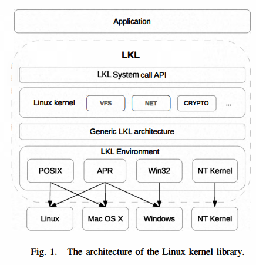
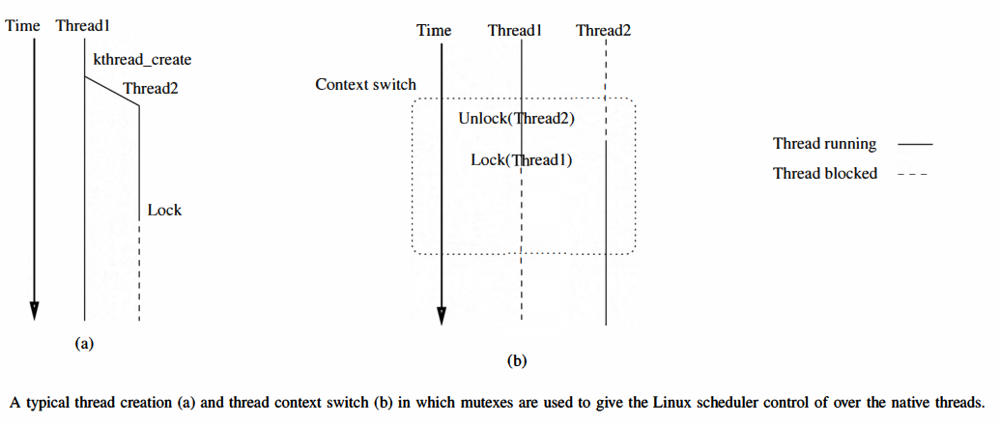

# Summary for LKL: The Linux Kernel Library

# Index
- [1. Introduction](#introduction)

# Introduction
Linux Kernel: One of the largest software projects in the world, high quality, complex  

Some projects (that found themselves in need of functionality implemented in some of the Linux subsystems) => Reimplement it from scratch  

Number of ext2 implementation written without directly using code from Linux kernel:  

Windows drivers Ext2 FSD, Ext2 IFS, Explore2fs Windows GUI explorer, Haiku Ext2 file system driver, ext2lib library for Windows  

Same kind of functionality => Reimplemented in different languages for different OS as a kernel module, as a application and a library  

=> But with different levels of support, performance, bug => Hard to reuse when re-implementing other file systems or other subsystems of the Linux kernel  

Extracting portions of the Linux kernel:

1. Selecting necessary part, separating + maintaing => Consume resources and require highly-skilled developer
2. Once separated code => stagnates, Upstream kernel introdced very slowly including bug fixes or features (Reverse is also true)

**The Linux kernel library project** => Organize the Linux code in a form such that it can be easily reused by an application  

Effort spent on getting access to Linux kernel functionality => Reduced to compiling the Linux Kernel (including patches) and linking resulting library into applications  

1. Developers can concentrate on creating new applications based on functionality provided by Linux kernel code
2. Upgradeing LKL -> Automatically brings bug fixes and new features updated in the main Linux tree => Freeing developers from monitoring changes done on kernel and subsystems 

Applications can make use of full Linux kernel subsystems like
1. Virtual file system
2. Networking stack
3. Task management, scheduling
4. (Even) Memory management to some extent

LKL -> Can run in any environment satisfying a few basic primitives, Can be used in user space (Linux, Windows) and kernel space (Windows)  

# Architecture
Main goal => Provide simple, maintainable way that applications can reuse Linux Kernel code  

Should be 
1. usable from both user, kernel space
2. allow easy tracking of Linux kernel tree
3. require minimum **glue code** from the application and provide stable, easy way to use API

In order to be able to easily upgrade LKL to future Linux kernel releases => Require a mechanism to cleanly separate the LKL specific components from the mainline kernel  

**User-mode Linux** => Implement LKL as a port of the kernel to a virtual computuer architecture, named **lkl** => No need to change any of the core kernel components  

Instead, the applications needs to provide implementations for a small set of envrionment dependent primitives => 
**native operations** from hereafter, are used by the generic lkl architecture to build the virtual machine upon which the Linux kernel will execute  

LKL system call interface => API based on the Linux system call interface, Offer a stable and familiar API to applications 

## The LKL Architecture
LKL port => Interact with applications via an interface which includes the LKL native operations => **LKL system call**, **Interrupt-like API** (notify the Linux kernel about external events)  

Not all primitives (that need to be ofered by an architecture layer for a full Linux port) were required  

For example...  

Only using Linux kernel for a single application => Do not need **address space separation** and protection between user and kernel or multiple user address spaces  

Do not even need some of the user space abstractions that the kernel offers (like user processes, process address spaces or signals)  

=> Allow simplifying the interface between the application and LKL.  

Most visible effect: Can directly link LKL into the application

### Memory Managment Support
LKL: Doest not require memory protection mechanism => LKL just needs a **physical** memory pool that hte kernel can use  

Actual memory reservation => Under control of the application (Controls both the allocation mechanism adn the size of the memory pool)  

Poll of memory => Managed by kernel using a mix of **buddy, SLUB/SLAB/SLOB/SLQB** algorithms, Only be used for buffers and structures dynamically allocated by the kernel  

Kernel code, statically allocated data => Managed by the external environment that loads LKL, not part of this poll  

Some subsystems such as VFS need virtual memory management support.  

Linux kernel => Implements virtual management API even on architectures that don't have a MMU => No MMU emulation is needed in LKL itself, just need to declare LKL as a non-MMU architecture

### Thread Support
Need to offer support for kernel threads  

Linux kernel uses such threads for internal house-keeping, like processing I/O requests, running softirqs, or workqueues  

Complete internal implementation of threads => Have variou limitations  

For example...  

Implementation based on **setjmp - longjmp** require usage of single stack space partitioned between all threads  

Linux kernel uses deep stacks (especially in the VFS layer) => Environment with small stack sizes (ex: inside another operating system's kernel), will place very low limit of number of possible threads  

Deferred actual implementation => Requirements for application: **Create a new thread, and terminate thread**

### Thread Switching
Threads used by LKL: implicitly scheduled by the environment, but Linux needs to control scheduling of its threads to function correctly and efficiently  

RCU(Read-copy update) -> Make assumptions about scheduling policies: Linux threads synchronized with Linux semaphores need to sleep and switch to other Linux threads  

To regain control of scheduling, generic LKL architecture layer associates an environment-provided semaphore with each LKL thread  

  

Immediately after creation, and before runnnig any Linux code, ach LKL acquires its corresponding semaphore, and gets blocked as the semaphore's initial value is 0  

When the Linux scheduler selects a new thread to run -> Releases the semaphore of the new thread and immediately acquires its own semaphore  

New thread will begin running and the old one stops  

Token passing mechanism => Ensure that only one thread running and the scheduling order is dictated by the Linux scheduler  

Semaphore: Must provided by the environment as a set of native operation  

Allocate, free, up, down basuc semaphore operations required

### IRQ Support
Typical scenario: Application that uses LKL needs to have LKL interact with some external entity  

Ex: Driver for another OS for a Linux file system like ext4, needs to read data from disk  

Such application will use two device drivers: Linux block device and a native kernel device driver  

Linux Device => Will act as translator between the Linux kernel and the native kernel(host): Linux device driver programs an **I/O request** by calling the native device driver => Programs the hardware to do the I/O operation  

Application --I/O request--> Linux Kernel (in LKL) --I/O request--> LKL block device driver --calls--> Native kernel device driver --programs--> Hardware   

At some point hardware device completes I/O operation and generates a native IRQ => Native device driver processes it, and needs to signal to Linux Kernel 

Native IRQ is **asynchronous** => Need to signal the Linux kernel asynchronously that the I/O operation has been completed => **IRQ support required in LKL**  

Part of the API that LKL offers: Operations to trigger IRQ  

Application specify IRQ number it wants to generate and, optionally some data(pointer)  

Simple IRQ => When driver has nothing to communicate apart from interrupt generation  

Timer interrupts => Example of simple IRQ, timer: periodic events and the kenrel knows the period  

**with data IRQ** => Used by native device drivers to communicate the context of the IRQ(ex: Completion status, completed operation) to Linux device driver  
Current Implementation of LKL: NO SMP, preemptive support  
Native environment could be SMP and and could trigger IRQs from a thread running parallel to the currently active LKL thread  

Since LKL only supports single thread... => Need to serialize IRQs handlers and LKL kernel threads => Create queue of uotstanding IRQs (Handled serially from the idle thread )

### Idle CPU Support
When no thread runnalbe -> Linux runs the so called **idle thread**  

Idle thread: Throttle down the CPU via special architecture specific CPU instructions  

Ideally, CPU should enter a low power mode and stay until an asynchronous evnet liks an IRQ wakes up  

LKL -> No access to the necessary low level CPU instructions, Even avaiable, inappropriate to throttle down the CPU  

On the other hand, busy waiting for simulated IRQs -> Wastes power and hogs the CPU  

**Proper way to handle the ide CPU issue**: Put the idle thread to sleep (when there's nothing to do) and wake it up when an IRQ has been signaled  

However, LKL doesn't control native thread scheduling, it needs help from the application efficiently manage the idle state  

Initially => Required the application to provide two native opertions: **enter_idle**, **exit_idle**  

enter_idle: Called from within the idle thread  
exit_idle: Called by the IRQ triggering routine  

Typical implementation: semaphore down for enter_idle, semaphore up for exit_idle => Discontinued because of need of semaphores in other components  

Now require basic semaphore operations from the environments => Simplify both our implementation and the native operations requirement 

### Time and Timers Support
Time support: Core components of modern Operating System => 
filesystem(timestamp), network stack(Use timer extensively), RCU synchronization(requires timer)  

LKL: Require both a **timer** and a **time source** which must be provided by the application via two native operations:
1. Return number of nanoseconds that passed since the start of the Unix epoch
2. Should receive the number of nanoseconds after which the application should trigger an IR\LTIMER interrupt 

## LKL System Call API
LKL => Offers a subset of the Linux system calls to the application in the form of **API**  

LKL is linked into the application => **Can** make direct calls to any exported kernel function(not appropriate, bypass kernel safeguard)  

Should only make use of the public kernel API => **System Call**  

LKL => No SMP support, directly invoking system call is not appropriate(Race between system call handler, kernel threads, IRQ handlers, etc.)  

Need to properly serialize system call handlers with respect to LKL threads and IRQ handlers  

1. Applications => Accesses the kernel through a set of **predefined system call wrappers**
2. wrapper function => Issue **with data IRQ** with the IRQ number set to *IRQ_SYSCALL* and the data set to a structure that the syscall number and parameters are stored
Slot for the system call result -> initialized, New native semaphore -> allocated (Stored in same structure)
3. Calling thread sleeps on the semaphore until the system call results are ready 
4. IRQ handler adds all system call requests to a **work_queue** 

Linux kernel runs **init** process after initialization => LKL cannot do that (Does not support user space processes)  

Instead, LKL runs a special-purpose routine => Waits for events on the system call **work_queue**  

Init thread:
1.Calls appropriate system call handler
2.Puts the returned value in the result field of the structure associated with the system call
3.Releases its semaphore unblocking the original calling thread 
4. Unblocked system call wrapper: Free associated structures, Return result to the caller 

## API helpers
