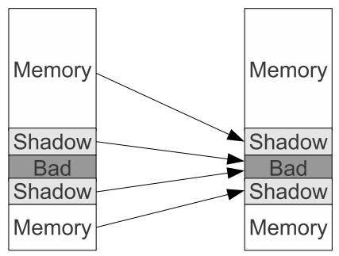

# Summary for AddressSanitizer: A Fast Address Sanity Checker

# Index
- [1. Introduction](#introduction)
- [2. Related Work](#related-work)
- [3. AddressSanitizer Algorithm](#addresssanitizer-algorithm)

# Introduction
많은 메모리 에러 탐지 도구들이 존재하고, 속도, 메모리 소비, 탐지 가능한 버그 유형 등에서 차이가 많이 나나 대부분 overhead가 크거나, 속도가 빠른 대신 탐지력이 떨어진다는 문제가 있다. 우리는 성능과 커버리지를 결합한 새로운 도구인 **AdressSanitizer** 을 제시한다. 상대적으로 낮은 비용인 73 퍼센트의 속도 저하와 3.4배의 메모리 사용량 증가로 `out-of-bounds access`와 해제된 힙 메모리의 사용을 탐지해낸다. 

AddressSanitizer는 두 부분으로 구성된다: **계측 모듈** 과 **런타임 라이브러리** 이다. 계측 모듈은 각 메모리 접근에 대해 **shadow state** 를 확인하도록 코드를 수정하고, 오버플로우와 언더플로우 탐지를 위해 스택과 global objects 주변에 **poisoned redzones** 를 생성한다. 현재 구현은 `LLVM` 컴파일러 인프라를 기반으로 한다.

런타임 라이브러리는 malloc, free 및 관련 함수들을 대체하고 할당된 힙 영역 주변에 레드존을 생성하며 해제된 힙 영역의 재사용을 지연시키면서 에러를 보고한다.

## Contributions
- 메모리 오류 탐지기가 기존보다 훨씬 낮은 오버헤드로 shadow memory를 활용할 수 있음을 보임
- 새로운 shadow state 인코딩을 제시: 128대 1 매핑이라는 컴팩트한 shadow memory 가능하게 함
- 새로운 shadow encoding을 대상으로 하는 특화된 메모리 할당자 설명
- 메모리 버그를 효율적으로 식별하는 도구 평가

# Related Work
이미 존재하는 메모리 탐지 도구와 기술을 알아본다.

## Shadow Memory
많은 다른 도구들이 각 애플리케이션 데이터 조각에 해당하는 메타데이터를 저장하기 위해 **shadow memory** 를 활용한다. 일반적으로 애플리케이션의 주소는 직접적인 스케일과 오프셋을 통해 shadow memory로 매핑되거나, `table lookup`을 포함하는 추가적인 translation 레벨을 통해 매핑된다. 

직접 매핑의 예로 `TaintTrace`와 `LIFT`가 있다. TaintTrace는 애플리케이션 주소 공간과 동일한 크기의 shadow space를 필요로 하는데, 이 경우 정상 주소 공간의 절반만으로는 생존할 수 없는 애플리케이션을 지원하기 어렵다. LIFT의 shadow space 공간 크기는 애플리케이션의 8분의 1이다. 

주소 공간 레이아웃에서 더 많은 유연성을 제공하기 위해 일부 도구들은 **multi-level translation** 방식을 사용한다. Valgrind와 Dr.Memory는 shadow memory를 조각들로 나누고 shadow address를 얻기 위해 table lookup을 사용하여 추가적인 메모리 로드를 필요로 한다. 

Umbra는 레이아웃 유연성과 효율성을 결합하여, 비균일하고 동적으로 조정되는 스케일과 오프셋 방식을 통해 테이블 조회를 피한다. BoundLess는 64비트 포인터의 상위 16비트에 일부 메타데이터를 저장하지만 느린 경로에서는 더 전통적인 shadow memory로 되돌아간다. 

## Instrumentation
많은 메모리 오류 탐지기들이 **binary instrumentation** 을 기반으로 한다. Valgrind, Dr.Memory, BoundsChecker 같은 유명한 도구들은 일반저긍로 거짓 양성 없이 힙 메모리에 대한 범위 초과와 use-after-free 버그를 찾아낸다. 우리가 아는 한 어떤 도구도 스택이나 전역 변수에서의 범위 초과 버그를 찾아내지 못한다. 

Mudflap은 컴파일 타임 계측을 사용하며 이를 통해 스택 객체에 대한 `out-of-bounds access`를 탐지할 수 있다. 그러나 하나의 스택 프레임에서 서로 다른 스택 객체들 사이에 레드존을 삽입하지 않기 때문에 모든 스택 버퍼 오버플로우 버그를 잡아내지는 못한다. 또한 복잡한 C++ 코드의 경우 거짓 양성 보고도 존재한다.

## Debug Allocators
다른 유형의 메모리 에러 탐지기의 경우 특수한 메모리 할당자를 사용하고 나머지 실행은 바꾸지 않는다. 

Electric Fence, Duma, GuardMalloc, Page Heap과 같은 도구 들은 **CPU Page protection** 을 사용한다. 각 할당된 영역은 `전용 페이지(또는 페이지 집합)`에 배치된다. 오른쪽(그리고, 또는 왼쪽)에 하나의 추가 페이지가 할당되고 접근 불가로 표시된다. 이러한 페이지에 접근하는 page fault는 범위 초과 오류로 보고되는데, 이러한 도구들은 굉장히 큰 메모리 오버헤드를 발생시키고 일부 유형의 버그도 놓칠 수 있다. 

DieHarder와 Dmalloc과 같은 일부 malloc 구현들은 확률적, 지연 기반으로 메모리 버그를 찾는다. 수정된 `malloc` 함수는 사용자에게 반환되는 메모리 영역 주변에 **red zone** 을 추가하고, 새로 할당된 영역에 magic value로 채운다. **free** 함수 역시 magic value를 쓴다.Magic value가 읽히면 프로그램이 초기화되지 않았거나 범위 밖의 값을 읽었다는 뜻이지만, 즉각적인 탐지가 없고 탐지 역시 확률적이다. 

Red zone의 magic value가 덮어 씌워지면 나중에 **free** 할 때 레드존이 검사되면서 탐지가 되지만, 문제가 발생한 시점까지는 알아내지 못한다. 동일한 magic value 기법은 버퍼 오버플로우 보호에도 가끔 사용된다. StackGuard와 ProPolice(현재 GCC에서 StackGuard를 다시 구현한 것)는 현재 스택 프레임에서 지역 변수와 반환 주소 사이에 canary 값을 배치하고 이를 통해 **stack smashing** 공격을 방지할 수 있다. 그러나 스택 객체에 대한 임의의 `out-of-bounds access`를 탐지할 수는 없다. 

# AddressSanitizer Algorithm
높은 수준에서는 우리 접근 방식이 Valgrind 기반의 `AddrCheck`와 유사하다. Shadow memory를 사용하여 애플리케이션 메모리의 각 바이트가 접근하기에 안전한지 기록하고 각 애플리케이션 로드나 저장 시 shadow memory를 검사하기 위해 계측을 사용한다. 그러나 우리 도구는 더 효율적인 shadow memory mapping, 더 컴팩트한 인코딩을 사용하고 힙 뿐만 아니라 스택과 전역 변수에서 오류를 탐지하고 속도도 빠르다. 다음 섹션들은 어떻게 shadow memory를 매핑, 인코딩하고 계측을 삽입하는지, 그리고 런타임 라이브러리가 어떻게 작동하는지 설명한다.

## Shadow Memory
**malloc** 함수에 의해 반환되는 메모리 주소들은 보통 8 바이트로 정렬된다. 이는 애플리케이션 힙 메모리의 모든 정렬된 8바이트 시퀀스가 9개의 다른 상태 중 하나에 있다는 결론으로 이어진다: 첫 번째 k(0 <= k <= 8) 바이트는 **addressable** 하고 나머지 8-k 바이트는 그렇지 않다. 이 상태는 shadow memory의 단일 바이트로 인코딩 될 수 있다.

AddressSanitizer는 **가상 주소 공간의 8분의 1** 을 shadow memory에 할당하고, 애플리케이션 주소를 해당하는 shadow address로 변환하기 위해 스케일과 오프셋을 가진 직접 매핑을 사용한다. 에플리케이션 메모리 주소 Addr이 주어지면 shadow byte의 주소는 `(Addr>>3)+Offset`으로 계산된다. `Max-1`이 가상 주소 공간에서 최대 유효 주소라면 Offset의 값은 Offset부터 Offset+Max/8까지의 영역이 시작 시 점유되지 않도록 선택되어야 한다. 

Umbra와 다르게 Offset은 모든 플랫폼에 대해 정적으로 선택되어야 하지만, 우리는 이를 심각한 제한으로 생각하지는 않는다. 가상 주소 공간이 `0x00000000-0xffffffff`인 일반적인 32비트 시스템에서 우리는 `Offset=0x20000000(2^29)`을 사용한다. 47개의 유효 주소 비트를 가진 64비트 시스템에서는 `Offset = 0x0000100000000000 (2^44)`을 사용한다. 일부 경우에는(예를 들어 리눅스에서 -fPIE/-pie 컴파일러 플래그와 함께) 계측을 더욱 단순화하기 위해 0 오프셋을 사용할 수 있다.  

  

위 그림은 주소 공간 레이아웃을 보여준다. 애플리케이션 메모리는 해당하는 shadow region에 매핑되는 두 부분(낮은 부분과 높은 부분)으로 나뉜다. Shadow region의 주소에 **shadow mapping** 을 적용하면 페이지 보호를 통해 **접근 불가** 로 표시된 **Bad** 영역의 주소를 얻게 된다.

각 shadow byte에 대해 다음 인코딩을 사용한다: 0은 해당하는 애플리케이션 메모리 영역의 8바이트가 전부 **addressable** 하다는 의미이다. k( 1 <= k <= 7)는 첫 번째 k 바이트가 주소 시정 가능하다는 뜻이다. 모든 음수 값은 8바이트가 전부 주소 지정 불가능하다는 것을 뜻한다. 서로 다른 종류의 지정 불가능한 유형을 구별하기 위해(힙, 스택, 전역, 해제된 메모리) 다른 음수 값들을 사용한다.

이 **shadow mapping** 은 `(Addr>>Scale)+Offset`의 형태로 일반화 될 수 있는데, 이때 scale은 1과 7 사이이다. 