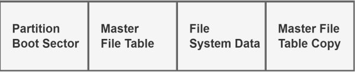
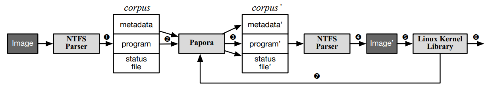

# Summary for Fuzzing the Latest NTFS in Linux with Papora: An Empirical Study

# Index
- [1. Introduction](#introduction)
- [2. Background](#background)
- [3. Experimental Setup](#experimental-setup)

# Introduction
NTFS는 Microsoft에서 개발한 Windows NT용 파일 시스템이다. 이후 수많은 하드디스크들이 NTFS 형식에 맞춰 출시되었고, 다른 운영체제들도 이에 맞춰 NTFS 지원을 개발해야했다. 그리고 리눅스의 **NTFS3** 도 그중 하나이다. 그러나 Linux Kernel의 NTFS3의 버그를 탐색하고 평가하는 도구가 아직 없었기에 **Papora** 라는 이름의 첫번째 NTFS3 퍼저를 개발하였다.

`Janus`나 `Hydra` 같은 파일 시스템 퍼저들도 여럿 있지만, NTFS 이미지로부터 **메타데이터를 추출** 하고 체크섬을 바로잡는 파서가 없거나, 파서가 있더라도 퍼즈 테스팅에 쓰기에 적합하지 않았다. 그리고 **KASAN** 을 지원하지 않아 취약점 탐색의 효율이 떨어졌었다.

1. NTFS의 구현은 오픈 소스가 아니기 때문에 쓸만한 이미지 파서를 만들기 쉽지 않다. 연구진은 여러 서드파티 릴리즈와 해당 문서들을 직접 비교하고, 어떤 구현이 예상되는 동작과 일치하는지 상호 참조하였다.
2. LKL을 활용하여 NTFS 이미지를 다루는 리눅스 커널의 동작을 에뮬레이션 하였다. 그러나 기존 LKL은 최신화가 잘 되지 않고, KASAN 역시 통합되어 있지 않았기 때문에 먼저 최신 버전으로 포팅을 한 후 LKL의 메모리 서브 시스템을 수정하여 **KASAN** 을 활성화 하였다. LKL은 선형 메모리 구조 같은 특수한 아키텍처에서 작동하는데, KASAN이 no-MMU LKL과 호환될 수 있도록 리팩토링하였다. 

3개의 0-day 취약점과 9개의 심각한 버그를 찾아냄으로서 Papora가 충분히 효과적인 퍼저임을 증명하였고, Linux의 NTFS가 여전히 OOB read나 null-pointer dereference 버그에 시달리고 있음을 알아냈다. 

# Background
## A. NTFS File System
파일 시스템은 `파일, 폴더, 링크, 데이터`에 대한 읽기/쓰기 작업을 효율적으로 처리할 수 있게 해주는 운영 체제의 핵심 요소이다. 1993년 Microsoft가 개발한 `New Technology File System(NTFS)`가 Windows NT의 첫번째 릴리즈와 함께 출시된 후 Linux에서 Windows 하드 드라이버에 접근하기 위해 많은 NTFS 드라이버가 개발되었고, NTFS3 역시 2021년에 커널에 추가되었다. 

### 1) NTFS Features
`File Allocation Table (FAT)` 파일 시스템의 후속으로서 NTFS는 많은 측면, 특히 **신뢰성과 보안** 측면에서 FAT를 많이 앞선다. 

NTFS 파일 시스템의 신뢰성은 두 가지 측면에서 반영될 수 있는데, 다른 저널링 파일 시스템과 유사하게 NTFS는 예기치 않은 시스템 크래시를 처리하기 위해 파일 시스템의 **일관성** 을 보장하는 `로깅 및 체크포인트 메커니즘`을 사용한다. 다른 한편으로는 **클러스터 리매핑** 이라 불리는 복구 기술도 신뢰성에 도움을 준다. 클러스터 내에 위치한 불량 섹터가 읽기 작업에서 감지되면 NTFS는 해당 클러스터를 새로 할당된 클러스터로 리매핑하고 더 이상 사용되지 않을 불량 클러스터를 표시한다.

보안의 경우, NTFS는 사용자 및 그룹 단위로 파일이나 디렉터리에 대한 접근 권한을 부여할 수 있다. 또한 **Encrypting File System(EFS)** 는 사용자가 NTFS 볼륨의 파일을 암호화할 수 있도록 하여 개인 키 없이는 공격자가 볼륨의 어떤 파일도 복호화할 수 없도록 만든다. 

### 2) NTFS Physical Structure
  
위 그림은 NTFS 이미지의 레이아웃을 보여준다. 

- **Partition Boot Sector(PBS)** 는 시스템 부트스트래핑을 위한 중요한 정보를 담고 있다. 그리고 Program Counter를 부트스트랩 코드로 수정하는 역할을 한다.
- **Master File Table (MFT)** 은 모든 파일과 디렉터리의 메타데이터를 보유하고 메타데이터 자체까지 포함한다. MFT의 무결성 보장을 위해 NTFS는 MFT와 정확히 같은 데이터를 유지하는 MFT 사본을 유지한다. MFT는 NTFS 메타데이터를 위한 여러 항목들로 구성되고, 각 항목들은 고정된 기능을 갖고 엄격한 syntax를 따른다. 가장 중요한 것은 MFT가 파일의 속성과 같이 파일을 검색하는 데 필요한 일부 메타 정보도 저장한다는 것이다. NTFS에서 각 파일은 하나 또는 여러 섹터로 구성된 클러스터에 저장되며, 파일 이름, 타임스탬프, 심지어 파일 데이터와 같은 속성들의 목록으로 구조화된다. MFT에 포함되지 않은 파일 데이터는 파일 시스템 데이터에 저장된다. 

## B. Fuzzing
**Fuzzing** 이나 **fuzzy testing** 은 타겟 상태와 테스트 결과를 기반으로 변이된 입력을 타겟에 입력으로 넣는 소프트웨어 테스팅 기법이다. 많은 유명한 퍼저들은 **code coverage** 에 기반하여 입력 mutation을 유도한다. `AFL`이나 `libFuzzer` 같은 code coverage based 퍼저들은 컴파일 할 때 타겟에 계측 코드를 삽입하고, **input mutator** 에 타겟 상태를 다시 넣어 계속 새로운 상태를 탐색할 수 있도록 한다. 

User space program은 변이된 입력을 커맨드 라인이나 설정 파일 같은 형태로 넣어 반복 실행시키면 되지만 파일 시스템과 같은 OS component를 퍼징하는 것은 다른 문제이다. 파일 시스템의 경우 input space가 **two dimension** 이 되는데(파일 시스템 이미지, 일련의 system call), 기존 커널 퍼저(Trinity, Syzkaller)들이 효과적으로 만들어내기에는 파일 시스템 이미지는 다소 복잡하다. **Janus** 나 **Hydra** 같은 파일 시스템 퍼저는 커다란 이미지에서 메타데이터를 추출해내는 파일 시스템 전용 파서로 이 문제를 해결한다. 그리고 LKL을 활용하여 **clean-state OS** 를 유지할 수 있도록 한다.

# Experimental Setup
이 섹션은 어떻게 NTFS 퍼저를 구현하였고, NTFS 파일 이미지를 효율적으로 퍼징하는 방법을 설명한다.

## A. Challenges
- **C1,Disk Image**: 대부분의 mainstream 퍼저가 선호하는 입력의 크기는 1KB 미만이나, 파일 시스템 디스크 이미지는 보통 몇 메가바이트 단위부터 시작된다. 이를 통째로 변이시키거나 로드시키는 작업은 I/O에 큰 부담을 주며 퍼징 효율을 급감시킬 것이다.
- **C2, Context-aware File Operations**: 파일 연산 작업은 디스크 이미지와 별개의 귀중한 시드이다. 즉, 일련의 file operation도 시스템 크래시로 이어질 수 있는데, 이러한 연산들은 이미지에 대한 **context-aware 작업** 에 해당한다. 이러한 작업들은 탐색 공간을 지수적으로 증가시킬 뿐만 아니라 적절한 이미지 상태(예를 들어 MFT의 entry) 업데이트도 필요로 한다.
- **C3, Reproduction**: 운영체제를 대상으로 하는 전통적인 퍼저는 가상 환경을 주로 사용하는데, 이를 빈번하게 껐다 키면 시간이 너무 오래 걸려 보통 파일 시스템을 재사용한다. 이는 비결정적 상태로 이어지며 버그 탐색에도 큰 방해가 된다.

## B. Overview
  

위 그림은 Papora의 전반적인 흐름을 담고 있다. 먼저 NTFS 파서가 주어진 이미지를 스캔한 다음에 `corpus`를 만들어 Papora로 전송한다. 퍼저는 
1. 주어진 이미지의 메타데이터와 
2. file operations로 구성된 프로그램

을 둘다 변이시키고, 이에 맞춰 **status field** 를 업데이트 한다(단계 2,3). 그런 다음 NTFS 파서는 업데이트된 corpus를 온전한 변형된 이미지로 조립한다(단계 4). 이 이미지는 LKL에 의해 마운트되고 프로그램에 따라 실행된다(단계 5). 마지막으로 실행 결과가 출력된 다음 피드백 정보가 다시 전송되어 후속 mutation을 유도한다(단계 7).

## C. Corpus Building
위에서 볼 수 있듯이 corpus는 세 부분으로 구성된다.

- 주어진 이미지에서 추출된 메타데이터
- 일련의 file operations로 구성된 프로그램
- 상태 파일(status file)

특별히 설계된 NTFS 파서가 메타데이터, 즉 **PBS와 MFT의 entry** 들을 추출하고 이를 대량의 데이터로 압축한다. 이런 방식을 사용하면 버그 탐색에 도움이 안 되는 99퍼 이상의 이미지 공간은 corpus에 포함되지 않는다. 

두 번째 부분의 경우 초기 프로그램은 file operation의 빈 시퀀스이다. 아까 파일과 디렉토리의 여러 속성들은 `MFT`에 저장된다고 했는데, 이미지 스캔 과정에서 이 속성들은 세 번째 부분인 상태 파일에 패키징되고 유지된다. Papora는 조립된 corpus를 입력으로 받아, 메타데이터나 file operation 중 하나를 변형하고, 이미지를 마운트, 프로그램을 실행, 버그 트리거 여부를 확인한다. 그렇지 않으면 **Input corpus** 의 해당 필드가 업데이트 되고 다음 라운드 퍼징을 위해 corpus가 Papora로 전송된다. 

## D. NTFS Parser
